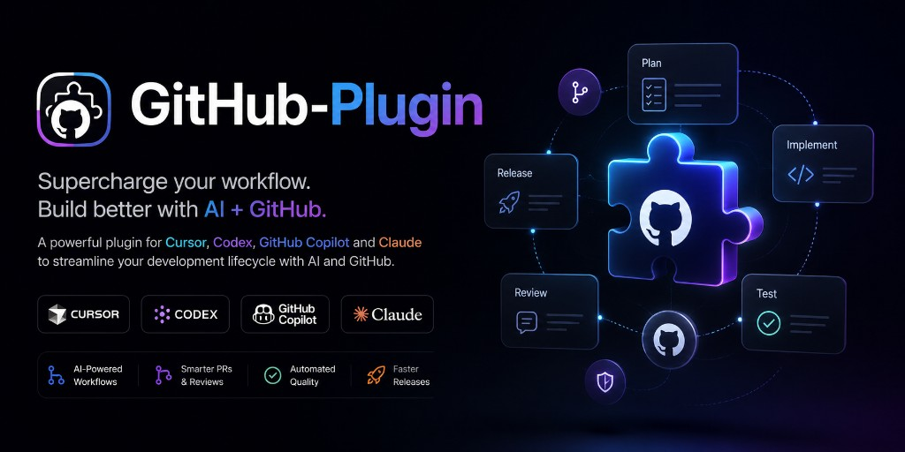
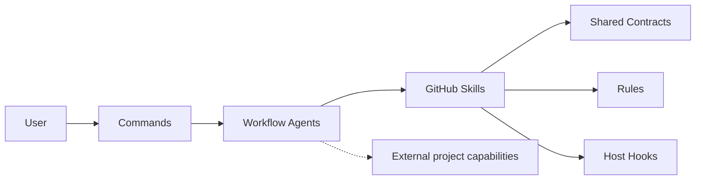

<p align="center">
  
</p>

# CromeSDK GitHub Plugin

[](LICENSE)

This repository publishes the standalone CromeSDK `github` plugin for
evidence-backed GitHub issue and pull-request collaboration. The installable
plugin lives in [`plugin/`](plugin/). Repository-local Node/Vitest test tooling
is intentionally not tracked; project-specific testing remains an external
capability of the host session or target repository.

[Plugin documentation](plugin/docs/README.md) ·
[Contributing guidance](AGENTS.md) ·
[Changelog](CHANGELOG.md) ·
[License](LICENSE) ·
[Repository](https://github.com/Crome696/github-plugin)

## Project snapshot

| Snapshot | Value |
| --- | --- |
| Status | Standalone workflow plugin |
| Version | `0.3.121` |
| License | MIT |
| Plugin name | `github` |
| Marketplace name | `github-plugin` |
| Installable source | `./plugin` |
| Hosts | Cursor, Codex, GitHub Copilot, Claude |
| Repository | [Crome696/github-plugin](https://github.com/Crome696/github-plugin) |

## What it does

The plugin coordinates evidence-backed GitHub collaboration from issue
preparation through pull-request integration. It provides read-only issue,
repository, pull-request, review, feedback, branch, and check analysis plus
task-authorized delivery workflows for branches, worktrees, commits, pushes,
issue linkage, Draft pull requests, review-fix loops, CI-fix loops,
Ready-for-Review, target refreshes, rebases, merges, issue-closure
verification, independent cleanup decisions, and exact evidence-backed
repository About description and Topics reconciliation.

The plugin does not implement product or project source code, framework
architecture, domain behavior, or project-specific test design. Those remain
external capabilities resolved by the host session.

## Key features

- Evidence-first issue, repository, pull-request, review, branch, and check
  analysis.
- Task-authorized branches, worktrees, commits, non-force pushes, and
  issue-linked Draft pull requests.
- Review-fix and CI-fix loops that stay bound to the verified pull-request
  head.
- Ready-for-Review, target refresh, rebase, merge, issue-closure, and cleanup
  workflows with explicit safety gates.
- Evidence-backed repository About description and Topics reconciliation with
  concurrency protection and post-write verification.

## Architecture



Commands are thin entry points, Agents coordinate the workflow, and Skills
own bounded analysis or GitHub operations. Shared Contracts carry typed
handoffs, Rules define policy, and Hooks enforce local safety gates. The dotted
edge marks capabilities resolved by the host session; they are not packaged
inside this repository.

## Getting started

Install the `github` plugin through the marketplace flow for your host. The
repository marketplace manifests resolve the installable source to
[`./plugin`](plugin/).

For technical orientation, start with
[`plugin/docs/README.md`](plugin/docs/README.md). It provides separate reading
paths for developers extending the plugin and AI agents operating the
workflow. For command-oriented navigation, browse
[`plugin/commands/`](plugin/commands/) and select the entry point for issue
preparation, delivery, review, feedback, integration, or hook generation.

## Project structure and package boundary

Marketplace manifests at the repository root all point to `./plugin`:

- [Cursor marketplace](.cursor-plugin/marketplace.json)
- [Claude marketplace](.claude-plugin/marketplace.json)
- [Agents marketplace](.agents/plugins/marketplace.json)

Only the `plugin/` directory is the installable plugin source. The root
documentation, changelog, and licensing files are repository artifacts and are
not inside the Marketplace source. The repository does not include a local
Node package, TypeScript configuration, Vitest configuration, test workspace,
or checked-in test fixtures.

## Plugin structure

```text
plugin/
├── .claude-plugin/plugin.json
├── .codex-plugin/plugin.json
├── .cursor-plugin/plugin.json
├── agents/
├── assets/
├── commands/
├── docs/
├── hooks/
├── rules/
├── shared/schemas/
├── skills/
└── plugin.json
```

The technical entry point for the plugin is
[`plugin/docs/README.md`](plugin/docs/README.md). It describes the workflow
architecture, approval gates, external capability boundary, Shared Contracts,
failure handling, and extension points.

## Development and validation

This repository tracks the installable plugin and its documentation. It does
not include a repository-local Node/Vitest test runner. Project-specific
implementation and testing remain external capabilities resolved by the host
session.

Run the static repository validation from the repository root:

```console
git diff --check
node --check plugin/hooks/generate-project-hooks.mjs
node plugin/hooks/generate-project-hooks.mjs --help
node scripts/validate-assets.mjs
```

The asset validator is a dependency-free packaging check. It verifies the
signature, structure, decoded raster data, dimensions, and RGB format of the
repository's supported PNG assets. It is intentionally a direct Node command;
this standalone repository does not contain a `package.json`, npm scripts, or
a local Vitest test runner.

Also verify that deleted repository-local test paths are absent and that
maintained documentation does not reference removed local test sources or
root package scripts.

The project-hook generator can be invoked directly from the repository root:

```console
node plugin/hooks/generate-project-hooks.mjs --hosts <cursor|codex|both|cursor,codex> --target <verified-repository-root>
```

The command invokes the installable generator at
`plugin/hooks/generate-project-hooks.mjs`.

When changing plugin identity, keep version `0.3.121` synchronized across the
four manifests under `plugin/` and the three root Marketplace manifests. When
changing a Skill, Agent, Command, Rule, Hook, or Shared Contract, update the
technical component inventory in [`plugin/docs/README.md`](plugin/docs/README.md)
and run the static validation above. Repository policy and synchronization
requirements remain in [`AGENTS.md`](AGENTS.md).

## Security and safety boundaries

- GitHub writes require the exact authorization and current identity evidence
  described by the relevant Skill and Shared Contract.
- Hooks fail closed before protected commit, pull-request, review, rebase,
  Ready-for-Review, and merge operations when their gate evidence is missing,
  stale, or mismatched.
- The plugin never packages external implementation capabilities or claims
  ownership of project-specific source code and tests.
- Secrets, tokens, credentials, and confidential values must not be copied into
  plugin artifacts, GitHub content, commits, pull requests, or logs.

## Contributing and support

Read [`AGENTS.md`](AGENTS.md) for repository ownership, packaging,
version-synchronization, and validation rules. The technical component
inventory and extension guidance live in
[`plugin/docs/README.md`](plugin/docs/README.md).

## License

This project is licensed under the MIT License. See [LICENSE](LICENSE).

Copyright (c) 2026 Crome696.
