# GitHub

Read-only repository inspection, convention detection, branch-name derivation,
affected-area mapping,
issue, pull-request loading and diff analysis, linked-issue, and grouped
pull-request discussion loading,
and interview-driven workflows for establishing
verified repository context, mapping issue or task scope to evidence-based repository
areas and downstream impact, and identifying evidence-based development
conventions for planning and implementation, deriving concise, evidence-based
Git branch names without creating or modifying branches, evaluating
implementation feasibility and meaningful approaches, resolving relevant skills,
rules, agents, tools, and domain capabilities without executing them, loading live GitHub issue
and pull-request snapshots, comparing original issue
text with rewritten revisions through structured semantic diffs and scope-drift
or contradiction flags, assessing issue quality, defining verifiable
acceptance criteria, decomposing oversized product issues into nearly atomic
sub-issues, assessing each proposed sub-issue for atomicity, mapping evidenced product
and mandatory technical dependencies among those candidates without ranking
slices by technical order, prioritizing those candidates with the user, turning new requests and vague GitHub issues into clear
actionable specifications, rewriting issue text into implementation-ready
English specifications, publishing approved issue drafts as new or updated
issues, applying validated partial issue-field updates, building
implementation-ready, task-authorized plans from evaluated issue and
repository context, preparing qualified issues through an autonomous,
verified branch/worktree workflow without implementing changes, inspecting expected
worktrees into read-only status and diff inventories for scope and commit
review, classifying those changes by purpose, component, and issue or
`ImplementationPlan` relationship for scope validation and commit planning,
detecting unrelated changes with evidence-backed confidence, distinguishing
scope violations from necessary technical side effects, and reporting blockers
or clarification needs before commit and pull-request preparation,
resolving the external skills and rules needed for confirmed pull-request
feedback across technology, architecture, testing, security, and documentation
without executing or duplicating implementation knowledge, and
composing evidence-backed commit proposals and draft pull-request descriptions,
creating exactly scoped local commits from task-authorized proposals with
immediate status checks and post-commit verification, pushing authorized
branches to verified remotes with non-force defaults and post-push SHA
verification, and turning validated
implementation briefs into verified draft pull requests. It also coordinates
internal review-fix loops on existing pull-request head branches through
host-neutral `ReviewFixPlan` confirmation, exact commits, verified non-force
pushes, and current-head re-review without publishing a review or merging.
It also composes and, after exact authorization from the user or a matching
target-repository `AGENTS.md` policy, publishes exact pull-request reviews as
comments, approvals, or requests for changes while rejecting stale heads and
inline locations. It drafts and, after separate exact authorization from the
user, a matching policy, or the feedback workflow, publishes one
evidence-backed reply to a specific review thread without resolving or
otherwise mutating that thread.
It also coordinates one verified pull request through current merge readiness,
an exactly authorized target-base refresh and local rebase, stopped-conflict
analysis, post-rebase validation, a separately authorized merge, linked-issue
closure verification, and independently authorized branch and worktree
cleanup.
The host-specific `post-merge` Hook observes the completed merge and injects a
deterministic `PostMergeStatus` containing PR state, merge-commit evidence,
expected issue closure, open cleanup actions, and deviations. It is read-only:
branch and worktree cleanup always remains a separate, independently
authorized workflow.

The thin `create-issue` and `refine-issue` commands resolve one target, start
the corresponding `issue-agent` mode, and display its exact result. The thin
`prepare-issue` command starts `preparation-agent` and displays its
`ImplementationPlan` and `BranchWorkspace`. The thin `publish-draft-pr`
command starts `delivery-agent` and displays its validated delivery handoffs.
The thin `review-pr` command starts `review-agent` and displays findings and
the `ReviewDecision`. The thin `address-pr-feedback` command starts the
dedicated `feedback-agent`; the thin `integrate-pr` command starts the
dedicated `integration-agent`. The thin `implement-auto-issue` command starts
`lifecycle-agent` and displays the `LifecycleRun` through Draft PR
publication from a new request. The thin `refine-auto-issue` command starts
the same Agent at refine for one verified existing issue and displays the
`LifecycleRun` through Draft PR publication. The thin
`generate-project-hooks` command starts
`host-hooks-agent`, which delegates the interactive Cursor/Codex selection and
bounded projection to the `generate-project-hooks` Skill. Codex does not
register plugin Commands, so Codex invokes that Skill directly. Commands
resolve targets, start one Agent, and display results; Skills and Agents own
all analysis and external operations.

The thin `auto-review-fix-pr` command starts `review-fix-agent` for one
verified pull request and displays `ReviewFixRun`. The Agent confirms only
mandatory fixes, attaches the existing head branch, and owns the bounded
commit/non-force-push loop. Review publication, thread writes, second PR
creation, Ready-for-Review, rebase, merge, and cleanup remain excluded.

The thin `auto-ci-fix-pr` command starts `ci-fix-agent` for one verified
pull request and displays `CiFixRun`. The Agent waits for required checks,
reruns only exactly authorized required names, confirms remaining failures,
and owns the bounded commit/non-force-push loop on the existing head.
Pending or unavailable policy evidence is never a pass. Optional checks are
never treated as required. Green checks are not merge or Ready-for-Review
authorization.

The thin `ready-pr` command starts `pr-ready-agent` for one verified Draft
pull request and displays `PullRequestReady`. The Agent requires a unique
linked issue, proposes optional reviewers as suggestions, and marks the
pull request ready only after exact authorization of that pull request, head
SHA, and reviewer set. Review publication, rebase, merge, and cleanup remain
excluded.

The thin `plan-product` command starts `product-planner-agent` and turns one
verified parent issue into a prioritized graph of nearly atomic product
sub-issues through analysis, interview, capability mapping, iterative
decomposition, atomicity review, dependency analysis, prioritization,
drafting, and overall review. It does not overwrite the parent. Publication of
the composed create drafts requires explicit overall-plan approval of the
issue structure, order, parallel groups, priorities, open decisions, and
exact draft set, then one `create-product-sub-issues` handoff. Codex does not
register plugin Commands, so Codex starts the Agent through the matching
default prompt.

The thin `reprioritize-issues` command starts `issue-reprioritize-agent` and
re-ranks every currently open GitHub issue in one repository as unique
consecutive `P1` through `Pn` title prefixes. Command invocation is
orchestration only. Title writes require exact ranked-set approval and a
matching live open-issue identity check, then one `apply-issue-priority-titles`
handoff. Codex starts the Agent through the matching default prompt.

The thin `close-issue` command starts `issue-close-agent` and closes exactly
one verified GitHub issue without a merged pull request after exact
authorization of that repository, issue, and close reason. Supported reasons
are duplicate, not planned, and consciously not delivered. Missing identity,
a missing close reason, or an ambiguous duplicate target fail closed with no
write. An already closed issue is a verified `no-op`.
`close-linked-issue` remains the post-merge path. Codex starts the Agent
through the matching default prompt.

The explicitly invoked `merge-pull-request` Skill merges exactly one open,
non-Draft pull request only after independent final authorization from the user
or a matching target-repository policy and a current
positive `MergeReadiness` result. It refreshes Draft state, expected head and base
revisions, reviews, approvals, required checks, conflicts, and the explicitly
selected repository-permitted strategy immediately before one GitHub merge
operation. It then verifies the merge commit, strategy, and final pull-request
state. It writes a current `PreMergeGate` immediately before the write; the
host Hook refreshes Draft status, reviews, blocking threads, approvals,
required checks, conflicts, base freshness, and issue linkage, and stops for
every changed or unavailable condition. It never performs cleanup before
successful verification.
The explicitly invoked `close-github-issue` Skill may close exactly one
verified issue without a merged pull request after exact authorization of the
repository, issue, and close reason. Supported reasons are duplicate, not
planned, and consciously not delivered. It refreshes the issue immediately
before writing, returns `no-op` when the issue is already closed, and fails
closed when identity, close reason, or duplicate target is missing or
ambiguous.
The explicitly invoked `close-linked-issue` Skill may close exactly one uniquely
linked issue only after a verified merge, a current `not-closed`
automatic-closure verification, complete implementation evidence, and either
separate exact close authorization from the user or a matching target-repository
policy, or the validated close-on-merge fallback authorization used by
`integrate-pr`. It refreshes the pull request, relationship, and issue
immediately before writing, verifies the closure, and optionally publishes one
separately authorized merge-reference comment. It never closes
ambiguous, mentioned-only, already closed, or incompletely implemented issues.

## Architecture



The [technical documentation](docs/README.md) is the developer and AI-agent
entry point for the plugin. It explains the architecture layers, external
capability boundary, approval gates, Shared Contracts, complete issue-to-merge
lifecycle, failure handling, and safe extension points. This documentation
complements the inventories and source-of-truth procedures in this README,
the Agents, Skills, Rules, Hooks, and Shared Contracts; it does not replace
them.

## Included commands

| Command | Activation | Purpose |
| --- | --- | --- |
| `create-issue` | Explicit invocation | Resolve one repository, start `issue-agent` in `create` mode, and display the exact issue result. |
| `refine-issue` | Explicit invocation | Resolve one issue, start `issue-agent` in `refine` mode, and display the exact revision result. |
| `prepare-issue` | Explicit invocation | Resolve one issue, start `preparation-agent`, and display `ImplementationPlan` plus `BranchWorkspace`. |
| `publish-draft-pr` | Explicit invocation | Resolve one prepared implementation, start `delivery-agent`, and display the complete delivery result. |
| `review-pr` | Explicit invocation | Resolve one pull request, start `review-agent`, and display findings and `ReviewDecision`. |
| `address-pr-feedback` | Explicit invocation | Resolve one pull request, start `feedback-agent`, and display feedback follow-up results. |
| `integrate-pr` | Explicit invocation | Resolve one pull request, start `integration-agent`, and display `PullRequestIntegration`. |
| `generate-project-hooks` | Explicit invocation | Resolve one repository, start `host-hooks-agent`, and display the selected-host project-hook projection result. |
| `implement-auto-issue` | Explicit invocation | Resolve one repository and request, start `lifecycle-agent`, and display the `LifecycleRun` through Draft PR publication. |
| `refine-auto-issue` | Explicit invocation | Resolve one existing issue, start `lifecycle-agent` at refine, and display the `LifecycleRun` through Draft PR publication. |
| `auto-review-fix-pr` | Explicit invocation | Resolve one pull request, start `review-fix-agent`, and display the `ReviewFixRun` for the host-neutral review-fix loop. |
| `auto-ci-fix-pr` | Explicit invocation | Resolve one pull request, start `ci-fix-agent`, and display the `CiFixRun` for the CI wait, authorized rerun, and bounded fix loop. |
| `ready-pr` | Explicit invocation | Resolve one pull request, start `pr-ready-agent`, and display the `PullRequestReady` Ready-for-Review result. |
| `plan-product` | Explicit invocation | Resolve one repository and parent issue, start `product-planner-agent`, and display the `ProductPlannerRun` through overall-plan review and approved sub-issue publication. |
| `reprioritize-issues` | Explicit invocation | Resolve one repository, start `issue-reprioritize-agent`, and display the `IssueReprioritization` result after exact ranked-set title application. |
| `close-issue` | Explicit invocation | Resolve one issue, start `issue-close-agent`, and display the `IssueClosure` triage-close result after exact close-reason authorization. |

## Included skills

| Skill | Activation | Purpose |
| --- | --- | --- |
| `inspect-repository` | Automatic | Inspect the current repository through bounded, issue-focused reads and return a version-1 `RepositoryContext` with verified applications, libraries, packages, project and architecture boundaries, technologies, commands, relevant paths, instructions, assumptions, and open questions for downstream work. |
| `detect-repository-conventions` | Automatic | Detect evidence-based naming, structure, architecture, coding, branching, commit, testing, documentation, formatting, linting, and contribution conventions, distinguishing mandatory rules from observed practices without modifying the repository. |
| `derive-branch-name` | Automatic | Derive a concise, descriptive Git branch name from one issue or task and verified repository conventions without creating or modifying branches. |
| `identify-affected-areas` | Automatic | Map an issue or task to evidence-based affected applications, libraries, modules, files, APIs, tests, configuration, documentation, data models, and dependencies, distinguishing direct, indirect, and uncertain impact without designing the solution. |
| `evaluate-implementation` | Automatic | Evaluate implementation feasibility, architectural fit, complexity, compatibility, testing implications, dependencies, risks, blockers, and meaningful alternative approaches without implementing changes or replacing `ImplementationPlan`. |
| `resolve-context-capabilities` | Automatic | Resolve relevant skills, rules, agents, tools, and domain capabilities from issue and evaluated implementation context, distinguish required and optional usage, report availability and gaps, and avoid execution or responsibility duplication. |
| `build-implementation-plan` | Automatic | Build a task-authorized, implementation-ready `ImplementationPlan` with ordered steps, dependencies, paths, validation, capabilities, risks, prerequisites, blockers, assumptions, unresolved questions, and carried routine delivery authorization without writing code or executing delivery. |
| `build-review-fix-plan` | Automatic | Confirm current diff findings and open feedback as a host-neutral `ReviewFixPlan` without mutating GitHub, Git, or files. |
| `build-ci-fix-plan` | Automatic | Confirm remaining failed required checks as a host-neutral `CiFixPlan` without mutating GitHub, Git, or files. |
| `fetch-target-branch` | Automatic | Fetch and verify one explicitly selected remote target branch after exact user or target-repository-policy authorization, return its current commit SHA, and never modify local work, branches, worktrees, or perform rebase, merge, or reset operations. |
| `generate-project-hooks` | Explicit invocation | Ask interactively whether to project Cursor, Codex, or both, then generate only the selected repository hook configurations and checker copies without creating gate snapshots, committing, or changing GitHub. |
| `detect-rebase-conflicts` | Automatic | Analyze one stopped or explicitly planned rebase for confirmed and potential conflicts, affected files, conflict types, base/ours/theirs changes, impacts, and available technology capability evidence without resolving conflicts or modifying Git state. |
| `rebase-branch` | Explicit invocation | Rebase one verified feature branch onto one authorized target revision, preserve a stopped conflict for separate resolution, and return `BranchRebase` evidence without pushing, merging, or cleaning up. |
| `verify-worktree` | Automatic | Verify an existing Git worktree against its expected repository, branch, base revision, and safe starting state without repairing or modifying Git state. |
| `inspect-working-tree` | Automatic | Capture Git status, changed, new, and deleted paths, and relevant diff statistics for one expected worktree while verifying branch and worktree association, without modifying the index or files. |
| `classify-changes` | Automatic | Classify inspected worktree changes by purpose, affected component, and relationship to an issue or `ImplementationPlan`/`ReviewFixPlan`, using diff and plan evidence for scope validation and later commit planning without modifying the index or files. |
| `detect-unrelated-changes` | Automatic | Detect changes that are not plausibly related to an issue, `ImplementationPlan`, or necessary follow-on edit, evaluate evidence and confidence, and distinguish scope violations from technical side effects before commit or pull-request preparation without changing files. |
| `validate-implementation-result` | Automatic | Consolidate implementation-result evaluation with working-tree inspection, change classification, and applicable scope gates; block unresolved scope deviations, missing required validations, and unmet completion criteria before commit or draft pull-request preparation without changing files or inventing authorization. |
| `validate-rebased-branch` | Automatic | Validate one explicitly identified branch after a completed rebase by comparing history and diff with the pre-rebase implementation and selected base, checking scope, required tests, and current-head status checks, and return an updated `ValidationResult` without rebasing, pushing, merging, or modifying Git state. |
| `compose-commit-message` | Automatic | Compose an evidence-backed English `CommitProposal` from verified issue, implementation-plan, repository-convention, validation, and working-tree evidence; preserve exact file scope and carry existing task-scoped routine authorization without staging or creating a commit. |
| `compose-pr-description` | Automatic | Compose an evidence-backed English `PullRequestDraft` from one verified issue, task-authorized `ImplementationPlan`, passed `ValidationResult`, and created `CommitProposal`; preserve templates and validations without inventing tests or pushing or publishing. |
| `link-pr-to-issue` | Automatic | Establish one unambiguous, evidence-backed relationship between one Draft pull request and one verified issue; select default close-on-merge linkage or an explicit neutral opt-out from intent and repository conventions without editing GitHub or closing the issue. |
| `create-commit` | Automatic | Create exactly one local Git commit from a task-authorized `CommitProposal`, stage only its exact path union, use only its approved message, verify the SHA and committed files, and never push or create a pull request. |
| `push-branch` | Automatic | Push one verified prepared branch under task-scoped non-force authorization, inspect branch, remote, upstream, and local status, verify the remote SHA, prevent force-pushes by default, and never create a pull request. |
| `create-draft-pr` | Automatic | Publish one exact task-authorized `PullRequestDraft` from a verified pushed branch, detect an existing matching open pull request, create only a draft PR, and verify its number, URL, head, base, content, and draft state without requesting review or marking it ready. |
| `propose-pr-reviewers` | Automatic | Propose an optional reviewer set for one Draft pull request from existing requests, CODEOWNERS suggestions, and policy names without treating CODEOWNERS as merge policy or writing GitHub. |
| `mark-pr-ready` | Explicit invocation | Mark one exact open Draft pull request Ready-for-Review after independent authorization of the pull request, head SHA, unique linked issue, and optional reviewer set, then verify the non-Draft state. |
| `merge-pull-request` | Explicit invocation | Merge one exact open non-Draft pull request only after a current positive `MergeReadiness`, exact final authorization, a selected allowed strategy, immediate live freshness checks, and post-merge verification; never rebase, resolve conflicts, mutate reviews or threads, or clean up. |
| `create-worktree` | Explicit invocation | Create or explicitly reuse one authorized implementation worktree from an `ImplementationPlan`, or attach an existing pull-request head branch from a `ReviewFixPlan` or `CiFixPlan`, then return `BranchWorkspace` creation evidence. |
| `load-github-issue` | Automatic | Load one live issue into a preserved `LoadedIssue` snapshot with availability evidence, comments, metadata, and linked pull requests without GitHub writes. |
| `list-open-issues` | Automatic | Load every currently open GitHub issue in one repository into `OpenIssueInventory`, excluding pull requests, and fail closed when the list is truncated. |
| `load-pull-request` | Automatic | Load one live pull request into a preserved `LoadedPullRequest` snapshot with exact content, head and base revisions, commits, files, checks, reviews, draft state, authors, and related metadata without GitHub writes. |
| `analyze-pr-diff` | Automatic | Analyze one pull-request diff across correctness, architecture, security, performance, maintainability, tests, documentation, and scope into evidence-backed `PullRequestDiffAnalysis` findings and separate uncertainties without publishing review comments. |
| `apply-issue-priority-titles` | Automatic | Apply one confirmed unique P1-through-Pn ranking as title prefixes on currently open issues after exact-set authorization and a live identity check, delegating each title patch to `update-github-issue`. |
| `inspect-pr-checks` | Automatic | Inspect one pull request's complete status-check and CI evidence, including explicitly retrieved requirements, into a `PullRequestCheckInspection`, distinguishing pass, fail, pending, skipped, and missing outcomes without inventing requirements or changing GitHub. |
| `check-required-status-checks` | Automatic | Project an existing `PullRequestCheckInspection` into required versus optional check evidence without performing another live fetch, rerunning CI, or changing GitHub. |
| `wait-required-checks` | Automatic | Wait after a verified pull-request head and report required-check pass, fail, pending, skipped, and missing outcomes without treating pending or unavailable policy evidence as a pass. |
| `rerun-required-checks` | Explicit invocation | Rerun only exactly authorized required check names, verify new live run identities, and fail closed for optional or unauthorized names. |
| `check-required-approvals` | Automatic | Inspect explicitly retrieved branch-protection and applicable-ruleset review requirements plus current approvals, change requests, and pending review requests into a `RequiredApprovalInspection`; report satisfied and missing requirements without inventing policy or changing GitHub. |
| `assess-merge-readiness` | Automatic | Assess one pull request into a version-2 `MergeReadiness` result of `ready`, `needs-attention`, or `blocked` using evidence for draft state, reviews, threads, approvals, checks, conflicts, issue coverage, and remaining blockers; never merge or rebase. |
| `check-open-review-threads` | Automatic | Check one pull request's current review-thread states and return evidence-backed required problems, optional discussions, resolved threads, outdated threads, and unknown states for merge-readiness workflows without modifying GitHub. |
| `detect-review-findings` | Automatic | Consolidate supplied diff, issue-coverage, required-check, discussion, and applicable external-rule evidence into source-aggregated proposed `ReviewFinding` objects before content-level comparison. |
| `deduplicate-review-findings` | Automatic | Compare proposed findings with one another and existing pull-request discussion threads, merge identical problem cores, preserve distinct causes, and return an auditable cleaned list without publishing review actions. |
| `classify-review-findings` | Automatic | Classify every deduplicated review finding by evidence-supported `blocker`, `major`, `minor`, or `suggestion` severity and domain category, preserve thread references, flag uncertain findings for discussion, and never remove or publish them. |
| `collect-review-feedback` | Automatic | Collect open review threads, request-changes findings, relevant comments, and failed or missing required checks into grouped open, resolved, outdated, or addressed follow-up feedback without modifying GitHub. |
| `identify-resolved-feedback` | Automatic | Compare collected feedback with the latest pull-request state, later commits, current diff, and explicit test evidence; mark only clearly evidenced fixes as `resolved_candidate` without resolving threads or publishing replies. |
| `validate-feedback-resolution` | Automatic | Validate every explicitly confirmed feedback item after external follow-up against the current diff, commits, tests, checks, and discussion context; report per-item status, evidence, remaining problems, and advisory thread eligibility without resolving threads or publishing replies. |
| `summarize-feedback-resolution` | Automatic | Summarize validated follow-up as resolved, open, disputed, or blocked items with evidence-linked solutions, commits, tests, checks, actionable next steps, and diagnostic merge impact without changing GitHub or Git. |
| `resolve-review-thread` | Automatic | Resolve one open review thread only after current validation proves its feedback was addressed, the platform supports resolution, required state-change authorization from the user or a matching target-repository policy exists, and post-mutation status is verified. |
| `delete-merged-branch` | Explicit invocation | Delete one fully integrated feature branch locally and/or remotely only after separate exact authorization from the user or a matching target-repository policy, current merge and worktree preflight, safe non-force operations, and post-deletion verification; preserve uncertain or recoverable targets in `CleanupResult`. |
| `cleanup-worktree` | Explicit invocation | Remove exactly one verified, clean implementation worktree after a successfully merged pull request and separate exact authorization from the user or a matching target-repository policy; protect the primary checkout, preserve uncertain or recoverable work, optionally prune only attributable stale metadata, and verify every result in `CleanupResult`. |
| `classify-review-feedback` | Automatic | Classify open collected review feedback by cause, severity, affected component, and required follow-up action, distinguish code, test, documentation, explanation, conflict, external dependency, and possibly unsubstantiated feedback, and never modify or close discussions. |
| `resolve-feedback-capabilities` | Automatic | Resolve the narrowest current-session skills and rules needed for explicitly confirmed open feedback across technology, architecture, testing, security, and documentation; report unavailable or missing capabilities as blocking or manual requirements without executing them or duplicating implementation knowledge. |
| `build-feedback-resolution-plan` | Automatic | Turn explicitly confirmed open feedback into a bounded, ordered `FeedbackResolutionPlan` with corrections, affected areas, dependencies, validations, risks, and external implementation handoffs without executing changes or expanding scope. |
| `compose-review` | Automatic | Compose an exact, non-publishing `ReviewDecision` draft from explicitly confirmed user- or policy-backed findings, grouping blockers, required changes, and optional suggestions with evidence and expected corrections. |
| `submit-pr-review` | Automatic | Publish one exactly authorized `ReviewDecision` as a comment, approval, or request for changes after rechecking the live pull-request head and every inline location, then verify and return the published findings without merging or fixing code. |
| `reply-to-review-thread` | Automatic | Draft and, after exact authorization of the payload and publication by the user, a matching target-repository policy, or the feedback workflow, publish one evidence-backed reply to exactly one pull-request review-thread comment; verify the resulting reply and never resolve or otherwise mutate the thread. |
| `load-pr-discussions` | Automatic | Load one pull request's reviews, grouped review threads, replies, conversation comments, authors, timestamps, affected locations, and resolution state into a read-only `LoadedPullRequestDiscussions` snapshot without replying to or resolving discussions. |
| `load-linked-issue` | Automatic | Resolve one pull request's issue candidates from closing keywords, explicit references, and GitHub relationships; distinguish linked, mentioned, and ambiguous results; and load the unique linked issue read-only without guessing or writing to GitHub. |
| `check-linked-issue-status` | Automatic | Check one pull request's uniquely linked issue, state, explicit acceptance criteria, closing relationship, and evidence-backed consistency for integration without changing GitHub. |
| `verify-linked-issue-closure` | Automatic | Verify after one successful pull-request merge whether the uniquely linked issue closed as expected, preserve merge and relationship attribution evidence, and report an evidence-backed cause or safe next step when it remains open without changing GitHub. |
| `close-github-issue` | Explicit invocation | Close one exact verified issue without a merged pull request after independent authorization of the repository, issue, and close reason, then verify the live closed state or return `no-op` when already closed. |
| `close-linked-issue` | Explicit invocation | Close the uniquely linked issue after a verified merge only when automatic closure did not occur, implementation evidence is complete, and the exact live target matches separate user/policy authorization or the validated close-on-merge fallback; optionally publish a separately authorized merge-reference comment without changing other issue metadata. |
| `analyze-issue` | Automatic | Analyze a loaded issue for evidence-based requirements, assumptions, gaps, blockers, contradictions, and implementation readiness without rewriting or publishing it. |
| `analyze-product-issue` | Automatic | Analyze a loaded parent issue from a product perspective into an English `ProductAssessment` covering problem, outcome, actors, use cases, requirements, rules, constraints, acceptance, dependencies, priorities, and open questions without interviewing, creating sub-issues, or publishing. |
| `conduct-product-interview` | Automatic | Interview from one `ProductAssessment` into an English `ProductInterview` covering missing or contradictory outcome, actors, user journeys, behavior, variants, business rules, edge cases, priorities, dependencies, constraints, and non-goals, recording confirmed decisions, assumptions, and open questions for later decomposition without creating sub-issues or publishing. |
| `identify-product-capabilities` | Automatic | Map one parent `LoadedIssue` and one confirmed `ProductInterview` into an English hierarchical `ProductCapabilityMap` grouped by independently understandable Product Value and behavior areas, uniquely assign requirements, record overlaps and gaps, and do not create sub-issues or publish. |
| `decompose-product-capabilities` | Automatic | Decompose one parent `LoadedIssue` and one `ProductCapabilityMap` into an English `ProductCapabilityDecomposition` of the smallest value-oriented units, each with one observable outcome and independent acceptance, preserving parent-issue and parent-capability traceability, and do not create sub-issues or publish. |
| `assess-issue-atomicity` | Automatic | Assess each proposed sub-issue candidate from one `ProductCapabilityDecomposition` for atomicity across single outcome, scope, independent understandability, testability, number of domain behaviors, hidden requirements, and unnecessary coupling, classify each as `too-large`, `atomic-enough`, or `over-fragmented` with a rationale and a better cut when needed, and do not create sub-issues or publish. |
| `build-product-dependency-graph` | Automatic | Analyze classified sub-issue candidates from one `ProductCapabilityDecomposition` and one `IssueAtomicityAssessment` into an English `ProductDependencyGraph` of evidenced product and mandatory technical `blocks`, `requires`, `enables`, `related`, and `independent` relations, detect cycles, question problematic cuts, identify parallel work, and do not rank slices by technical order, create sub-issues, or publish. |
| `prioritize-product-issues` | Automatic | Prioritize classified sub-issue candidates together with the user using Product Value, user impact, urgency, risk, learning value, and dependencies, recommend MoSCoW classes `must`, `should`, `could`, and `later` without autonomously setting essential product priority, consider the `ProductDependencyGraph`, flag divergences between product class and required implementation order, document rationales and explicit user decisions, and do not create sub-issues or publish. |
| `rank-open-issues` | Automatic | Rank one `OpenIssueInventory` into unique consecutive `P1` through `Pn` proposed titles without writing GitHub or treating a recommendation as confirmation. |
| `compose-product-sub-issues` | Automatic | Compose complete English standalone sub-issue drafts from confirmed atomic units, including parent reference, problem/outcome, scope, behavior, acceptance criteria, dependencies, priority, constraints, and capability/requirement traceability, without creating or publishing GitHub issues. |
| `compare-issue-revision` | Automatic | Compare an original issue with one rewritten revision through an evidence-based semantic diff, explain material changes, and flag scope drift or contradictions without changing either source. |
| `assess-issue-quality` | Automatic | Assess completeness, understandability, implementability, testability, scope, and contradictions without publishing or editing GitHub. |
| `define-acceptance-criteria` | Automatic | Formulate observable, testable English acceptance criteria from scoped requirements without publishing or editing GitHub. |
| `structure-issue` | Automatic | Structure issue information covering the product-interview topics into an English `IssueAssessment`-compatible handoff without publishing. |
| `rewrite-issue` | Automatic | Rewrite issue text into a structured implementation-ready English specification, mark inferred and missing information, and return a change summary without publishing or requesting a redundant post-Build chat approval. |
| `rewrite-github-issue` | Automatic | Draft an English issue from a complete `ProductInterview` or, when that record is absent, interview through an adaptive product dialog, then produce an exact task-authorized `IssueDraft` handoff without writing GitHub directly. |
| `create-github-issue` | Automatic | Publish an exact task-authorized `IssueDraft` as a new issue or rewrite, then verify the live result without a redundant routine gate. |
| `create-product-sub-issues` | Automatic | Publish a fully approved product plan as GitHub sub-issues from confirmed drafts only, preserve priority, parent relationship, and documented dependencies without silently changing titles, bodies, or labels, create every issue before finalizing relationships, and return the unit-id mapping plus failed operations. |
| `update-github-issue` | Automatic | Apply an exact task-authorized partial update to selected issue fields, preview the final result, detect edit conflicts, and verify the live issue without repeated approval prompts. |

`inspect-repository` reads the current checkout, Git metadata, applicable
instructions, project boundaries, manifests, build and package-manager
configuration, tests, documentation, and development tooling through bounded,
issue-focused reads without executing change-producing commands. It returns a
version-1 `RepositoryContext` that separates evidenced facts from inferred
technologies, discovered commands, architecture boundaries, assumptions, and
unresolved questions, and narrows inspection to the supplied task focus when
available without loading unrelated source or dependency trees.
`detect-repository-conventions` reads applicable instructions, project
boundaries, source organization, Git history, tests, documentation, and
development tooling without executing change-producing commands. It returns a
version-1 `RepositoryConventions` handoff with convention, evidence, scope,
confidence, authority, relevant paths, and explicit conflicts for downstream
planning or implementation.
`derive-branch-name` consumes one issue or task plus available repository
convention evidence and returns a version-1 `BranchNameProposal` with a
concise, filesystem-safe candidate, rationale, applied convention, and
evidence-based alternatives without changing Git state.
`identify-affected-areas` maps one issue or task against verified repository
context without modifying the checkout. It returns a version-1
`AffectedAreas` handoff with relevant paths, direct, indirect, or uncertain
impact, evidence-based dependencies, confidence, and recommended investigation
points without designing or implementing the solution.
`evaluate-implementation` consumes the available task, issue, affected-area,
repository-context, and convention evidence to return a version-1
`ImplementationEvaluation` with feasibility, architectural fit, complexity,
compatibility, testing implications, approach comparisons, dependencies,
risks, blockers, assumptions, and unresolved questions without implementing
changes or replacing `ImplementationPlan`. `resolve-context-capabilities`
consumes the issue, affected-area, repository, convention, and evaluated
implementation context to return a version-1 `ContextCapabilities` handoff
with required or optional capabilities, priority, evidence, intended usage,
availability, and missing-capability gaps without executing or inventing
capabilities. `build-implementation-plan` consumes those validated inputs and
returns a version-1 `ImplementationPlan` with an evidence-based objective,
ordered implementation steps, dependencies, relevant paths, validation,
required capabilities, workspace values, risks, prerequisites, blockers,
assumptions, unresolved questions, and carried task-scoped routine
authorization without writing code or changing Git state.
`verify-worktree` consumes expected workspace values and optional
`BranchWorkspace`, `ImplementationPlan`, and `RepositoryContext` evidence. It
checks the registered worktree path, repository identity, checked-out branch,
base-revision ancestry, conflicts, in-progress Git operations, and unexpected
changes using read-only Git metadata. It returns a version-1
`BranchWorkspace` with a validated `active` status or a structured `blocked`
or `partial` failure; it never repairs, creates, switches, or cleans up a
worktree.
`inspect-working-tree` consumes the same workspace identity inputs and
inventories porcelain status, path classifications, and diff statistics for
downstream scope and commit review. It verifies branch and worktree
association, marks unexpected repository states explicitly, and returns a
version-1 `WorkingTreeInspection` without modifying the index, files, or Git
state. A clean empty tree is a valid inspected result with empty file lists.
`classify-changes` consumes that read-only inventory plus an optional
`ImplementationPlan`, issue, analysis, or affected-area handoff. It classifies
each observed path by purpose and affected component, relates it independently
to the issue and plan, and records diff and scope evidence for validation.
It returns a version-1 `ChangeClassification` without modifying the index,
files, or Git state and never grants commit authorization.
`detect-unrelated-changes` consumes that classification plus optional plan,
issue, analysis, or affected-area evidence. It evaluates candidate paths for
unrelated scope, necessary technical side effects, or unresolved ambiguity,
records evidence and confidence, and returns a version-1
`UnrelatedChangeDetection` with independent commit and pull-request gates.
It reports blockers or clarification needs without resetting, restoring,
cleaning, removing, staging, committing, or pushing any change. It does not
invent delivery authorization.
`validate-implementation-result` consumes the implementation plan,
working-tree inspection, change classification, and an applicable
`UnrelatedChangeDetection`. It consolidates scope, planned steps, acceptance
and completion criteria, required validations, unexpected changes, and
documented deviations into a version-1 `ValidationResult` with blockers,
warnings, evidence, and diagnostic commit or draft-pull-request readiness. It
never changes files or Git state, and its readiness flags do not invent
task-scoped authorization.
`validate-rebased-branch` consumes explicit completed-rebase identity,
pre-rebase and post-rebase revisions, implementation scope, current worktree
evidence, and SHA-bound test or status-check results. It compares history and
patch scope, detects potentially lost or unexpected changes, and returns an
updated version-1 `ValidationResult`. It never rebases, resolves conflicts,
pushes, merges, or modifies Git state; its readiness flags remain diagnostic
only.
`rebase-branch` consumes one verified active `BranchWorkspace`, one verified
`TargetBranchFetch`, and exact user or target-repository-policy authorization
for the named feature branch, target branch, target SHA, and local rebase. It
runs only the bounded local rebase,
leaves conflicts stopped for `detect-rebase-conflicts`, and returns a version-1
`BranchRebase` handoff with pre- and post-rebase revisions. It never resolves
conflicts, continues, skips, aborts, pushes, merges, or cleans up.
`compose-commit-message` consumes the validated implementation result,
working-tree inventory, implementation plan, and available issue,
classification, and repository-convention evidence. It returns exactly one
version-1 `CommitProposal` with an English message, evidence-backed rationale,
and repository-relative added, modified, and deleted scope. It describes the
actual change rather than the work process, references an issue only when a
verified issue and applicable commit convention support it, and never edits,
stages, commits, or publishes anything. It carries a verified task-scoped
routine authorization when supplied.
`compose-pr-description` consumes one verified issue, `ImplementationPlan`,
passed `ValidationResult`, and created `CommitProposal`, preserves an
applicable repository pull-request template, and returns a version-1
`PullRequestDraft` with an English body covering problem context, solution,
key changes, validations, limitations, risks, and issue linkage. It never
invents executed tests, pushes a branch, or publishes a pull request; it
carries existing routine authorization without inventing it. When supplied,
it consumes a validated `PullRequestIssueLink` and preserves its exact
relationship kind, keyword text, and single linked issue.
`link-pr-to-issue` validates one Draft pull request against one loaded issue,
rejects conflicting or multiple issue candidates, defaults to `Fixes`, and
uses neutral `Refs` only when explicit evidence opts out of closing the issue.
`Closes` and `Resolves` remain valid explicit closing-keyword choices. It
returns the relationship kind and reproducible evidence without editing
GitHub, closing the issue, merging, or marking the pull request ready.
`create-commit` consumes one approved version-1 `CommitProposal` and a
trusted workspace identity. It checks for scope drift and foreign staged
paths before staging, stages only the approved path union, checks the index
again, runs the immediate pre-commit status check, uses the exact approved
message, and verifies the resulting commit and final status. It returns
`created` only after complete verification and never pushes or creates a pull
request.
`push-branch` consumes one active version-1 `BranchWorkspace` plus a verified
remote target and authorization evidence. It checks repository and branch
identity, upstream and remote state, divergence, and local status before the
push, uses a non-force push by default, verifies the remote branch at the
expected local head SHA, and returns a version-1 `BranchPush` handoff. A
force-with-lease operation requires separate exact authorization, and the
Skill never creates a pull request.
`create-draft-pr` consumes one explicitly authorized version-1
`PullRequestDraft` plus the identity-matched `BranchWorkspace`,
`ValidationResult`, `CommitProposal`, `BranchPush`, and
`PullRequestIssueLink` handoffs. It writes and verifies a local
`PrePrCreateGate` immediately before checking the exact command and using
`gh pr create --draft`, then preserves the approved title and body and verifies
the resulting PR number, URL, head, base, SHA, content, and draft state. It
never requests review, marks the draft ready, merges, rebases, or edits a
duplicate pull request.
`merge-pull-request` consumes one explicitly approved version-1
`PullRequestMerge` and a current matching version-2 `MergeReadiness` result of
`ready`. It independently rechecks the live open non-Draft PR, unchanged expected
head and base revisions, mergeability, required checks, reviews, approvals, and the
exact repository-permitted strategy immediately before a single GitHub merge.
It returns `merged` only after verifying the final PR state and merge-commit
SHA; any state change blocks before the write, while an ambiguous write becomes
`partial` after one read-only check. It never cleans up, rebases locally,
resolves conflicts, enables auto-merge or merge queues, or mutates reviews or
threads.
`load-github-issue` reads exactly one issue and returns a version-1
`LoadedIssue` handoff that preserves original issue content and distinguishes
retrieved facts from unavailable fields. `load-pull-request` reads exactly one
pull request and returns a version-1 `LoadedPullRequest` handoff that preserves
its exact content, head and base revisions, commits, files, checks, reviews,
comments, and availability evidence for downstream workflows without GitHub
writes. `analyze-pr-diff` reads exactly one pull request's live unified diff and
returns a version-1 `PullRequestDiffAnalysis` across correctness, architecture,
security, performance, maintainability, tests, documentation, and scope. It
keeps proposed findings tied to changed lines or the smallest verified context,
separates uncertainties from confirmed problems, records applicable host
capabilities, and never publishes comments or reviews. `inspect-pr-checks` reads
exactly one pull request's live check,
commit-status, branch-protection, and applicable-ruleset evidence and returns
a version-1 `PullRequestCheckInspection` with explicit required-check sources,
pass, fail, pending, skipped, and missing outcomes, and sanitized failure
summaries without inferring requirements or making GitHub writes.
`check-required-status-checks` uses the same stable contract for a focused
required-check assessment. It separates explicitly retrieved required checks
from optional observed checks, reports failed, pending, skipped, and missing
requirements with source evidence, and preserves unavailable policy evidence
instead of inventing missing requirements or treating optional checks as
required. It never reruns CI or changes GitHub, Git, or local files.
`load-pr-discussions` reads exactly one pull request's reviews, review
threads, replies, conversation comments, authors, timestamps, affected
locations, and resolution state into a version-1
`LoadedPullRequestDiscussions` handoff. It groups each inline discussion by
thread and location, preserves exact content and time relationships, reports
unavailable fields explicitly, and never replies to or resolves a thread.
`load-linked-issue` resolves one pull request's issue candidates from
closing keywords, explicit references, and retrieved GitHub relationships,
loads the unique linked issue as a nested `LoadedIssue`, and returns
clarifications instead of selecting an issue under ambiguity. `analyze-issue`
consumes the issue snapshot and returns a version-1
`IssueAnalysis` with evidence inventories, severity findings, and
implementation readiness without GitHub writes.
`analyze-product-issue` consumes the same snapshot and returns a version-1
`ProductAssessment` of the parent issue's product topics, mixed features,
implicit requirements, and unclear decisions as interview-prep without
interviewing, creating sub-issues, or GitHub writes.
`conduct-product-interview` consumes that assessment and returns a version-1
`ProductInterview` of confirmed decisions, assumptions, and open questions
for later decomposition, asking at most one or two context-related questions
per round without creating sub-issues or GitHub writes.
`identify-product-capabilities` consumes the parent `LoadedIssue` and that
confirmed interview and returns a version-1 `ProductCapabilityMap` that groups
requirements by independently understandable Product Value, records capability
relationships, unique assignment, overlaps, and gaps, and does not create
sub-issues or GitHub writes.
`decompose-product-capabilities` consumes that parent `LoadedIssue` and
Capability Map and returns a version-1 `ProductCapabilityDecomposition` of
the smallest value-oriented units, each with one observable outcome and
independent acceptance, preserving parent-issue and parent-capability
traceability, and does not create sub-issues or GitHub writes.
`assess-issue-atomicity` consumes that decomposition and returns a version-1
`IssueAtomicityAssessment` that classifies each unit as `too-large`,
`atomic-enough`, or `over-fragmented` across single outcome, scope,
independent understandability, testability, domain behaviors, hidden
requirements, and unnecessary coupling, proposes a better cut when needed,
and does not create sub-issues or GitHub writes.
`build-product-dependency-graph` consumes that decomposition and assessment
and returns a version-1 `ProductDependencyGraph` of evidenced product and
mandatory technical `blocks`, `requires`, `enables`, `related`, and
`independent` relations, detects cycles, questions problematic cuts,
identifies parallel work, and does not rank slices by technical order or
create sub-issues or GitHub writes.
`prioritize-product-issues` consumes that graph and returns a version-1
`ProductIssuePrioritization` that recommends MoSCoW classes `must`,
`should`, `could`, and `later` from Product Value, user impact, urgency,
risk, learning value, and dependencies, records explicit user decisions,
flags divergences between product class and required implementation
order, and does not autonomously set essential product priority or create
sub-issues or GitHub writes. `compose-product-sub-issues` consumes the
confirmed decomposition and prioritization, optionally uses matching
dependency, interview, and parent-issue evidence, and returns a version-1
`ProductSubIssueDrafts` set. Each draft is standalone for later
`prepare-issue` analysis after publication; the Skill never publishes drafts.
`check-linked-issue-status` consumes exact pull-request and linked-issue
evidence, selectively refreshes missing current fields, and returns a version-1
`LinkedIssueStatusAssessment` with issue state, explicit acceptance-criteria
coverage, closing-link consistency, blockers, uncertainties, and a diagnostic
integration verdict. It never treats a closed issue or closing keyword as proof
of completed criteria and never closes or edits GitHub.
`verify-linked-issue-closure` consumes one verified successful merge plus exact
linked-issue evidence, refreshes the live PR, repository default branch, issue,
and timeline, and returns a version-1 `LinkedIssueClosureVerification`. It
reports whether automatic closure was expected and observed, distinguishes
direct attribution from timing alone, and supplies an evidence-backed cause or
one safe next step when the issue remains open. It never closes, reopens,
edits, comments on, or otherwise mutates the issue or pull request.
`detect-review-findings` consumes supplied version-1 pull-request review
handoffs and records one source entry for diff analysis, issue coverage,
checks, discussions, and external rules. It carries forward evidence-backed
proposed findings, detects explicit requirement gaps, exact required-check
failures, actionable unresolved feedback, and applicable rule violations,
performs source-level overlap aggregation, preserves uncertainties, rejects
style-only preferences without project evidence, and never publishes a review
or changes GitHub or local files. `deduplicate-review-findings` consumes the
result and an optional `LoadedPullRequestDiscussions` snapshot, compares
problem cores, merges only content-equivalent findings, keeps distinct causes
separate, records already-discussed or already-addressed entries in an
auditable suppressed list, and returns structured `discussion:<thread-id>`
references without changing GitHub. `classify-review-findings` consumes one
version-1 `DeduplicatedReviewFindings` handoff and preserves every active
finding while reclassifying its severity and primary domain category from
observed impact and evidence. It maps incoming `nit` values to `suggestion` in
its `ClassifiedReviewFindings` contract, preserves merge and thread metadata,
flags insufficient or conflicting evidence for discussion, and never removes,
dismisses, or publishes findings.
`validate-feedback-resolution` consumes the classified feedback and resolution
plan plus current pull-request diff, commits, discussions, checks, and
SHA-bound test evidence. It returns one validation result for every confirmed
item, distinguishes addressed, partially addressed, not addressed, and
unverifiable outcomes, and records remaining problems and advisory thread
eligibility. It never treats thread state as proof, resolves or reopens a
thread, publishes a reply, reruns checks, or authorizes a GitHub mutation.
`summarize-feedback-resolution` consumes that validation handoff and returns a
version-1 `FeedbackResolutionSummary` with exactly one entry per selected
feedback item. It groups items as resolved, open, disputed, or blocked,
connects claimed solutions to current diff, commit, test, and check evidence,
records next steps and diagnostic merge impact, and preserves unavailable
evidence. It never treats thread state as proof, authorizes a merge, resolves
a thread, publishes a reply, reruns checks, or changes GitHub or Git state.
`resolve-review-thread` consumes one current, version-1 validation result and
one exact open thread. It resolves only an addressed, fully evidenced,
resolution-eligible item when the platform supports the operation and any
applicable state-change approval is recorded. It refreshes the thread
immediately before mutation and verifies the final resolved status; it never
closes disputed, outdated, ambiguous, or insufficiently evidenced threads.
`resolve-feedback-capabilities` consumes one version-1
`ClassifiedReviewFeedback` handoff with explicitly confirmed open feedback
IDs, plus any supplied session capability evidence. It returns a version-1
`FeedbackResolutionCapabilities` handoff tied to the exact pull-request head,
selects only exposed external skills and rules, and records unavailable or
missing technology, architecture, testing, security, and documentation
capabilities as blocking or manual requirements. It never implements,
executes, or authorizes resolution work.
`compare-issue-revision` compares one original issue source with one rewritten
revision and returns a version-1 `IssueRevisionComparison` with semantic
added, removed, modified, and unchanged items, evidence-based impact notes,
and review flags for scope changes or contradictions without ranking the
versions.
`assess-issue-quality` diagnoses issue readiness across six dimensions without
GitHub writes.
`define-acceptance-criteria` turns a scoped outcome into independent pass/fail
conditions without GitHub writes. `structure-issue`
gathers and structures complete requirements without GitHub writes and hands
them to a downstream workflow. `rewrite-issue` owns direct text-only
restructuring and change summaries without interviews, approval, or writes.
`rewrite-github-issue` owns rewrite drafting used by
`issue-agent` refine mode. `conduct-product-interview` owns the adaptive
product interview after `analyze-product-issue`.
`identify-product-capabilities` owns the hierarchical Capability Map after a
confirmed interview. `decompose-product-capabilities` owns the atomic units
after that map. `assess-issue-atomicity` owns the classification of those
units. `build-product-dependency-graph` owns evidenced product and
mandatory technical dependencies among those classified units.
`prioritize-product-issues` owns confirmed MoSCoW ranking of those units
with the user. `compose-product-sub-issues` owns composition of the complete
unpublished draft set, while `issue-agent` continues to prepare and publish
exactly one selected `IssueDraft` per refine run.
`issue-agent` owns mode
selection, orchestration, and task-scoped payload authorization. In refine
mode it first runs `analyze-product-issue`, `conduct-product-interview`,
`identify-product-capabilities`, `decompose-product-capabilities`,
`assess-issue-atomicity`, `build-product-dependency-graph`, and
`prioritize-product-issues` so
`rewrite-github-issue` and
`structure-issue` can skip evidenced or already confirmed product topics and
draft one selected atomic unit. `create-github-issue` owns the
publication mode, full validated title/body rewrite publication, and
post-publication verification. `create-product-sub-issues` owns exact-set
publication of an approved product plan as GitHub sub-issues.
`update-github-issue` owns validated partial
field patches, final-value previews, conflict checks, task-scoped delivery,
and post-update verification. The
issue-design skills ask only one or two critical questions per round when
their workflow requires questions, separate current scope from future context,
record explicit non-goals where applicable, and produce observable
acceptance criteria where relevant. They follow the user's conversation
language in chat while keeping durable issue artifacts in English.

## Included rules

| Rule | Activation | Purpose |
| --- | --- | --- |
| `github-scope-contract.mdc` | Always active | Keep GitHub workflows within repository collaboration scope and exclude implementation, framework, testing, domain, and product knowledge. |
| `github-safety.mdc` | Always active | Preserve identity, scope, verification, and confidential-data safety during autonomous routine delivery; force-pushes, destructive history, default-branch writes, merges, and uncertain operations remain hard-gated. |
| `branch-worktree-policy.mdc` | Always active | Default issue-based implementations to a verified dedicated branch and worktree, create or reuse it without a redundant routine gate, and preserve explicit rules for base revisions, naming, paths, clean state, conflicts, verification, and reuse. |
| `github-evidence.mdc` | Always active | Require GitHub statements and review findings to be grounded in issues, diffs, files, checks, or comments, with assumptions and missing context clearly identified. |
| `plugin-versioning.mdc` | Always active | Classify component changes, synchronize package and contract versions, require public migrations and changelog evidence, and preserve external Skill and Rule compatibility. |
| `interactive-approval.mdc` | Always active | Run routine issue publication, updates, workspace creation, commits, non-force pushes, and draft pull requests autonomously within one verified task scope; check the target repository's `AGENTS.md` before every approval or confirmation and use a clear scope-matched policy instead of a chat gate when available. |
| `commit-policy.mdc` | Always active | Require focused commits with validated exact scope, secret checks, traceable messages, documented validation, explicit authorization, and stop conditions for foreign changes or failed checks. |
| `pull-request-policy.mdc` | Always active | Require new AI implementations to use validated Draft pull requests with complete evidence, exact issue linkage, duplicate prevention, and separate Ready-for-Review or merge workflows. |
| `merge-policy.mdc` | Always active | Require current evidence for non-Draft status, reviews, approvals, required checks, conflicts, unique issue linkage, and clear scope before a separately authorized merge; require fresh validation after rebases and verified merges before issue closure or cleanup. |
| `product-decomposition-policy.mdc` | Always active | Split large GitHub product issues into nearly atomic sub-issues that each have one bounded outcome, verifiable acceptance criteria, and independent product value, while blocking technical task splits, hidden compound requirements, and artificial fragmentation. |
| `product-interview-policy.mdc` | Always active | Gather the product decisions needed for that split through a granular, adaptive user interview covering problem, outcome, actors, use cases, behavior, business rules, variants, edge cases, priorities, dependencies, constraints, and out-of-scope, without re-asking evidenced answers or inventing essential product choices. |
| `issue-priority-title-policy.mdc` | Always active | Encode unique consecutive P-number title prefixes for the current open-issue inventory only through the dedicated reprioritization workflow, require exact-set approval and a live identity check before title writes, and forbid other issue Skills from silently adding those prefixes. |

The scope rule defines the GitHub plugin's responsibility for issues,
repository context, branches, worktrees, commits, pull requests, review
feedback, and rebase, merge, and cleanup workflows. The safety and
interactive-approval rules run routine issue publication, full overwrite,
partial update, branch/worktree creation, commits, non-force pushes, and
draft-pull-request publication without redundant prompts after task
authorization. Change requests, rebases, merges, branch/worktree deletion,
force-pushes, destructive history, default-branch writes, and uncertain merges
remain hard-gated. Before asking for any approval, confirmation, or per-finding
decision, the workflow reads the target repository's applicable instructions,
especially `AGENTS.md`. A clear, scope-matched policy may replace the
conversational gate for the exact operation, including review finding
decisions, review publication, thread actions, fetch, rebase, force-with-lease,
merge, issue closure, branch deletion, and worktree cleanup. Ambiguous or
conflicting instructions retain the safe defaults, and confidential-data
publication remains forbidden. The
evidence rule requires concrete support for material statements and review
findings, labels assumptions, and prevents invented context.
The plugin-versioning rule classifies changes to Commands, Skills, Rules,
Agents, Hooks, and Shared Contracts; synchronizes package and Contract
versions; requires traceable migration and changelog evidence for breaking
public changes; and defines the handoff boundary for external Skills and Rules.
The commit-policy rule requires every commit to use a validated exact path
scope, a secret-free and convention-compliant message, documented checks, and
recorded authorization; foreign changes, failed checks, and unauthorized
history changes stop the workflow.
The pull-request-policy rule requires a complete evidence-backed description,
blocks creation while validation blockers or unresolved scope remain, checks
for an exact head-to-base duplicate, and keeps every pull request in Draft
state until a separate workflow authorizes a Ready-for-Review or merge
operation. The merge-policy rule requires current repository policy,
branch-protection, review, approval, check, conflict, issue-linkage, and scope
evidence before a separately authorized merge; it keeps rebase and merge
approvals independent, invalidates readiness after rebases, and delays issue
closure and cleanup until merge verification.
The product-decomposition-policy rule requires each GitHub product issue to
carry exactly one independently understandable outcome, verifiable acceptance
criteria, and a safe stopping point. It rejects technical task breakdown
without product value, hidden multiple requirements, and artificial
fragmentation, while allowing documented dependencies to keep inseparable
validation in one issue. It does not treat technical sequence as product
priority. `issue-agent` still publishes exactly one selected
slice per run. The product-interview-policy rule requires that split to be
elicited through an adaptive user dialog: skip already evidenced answers,
challenge contradictions, do not invent essential product decisions, and end
the interview only when remaining uncertainties are explicitly accepted or
documented as open points.

For example, a target repository can opt into fully autonomous delivery with a
scope-specific `AGENTS.md` policy like this:

```markdown
## GitHub automation policy

For this repository, the GitHub plugin may autonomously:

- select or discard evidence-backed pull-request findings and publish the exact
  resulting review event;
- reply to and resolve validated review threads;
- fetch the named base branch;
- rebase the named feature branch and use force-with-lease for its matching
  remote branch;
- merge the named pull request using the explicitly listed merge method;
- close its uniquely linked issue after verified merge;
- delete the named merged branch and remove its named implementation worktree.

This authorization applies only to the repository, branches, pull requests,
issues, remotes, methods, and worktrees named by the current workflow. Record
this policy as authorization evidence and preserve all live identity,
freshness, validation, hook, and secret checks.
```

The policy replaces approval prompts, not facts or safety evidence. Natural
language is sufficient, but the instruction must clearly identify the
operation and scope; missing or ambiguous policy falls back to the owning
workflow's normal gate.
Source-code implementation knowledge, framework architecture, project-specific
testing, domain knowledge, and product-specific business rules remain outside
this plugin.
A completed Cursor Plan Build authorizes the exact non-mutating drafting scope
and establishes routine delivery continuity for the same task without a
redundant conversational approval. It does not authorize hard operations.
The branch-worktree-policy rule defaults issue-based implementation to a
verified dedicated branch and worktree, while allowing an applicable
repository instruction to authorize a primary-checkout fallback, reuse, or
another named isolation mode. Waived checks remain visible as policy evidence
and are not reported as passed verification.

## Included agents

| Agent | Activation | Purpose |
| --- | --- | --- |
| `issue-agent` | Explicit invocation | Run `create` for a new issue or `refine` for one existing issue, then hand a task-authorized `IssueDraft` to the publication Skill. |
| `preparation-agent` | Explicit invocation | Turn one qualified issue into a task-authorized `ImplementationPlan` and verified `BranchWorkspace`; create the verified routine workspace without redundant gates, and never implement changes. |
| `delivery-agent` | Explicit invocation | Turn one completed implementation into a validated exact-scope commit, verified non-force branch push, linked Draft pull request, and complete delivery handoffs without inventing repairs. |
| `review-agent` | Explicit invocation | Review one verified pull request through linked-issue coverage, discussions, checks, diff analysis, finding aggregation, deduplication, classification, user- or policy-backed finding decisions, exact review drafting, and separately authorized publication. |
| `feedback-agent` | Explicit invocation | Collect feedback, identify advisory resolved candidates, triage selected open items under user or target-repository-policy authorization, coordinate bounded external resolution, validate results, and hand eligible thread actions to their Skills without merging or rebasing. |
| `integration-agent` | Explicit invocation | Coordinate readiness, target-repository-policy-aware base refresh and rebase, post-rebase validation, separately authorized merge, issue-closure verification, and independent cleanup decisions. |
| `host-hooks-agent` | Explicit invocation | Coordinate one verified repository's project-hook generation by delegating the interactive host choice and bounded projection to `generate-project-hooks`. |
| `lifecycle-agent` | Explicit invocation | Sequence issue create or existing-issue refine, then preparation, external implementation, and Draft PR delivery by starting the existing delivery Agents, then stop before review. |
| `review-fix-agent` | Explicit invocation | Review one verified pull request, confirm mandatory fixes, coordinate external implementation on its existing head branch, commit and non-force push, and repeat until complete or blocked. |
| `ci-fix-agent` | Explicit invocation | Wait for required checks on one verified pull request, rerun only exactly authorized required names, confirm remaining CI failures, coordinate external implementation on its existing head branch, commit and non-force push, and reassess until complete or blocked. |
| `pr-ready-agent` | Explicit invocation | Verify one Draft pull request, unique linked issue, and optional reviewer set, then mark it Ready-for-Review after exact authorization. |
| `product-planner-agent` | Explicit invocation | Turn one verified parent issue into a prioritized graph of nearly atomic product sub-issues, then hand the approved create set to `create-product-sub-issues` only after exact user approval. |
| `issue-reprioritize-agent` | Explicit invocation | Inventory currently open issues in one repository, rank them into unique consecutive P1-through-Pn titles with the user, and apply those titles only after exact ranked-set authorization. |
| `issue-close-agent` | Explicit invocation | Load one verified issue, require an exact close reason and duplicate target when needed, then close it without a merged pull request after exact authorization. |

The `issue-agent` Agent collects and verifies exactly one target. In `create`
mode it structures requirements through the product-interview policy, defines
acceptance criteria, assesses the draft across six quality dimensions,
resolves material gaps without inventing product decisions, and hands a
`mode: create` draft to `create-github-issue`. In `refine` mode it
loads and assesses the live parent issue from a product perspective, conducts
the adaptive product interview, maps capabilities, decomposes atomic units,
classifies atomicity, graphs evidenced dependencies, drafts the refinement, compares the original
with the revision, and hands a `mode: edit`
draft for the same issue. Both modes validate the exact payload and carry
task-scoped routine authorization; the publication Skill performs the external
write and verification without a redundant routine gate.

The `preparation-agent` Agent loads and analyzes one qualified issue, inspects
the repository, detects conventions, maps affected areas, evaluates
implementation approaches, resolves capabilities, derives a branch proposal,
and builds a task-authorized `ImplementationPlan`. It discusses material
alternatives and risks interactively, resolves applicable repository
instructions, carries routine authorization, creates only the verified
workspace mode, and returns a verified `BranchWorkspace`. It does not
implement changes, invent hard-operation authorization, or invoke another
Agent or clean up the workspace. It preserves task and repository-policy
authorization evidence for downstream consumers. Cursor and Claude manifests register the
Agent path; the Codex manifest intentionally omits that path because native
Codex plugin-Agent delivery has not been verified locally.

The `delivery-agent` Agent accepts one completed implementation with its
verified issue, plan, and workspace. It inspects and classifies every working-
tree path, resolves unrelated-change and validation gates, composes the exact
commit and Draft pull-request handoffs, and hands commit, non-force push, issue
linkage, and Draft pull-request writes to their owning Skills. It discusses
material blockers and deviations interactively, requests external
implementation or domain capabilities for domain-specific repairs, and never
implements, force-pushes, marks a pull request ready, merges, edits a duplicate,
or invokes another Agent.

The `review-agent` Agent accepts exactly one verified pull request. It loads the
pull-request context, unique linked issue when available, discussions, checks,
and live diff; aggregates, deduplicates, and classifies evidence-backed
findings; and presents every active finding for an exact user or
target-repository-policy `discard`, `modify`, `suggestion`, or `change_request`
decision. It composes one exact non-publishing `ReviewDecision` from confirmed
findings and invokes `submit-pr-review` only after separate authorization of
the exact payload and event. It never edits code, mutates discussions, merges,
rebases, marks a pull request ready, or performs other implementation actions.
It never edits code, mutates discussions, merges, rebases, marks a pull request
ready, or performs other implementation actions.

The `feedback-agent` Agent accepts exactly one verified open pull request. It
collects feedback, identifies advisory resolved candidates before selection,
classifies open items, resolves named session capabilities, builds a bounded
external implementation handoff, validates the current head, summarizes
outcomes, and hands exact eligible replies or thread resolutions to their
owning Skills. Rebase, merge, and cleanup remain outside this Agent.

The `integration-agent` Agent accepts exactly one verified open pull request. It
assesses merge readiness, presents blockers, reads the target repository's
`AGENTS.md` before each gated operation, refreshes the selected base after
exact authorization, analyzes and performs a separately authorized rebase,
stops and plans resolution for conflicts, validates the new head, reassesses
readiness, merges only after independent final authorization, verifies
linked-issue closure, and records separate branch and worktree cleanup
decisions in `PullRequestIntegration`. The Agent never directly performs a
mutation or invokes another Agent.

The `host-hooks-agent` Agent accepts exactly one verified repository. It
delegates to `generate-project-hooks`, which asks the user interactively to
select Cursor, Codex, or both before writing the selected project projections.
It returns the exact setup result and never commits, changes GitHub, creates
gate snapshots, infers a host, or invokes another Agent. Codex invokes the
Skill directly because the Codex plugin manifest does not register Commands or
Agents.

The `lifecycle-agent` Agent accepts either one repository and one new issue
request (`entry_phase: issue_create`, from `/implement-auto-issue`) or one
verified existing issue (`entry_phase: issue_refine`, from
`/refine-auto-issue`). Create starts `issue-agent` in create, then refine;
refine-entry skips create, verifies the existing issue, and starts
`issue-agent` in refine. Both paths then start `preparation-agent`, hand
implementation to verified current-session capabilities, and start
`delivery-agent` for the commit, non-force push, and Draft pull request. The
Agent returns a version-1 `LifecycleRun` and stops before review,
Ready-for-Review, feedback, rebase, merge, or cleanup. It does not start
`pr-ready-agent`, `issue-reprioritize-agent`, `issue-close-agent`, or copy
those Agents' Skill chains, and it does not implement project code itself.
`/refine-issue` remains the refine-only Command.

The `product-planner-agent` Agent accepts exactly one verified parent issue
and is started by the thin `plan-product` command. It sequences product
analysis, the adaptive interview, capability mapping, iterative
decomposition, atomicity review, dependency analysis, prioritization,
standalone sub-issue drafting, and overall review into a version-1
`ProductPlannerRun`. It does not invent essential product decisions, overwrite
the parent, or start another Agent. Publication of the composed create drafts
requires explicit overall-plan approval of the issue structure, order,
parallel groups, priorities, open decisions, and exact draft set before one
`create-product-sub-issues` handoff.

The `issue-reprioritize-agent` Agent accepts exactly one verified repository
and is started by the thin `reprioritize-issues` command. It lists currently
open GitHub issues, ranks them into unique consecutive `P1` through `Pn`
titles with the user, and applies those titles only after exact ranked-set
approval and a matching live identity check. It does not invent ranks,
include pull requests, change bodies or labels, or start another Agent.

The `issue-close-agent` Agent accepts exactly one verified issue and is
started by the thin `close-issue` command. It loads the issue, requires an
exact close reason of `duplicate`, `not_planned`, or `not_delivered`,
requires a unique same-repository duplicate target when the reason is
duplicate, and closes the issue only after exact authorization. It returns
`no-op` when the issue is already closed and does not merge a pull request,
rewrite title or body, or start another Agent.

`reply-to-review-thread` accepts one verified inline review thread and composes
one concise English response from current, cited evidence. Direct invocation
requires separate authorization of the exact response and publication from the
user or a matching target-repository policy; the `address-pr-feedback` workflow
may use its exact scoped authorization after successful validation. It
refreshes the target and parent comment before writing, verifies the published
reply, and never resolves, reopens, edits, dismisses, or minimizes the thread.
A resolved or outdated thread requires explicit state-specific authorization
before replying.

## Shared contracts

The [`shared/schemas/`](shared/schemas/) directory defines the stable YAML
contracts shared by future commands, Agents, and Skills. The contracts cover
read-only issue snapshots, revision comparisons, analysis, affected repository
areas, partial issue updates, issue assessment and drafts, pull-request
snapshots, diff analyses, and discussion snapshots, branch-name
proposals, implementation evaluations and planning, repository and convention
and worktree context, working-tree inspection, change classification,
scope-gate detection, implementation-result validation, capability resolution,
validation, commits, branch pushes, pull-request descriptions, pull requests,
reviews, review-finding classification, merge readiness, explicit rebases,
integration lifecycle records, product-planning runs, Ready-for-Review,
triage issue closure, and cleanup.
`BranchRebase` records one exact authorization-bounded local rebase, its verified
pull-request, worktree, and target identity, preflight, conflict or success
result, and post-rebase verification without authorizing push, merge, or
conflict resolution. `PullRequestIntegration` preserves the complete phase
sequence, revision identities, blocker decisions, independent hard-operation
authorizations, issue-closure evidence, and separate branch and worktree
cleanup outcomes for one pull request.
The `ReviewThreadReply` contract (version 2) covers the exact evidence-backed
response, direct approval or scoped feedback-mode authorization, publication,
and verification handoff for one review-thread reply without thread resolution.
`ReviewThreadResolution` uses the same version-2 scoped authorization model for
one exact validated thread resolution.
`PreCommitGate` is a local-only version-2 snapshot that binds one approved
commit proposal and complete validation result to the verified worktree, branch,
scope, and pre-commit `HEAD`, plus the exact approved message-file bytes and
cached staged-index fingerprint; it never authorizes a commit by itself. A
version-1 snapshot fails closed and must be regenerated.
`PreRebaseGate` is a local-only version-1 snapshot that binds one exact
authorized local rebase start to the verified pull-request head branch and SHA,
clean worktree, current remote context, unique base branch, and complete
`TargetBranchFetch` evidence. The pre-rebase Hook reuses that identity evidence
for guarded recovery of the same active rebase, but the snapshot never performs
or authorizes a rebase by itself and is never fabricated or renewed by recovery.
`PrePrCreateGate` is a local-only version-1 snapshot that binds one exact Draft
pull-request publication to the verified commit, pushed branch, unique issue
link, complete description, and passed validation; it never creates or edits a
pull request.
`PreReviewSubmitGate` is a local-only version-1 snapshot that binds one exact
AI review publication to structurally complete, deduplicated, explicitly
confirmed, and current review evidence; it never grants publication authority or
reanalyzes the pull-request diff.
`PrePrReadyGate` is a local-only version-1 snapshot that binds one exact
standalone Ready-for-Review transition and, only after the live PR is
non-Draft, one exact requested-reviewers `POST` to the complete pull-request
URL/branch/SHA identity, unique linked issue, typed reviewer set, and
independent authorization. It rejects incomplete legacy gates and compound
commands and never marks the pull request ready or requests reviewers itself.
`PreMergeGate` is a local-only version-1 snapshot that binds one exact
approved pull-request merge to current `MergeReadiness` evidence and explicit
merge authorization; it never grants merge authority or repairs a blocker.
`PostMergeStatus` is a version-1 read-only post-merge status containing the
observed PR state, merge commit and target-branch evidence, expected linked-issue
closure, cleanup availability, open actions, and deviations. It never performs
issue closure, branch deletion, worktree removal, or state-file writes.
`ProductPlannerRun` is a version-1 lifecycle record for one interactive
parent-issue product-planning run. It preserves parent identity, phase
handoffs, ranked sub-issue drafts, parent traceability, orchestration versus
publication authorization, and verified create results. Orchestration never
implies publication; the parent is never overwritten.
`ProductSubIssuePublication` is a version-1 exact-set publication result that
maps approved product-plan unit IDs to GitHub issue numbers and URLs, records
parent and hard-dependency relationship outcomes, and preserves failed
operations after every confirmed create has been attempted.

## Contract tests

The repository test suite validates all 82 Shared Contract descriptions and
their generated minimal fixtures. It checks required fields, enum statuses,
contract versions, nested handoff compatibility, Skill/Agent/Command
producers and consumers, implementation-context boundaries, and the deep
invariants for implementation planning, review findings, validation,
merge-readiness, and cleanup.

Run the suite from the repository root:

```text
npm ci
npm test
```

`npm run fixtures:generate` emits minimal payloads for all contracts and may
rewrite richer scenario or deep-invariant fixtures. Review that diff and keep
only intentional fixture changes.

The tests use only the plugin's own YAML contract descriptions and local test
helpers. They do not require technology-specific plugins or external
implementation capabilities.

### End-to-end command scenarios

`../tests/scenarios/` provides deterministic, fixture-driven end-to-end scenarios
for the delivery Commands: `create-issue`, `refine-issue`, `prepare-issue`,
`publish-draft-pr`, `review-pr`, `address-pr-feedback`, `integrate-pr`,
`implement-auto-issue`, `refine-auto-issue`, `auto-review-fix-pr`, `auto-ci-fix-pr`, `ready-pr`, and `plan-product`.
The scenarios cover successful delivery, missing identity or handoff data,
simulated API failures, scope deviations, review blockers, missing approvals,
merge conflicts, stopped rebase conflicts, and cleanup with recoverable
uncommitted work.

The runner composes scenarios from the existing Shared Contract fixtures,
validates every supplied handoff and invariant, follows the registered
Command-to-Agent workflow graph, and records successful, blocked, failed, and
preserved effects without invoking Git, `gh`, or live GitHub. Its write-gate
catalog is fail-closed: exact target identity, validation, scope, current
head, host gate snapshots, and the applicable routine or independent approval
must be present before an effect is recorded. `safety-gates.test.ts` also
proves that readiness, feedback authorization, rebase approval, and routine
delivery authorization cannot be reused for an unrelated hard operation.

Run both the typecheck and the complete suite from the repository root:

```text
npm run typecheck
npm test
```

## Included hooks

| Hook | Hosts | Purpose |
| --- | --- | --- |
| `pre-commit` | Cursor `beforeShellExecution`; Codex `PreToolUse` for `Bash` | Deterministically allow non-commit commands and fail closed before AI-driven commits unless the current worktree, branch, exact scope, secret scan, required validations, version-2 `PreCommitGate`, exact message bytes, staged-index fingerprint, and canonical standalone command are all verified. |
| `pre-rebase` | Cursor `beforeShellExecution`; Codex `PreToolUse` for `Bash` | Deterministically allow non-rebase commands; require the complete gate, clean worktree, current target tracking ref, secured pre-rebase HEAD, exact target SHA, and exact authorization for a new start; allow only standalone `--continue`, `--skip`, or `--abort` recovery when the existing gate, active rebase metadata, and exact registered non-primary worktree match. |
| `pre-pr-create` | Cursor `beforeShellExecution`; Codex `PreToolUse` for `Bash` | Deterministically allow non-PR commands and fail closed before `gh pr create` unless the exact command, created commit, pushed branch, unique issue link, complete description, passed validation, and absence of known blockers are verified. |
| `pre-review-submit` | Cursor `beforeShellExecution`; Codex `PreToolUse` for `Bash` | Deterministically allow non-review commands and fail closed before AI review publication unless the exact canonical `gh api` command, authorized payload, finding evidence, valid locations, deduplication, recorded confirmation, blocker support, and current pull-request head are verified. |
| `pre-pr-ready` | Cursor `beforeShellExecution`; Codex `PreToolUse` for `Bash` | Deterministically allow unrelated commands and fail closed before `gh pr ready` or an authorized requested-reviewers write unless the exact `PrePrReadyGate`, open Draft identity, unique issue, head SHA, and reviewer set match. |
| `pre-merge` | Cursor `beforeShellExecution`; Codex `PreToolUse` for `Bash` | Deterministically allow non-merge commands and fail closed before a GitHub pull-request merge unless the exact `PreMergeGate`, current `MergeReadiness`, reviews, blocking threads, approvals, required checks, conflicts, base SHA, issue relationship, selected strategy, and explicit merge authorization are verified. |
| `post-merge` | Cursor `afterShellExecution`; Codex `PostToolUse` for `Bash` | Read-only after-merge verification of PR state, merge commit, target-branch containment, expected issue closure, cleanup availability, open cleanup actions, and deviations; never deletes branches or worktrees and always preserves separate authorization requirements. |

All host events enter through `hooks/dispatch.mjs`. It reads the bounded host
payload once, classifies shell segments without Git or GitHub access, and routes
one protected operation to exactly one checker. Irrelevant pre-events return the
native allow envelope without starting a checker; irrelevant post-events return
the existing empty response. Quoted text is not classified as an operation, and
compound protected commands fail closed before any live read. Cursor retains its
operation-specific fail-closed matchers, while Codex uses one `PreToolUse` and
one `PostToolUse` dispatcher registration, eliminating duplicate checker starts.

Every Git and `gh` child runs through `hooks/lib/run-command.mjs` with a
5-second child deadline, bounded stdout/stderr, and no retry. Pre-operation
checkers share a 25-second total budget; post-merge observation has a
40-second budget. The copied `run-command-worker.mjs` terminates and reaps the
child process tree, including Windows descendants such as credential helpers.
Timeouts, output overflow, authentication/network failures, malformed output,
and incomplete pagination remain fail-closed for pre-hooks. Post-merge maps
incomplete relationship evidence to unavailable or uncertain read-only status.

The hook projections are host-specific and deliberately do not share a
`hooks/hooks.json` event file:

- `hooks/cursor-hooks.json` points Cursor at `beforeShellExecution` with
  `failClosed: true`, and at `afterShellExecution` for read-only post-merge
  status injection.
- `hooks/codex-hooks.json` points Codex at `PreToolUse` for `Bash` and uses the
  documented `PLUGIN_ROOT` command path through one dispatcher registration;
  its one `PostToolUse` registration uses the same dispatcher and injects the
  read-only post-merge status only for merge completion.
- `hooks/dispatch.mjs` is the shared classifier and process boundary. It
  preserves Cursor and Codex native response envelopes and forwards the
  original event to the selected checker without changing gate semantics.
- `hooks/pre-commit.mjs` is the host-neutral Node checker. It reads the ignored
  `.cursor/hooks/state/pre-commit.json` `PreCommitGate` snapshot and current Git
  state only. It never plans, repairs, stages, resets, cleans, or rewrites
  files. Denials expose a concrete cause and one next step without secret
  values.
- `hooks/pre-rebase.mjs` is the host-neutral Node checker. It reads the ignored
  `.cursor/hooks/state/pre-rebase.json` `PreRebaseGate`, the exact bounded
  rebase command, and current local Git state only. A new start verifies the
  pull-request branch, clean worktree, registered non-primary worktree, current
  target tracking ref, secured feature-branch upstream, unique base, and exact
  authorization. Recovery additionally requires exactly one active
  `rebase-merge` or `rebase-apply` administrative state whose `head-name`,
  `onto`, and `orig-head` match the gate and the exact registered worktree. It
  never fetches, rebases, performs recovery, repairs, stages, resets, cleans,
  or rewrites files.
- `hooks/pre-pr-create.mjs` is the host-neutral Node checker. It reads the
  ignored `.cursor/hooks/state/pre-pr-create.json` `PrePrCreateGate`, the exact
  `gh pr create` arguments, the current Git HEAD, and the live remote branch
  only. It never composes, rewrites, pushes, publishes, or repairs content;
  denials collect concrete missing prerequisites without exposing values.
- `hooks/pre-review-submit.mjs` is the host-neutral Node checker. It reads the
  ignored `.cursor/hooks/state/pre-review-submit.json`
  `PreReviewSubmitGate`, the exact canonical review API command and payload,
  and the live pull-request identity only. It verifies structural finding
  evidence, locations, deduplication, explicit confirmation, blocker
  support, and freshness without reanalyzing or rewriting the review.
- `hooks/pre-pr-ready.mjs` is the host-neutral Node checker. It reads the
  ignored `.cursor/hooks/state/pre-pr-ready.json` `PrePrReadyGate`, one exact
  standalone `gh pr ready` or requested-reviewers POST command, the exact
  payload file when applicable, and the live pull-request identity including
  URL, branches, head SHA, and one linked issue. It fails closed on missing or
  unsupported gate version, compound commands, phase mismatch, identity drift,
  unauthorized typed reviewer sets, stale gates, and unavailable live
  evidence, and never marks the pull request ready or requests reviewers
  itself.
- `hooks/pre-merge.mjs` is the host-neutral Node checker. It reads the ignored
  `.cursor/hooks/state/pre-merge.json` `PreMergeGate`, the exact GitHub merge
  command, current pull-request state, review threads, approval state, status
  checks, base branch, and issue relationship. It fails closed on any changed,
  missing, stale, unavailable, or ambiguous condition and never merges,
  resolves blockers, reruns checks, mutates discussions, or repairs the gate.
- `hooks/post-merge.mjs` is the host-neutral Node observer. It reads the
  completed merge command, current pull-request and linked-issue evidence, the
  optional read-only `PreMergeGate`, and local branch/worktree inventories. It
  returns `PostMergeStatus` through host context, never writes state, closes an
  issue, deletes a branch, removes a worktree, or treats merge completion as
  cleanup authorization.

Each contract is versioned independently and uses explicit required fields,
status values, routine authorization sources, hard-operation boundaries, and
verification evidence. Handoffs must
preserve the declared field names and must return `blocked` or `partial`
instead of fabricating missing results. Contract files remain within this
plugin; external implementation capabilities are referenced only by exposed
`session:` identities and are never copied into a schema or handoff.

## Generate project-hook projections

The explicit `generate-project-hooks` Skill writes selected host projections
into one verified target repository. It asks interactively whether to generate
Cursor, Codex, or both; it never infers the answer from the current host,
arguments, existing files, or a previous run. Cursor's thin
`/generate-project-hooks` Command starts `host-hooks-agent`; Codex invokes the
Skill directly because Codex does not register plugin Commands.

The projection contains `.cursor/hooks.json` and/or `.codex/hooks.json`, the
selected host's dispatcher, checker and bounded-runner copies, the required
local-state ignore paths, and a marked English `AGENTS.md` guidance block.
Existing conflicting files block the whole operation rather than being
overwritten. The generator is idempotent for its own output and reports
`written`, `unchanged`, `blocked`, or `partial`. Installed projections must be
regenerated after changing dispatch or runner code; no gate snapshot is created
as part of migration.

The generator deliberately does not create
`.cursor/hooks/state/*.json`. Gate snapshots are runtime evidence written by
the owning operation Skill immediately before `git commit`, rebase, Draft PR
creation, review publication, or merge. A missing, stale, or mismatched gate
continues to fail closed by policy.

## Install

Install the `github` plugin from the CromeSDK marketplace using the local
plugin path `plugin`.

## Layout

```text
.claude-plugin/plugin.json
.codex-plugin/plugin.json
.cursor-plugin/plugin.json
assets/architecture-theme.json
assets/architecture.mmd
assets/architecture.svg
assets/logo.png
docs/README.md
docs/architecture/system-overview.md
docs/architecture/approval-gates.md
docs/architecture/external-capabilities.md
docs/architecture/contracts.md
docs/workflows/issue-to-merge.md
docs/development/extension-points.md
plugin.json
hooks/cursor-hooks.json
hooks/codex-hooks.json
hooks/generate-project-hooks.mjs
hooks/dispatch.mjs
hooks/lib/read-hook-input.mjs
hooks/lib/run-command.mjs
hooks/lib/run-command-worker.mjs
hooks/pre-commit.mjs
hooks/pre-rebase.mjs
hooks/pre-pr-create.mjs
hooks/pre-review-submit.mjs
hooks/pre-pr-ready.mjs
hooks/pre-merge.mjs
hooks/post-merge.mjs
rules/github-scope-contract.mdc
rules/github-safety.mdc
rules/branch-worktree-policy.mdc
rules/github-evidence.mdc
rules/interactive-approval.mdc
rules/commit-policy.mdc
rules/pull-request-policy.mdc
rules/merge-policy.mdc
rules/product-decomposition-policy.mdc
rules/product-interview-policy.mdc
rules/issue-priority-title-policy.mdc
rules/plugin-versioning.mdc
agents/issue-agent.md
agents/preparation-agent.md
agents/delivery-agent.md
agents/review-agent.md
agents/feedback-agent.md
agents/integration-agent.md
agents/host-hooks-agent.md
agents/lifecycle-agent.md
agents/review-fix-agent.md
agents/ci-fix-agent.md
agents/pr-ready-agent.md
agents/product-planner-agent.md
agents/issue-reprioritize-agent.md
agents/issue-close-agent.md
commands/create-issue.md
commands/refine-issue.md
commands/prepare-issue.md
commands/publish-draft-pr.md
commands/review-pr.md
commands/address-pr-feedback.md
commands/integrate-pr.md
commands/generate-project-hooks.md
commands/implement-auto-issue.md
commands/refine-auto-issue.md
commands/auto-review-fix-pr.md
commands/auto-ci-fix-pr.md
commands/ready-pr.md
commands/plan-product.md
commands/reprioritize-issues.md
commands/close-issue.md
skills/define-acceptance-criteria/SKILL.md
skills/generate-project-hooks/SKILL.md
skills/assess-issue-quality/SKILL.md
skills/load-github-issue/SKILL.md
skills/list-open-issues/SKILL.md
skills/load-pull-request/SKILL.md
skills/analyze-pr-diff/SKILL.md
skills/inspect-pr-checks/SKILL.md
skills/check-required-status-checks/SKILL.md
skills/wait-required-checks/SKILL.md
skills/rerun-required-checks/SKILL.md
skills/check-required-approvals/SKILL.md
skills/assess-merge-readiness/SKILL.md
skills/check-open-review-threads/SKILL.md
skills/detect-review-findings/SKILL.md
skills/deduplicate-review-findings/SKILL.md
skills/classify-review-findings/SKILL.md
skills/classify-review-feedback/SKILL.md
skills/resolve-feedback-capabilities/SKILL.md
skills/build-feedback-resolution-plan/SKILL.md
skills/build-review-fix-plan/SKILL.md
skills/build-ci-fix-plan/SKILL.md
skills/identify-resolved-feedback/SKILL.md
skills/validate-feedback-resolution/SKILL.md
skills/summarize-feedback-resolution/SKILL.md
skills/resolve-review-thread/SKILL.md
skills/collect-review-feedback/SKILL.md
skills/compose-review/SKILL.md
skills/submit-pr-review/SKILL.md
skills/reply-to-review-thread/SKILL.md
skills/load-pr-discussions/SKILL.md
skills/load-linked-issue/SKILL.md
skills/inspect-repository/SKILL.md
skills/detect-repository-conventions/SKILL.md
skills/derive-branch-name/SKILL.md
skills/identify-affected-areas/SKILL.md
skills/evaluate-implementation/SKILL.md
skills/resolve-context-capabilities/SKILL.md
skills/build-implementation-plan/SKILL.md
skills/verify-worktree/SKILL.md
skills/inspect-working-tree/SKILL.md
skills/classify-changes/SKILL.md
skills/detect-unrelated-changes/SKILL.md
skills/validate-implementation-result/SKILL.md
skills/validate-rebased-branch/SKILL.md
skills/fetch-target-branch/SKILL.md
skills/detect-rebase-conflicts/SKILL.md
skills/rebase-branch/SKILL.md
skills/compose-commit-message/SKILL.md
skills/compose-pr-description/SKILL.md
skills/link-pr-to-issue/SKILL.md
skills/create-commit/SKILL.md
skills/push-branch/SKILL.md
skills/create-draft-pr/SKILL.md
skills/propose-pr-reviewers/SKILL.md
skills/mark-pr-ready/SKILL.md
skills/create-worktree/SKILL.md
skills/merge-pull-request/SKILL.md
skills/delete-merged-branch/SKILL.md
skills/cleanup-worktree/SKILL.md
skills/analyze-issue/SKILL.md
skills/analyze-product-issue/SKILL.md
skills/conduct-product-interview/SKILL.md
skills/identify-product-capabilities/SKILL.md
skills/decompose-product-capabilities/SKILL.md
skills/assess-issue-atomicity/SKILL.md
skills/build-product-dependency-graph/SKILL.md
skills/prioritize-product-issues/SKILL.md
skills/rank-open-issues/SKILL.md
skills/compose-product-sub-issues/SKILL.md
skills/compare-issue-revision/SKILL.md
skills/structure-issue/SKILL.md
skills/rewrite-issue/SKILL.md
skills/rewrite-github-issue/SKILL.md
skills/create-github-issue/SKILL.md
skills/create-product-sub-issues/SKILL.md
skills/update-github-issue/SKILL.md
skills/apply-issue-priority-titles/SKILL.md
skills/check-linked-issue-status/SKILL.md
skills/verify-linked-issue-closure/SKILL.md
skills/close-github-issue/SKILL.md
skills/close-linked-issue/SKILL.md
shared/schemas/README.md
shared/schemas/AffectedAreas.yaml
shared/schemas/ChangeClassification.yaml
shared/schemas/UnrelatedChangeDetection.yaml
shared/schemas/BranchNameProposal.yaml
shared/schemas/ImplementationEvaluation.yaml
shared/schemas/ContextCapabilities.yaml
shared/schemas/FeedbackResolutionCapabilities.yaml
shared/schemas/FeedbackResolutionValidation.yaml
shared/schemas/FeedbackResolutionSummary.yaml
shared/schemas/ReviewThreadResolution.yaml
shared/schemas/BranchRebase.yaml
shared/schemas/PullRequestIntegration.yaml
shared/schemas/PullRequestReady.yaml
shared/schemas/IssueUpdate.yaml
shared/schemas/ProductAssessment.yaml
shared/schemas/ProductInterview.yaml
shared/schemas/ProductCapabilityMap.yaml
shared/schemas/ProductCapabilityDecomposition.yaml
shared/schemas/IssueAtomicityAssessment.yaml
shared/schemas/ProductDependencyGraph.yaml
shared/schemas/ProductIssuePrioritization.yaml
shared/schemas/ProductPlannerRun.yaml
shared/schemas/ProductSubIssueDrafts.yaml
shared/schemas/OpenIssueInventory.yaml
shared/schemas/OpenIssueRanking.yaml
shared/schemas/IssueReprioritization.yaml
shared/schemas/IssueClosure.yaml
shared/schemas/RequiredCheckWait.yaml
shared/schemas/RequiredCheckRerun.yaml
shared/schemas/CiFixPlan.yaml
shared/schemas/CiFixRun.yaml
shared/schemas/PreCommitGate.yaml
shared/schemas/PreRebaseGate.yaml
shared/schemas/PrePrCreateGate.yaml
shared/schemas/PreReviewSubmitGate.yaml
shared/schemas/PrePrReadyGate.yaml
shared/schemas/PreMergeGate.yaml
shared/schemas/PostMergeStatus.yaml
shared/schemas/*.yaml
```

## License

MIT. See the repository `LICENSE` file.
