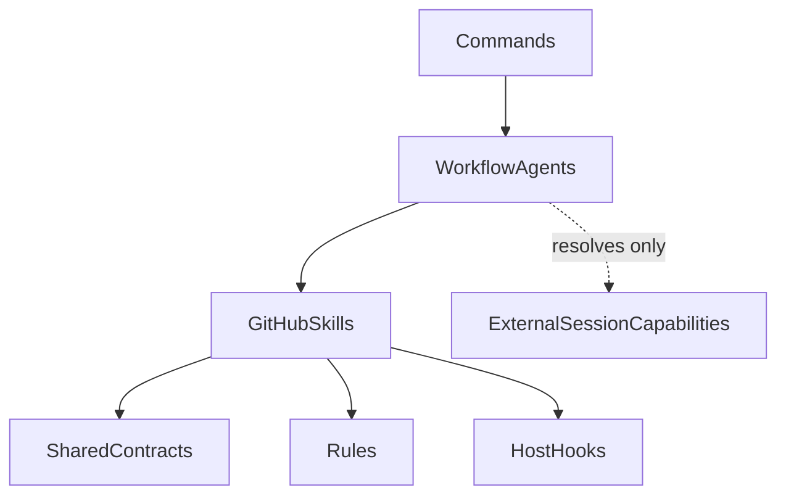

# GitHub Workflow Plugin Documentation

This documentation is the technical entry point for developers and AI agents
working with the CromeSDK `github` plugin. The plugin is also referred to as
the **GitHub Workflow Plugin** in architecture diagrams and workflow
descriptions.

The plugin coordinates evidence-backed GitHub collaboration from issue
preparation through pull-request integration, including internal
review-fix loops and CI wait/rerun/fix loops on existing pull-request head
branches. It does not implement the
product or project code being delivered. The operational behavior remains
defined by the plugin's Skills, Agents, Rules, Hooks, and Shared Contracts;
this documentation explains how those pieces fit together.

## Choose a reading path

### For developers integrating or extending the plugin

1. Read [System overview](architecture/system-overview.md) for boundaries and
   component responsibilities.
2. Read [Shared Contracts](architecture/contracts.md) before changing a
   handoff, schema, or workflow edge.
3. Read [Approval gates](architecture/approval-gates.md) before adding or
   changing a write operation or Hook.
4. Read [Extension points](development/extension-points.md) before adding a
   Command, Agent, Skill, Contract, or Hook.

### For AI agents operating the workflow

1. Confirm the target repository, issue or pull request, branch, and current
   revision from verified evidence.
2. Follow the [Issue-to-merge lifecycle](workflows/issue-to-merge.md) for
   sequencing and handoffs.
3. Resolve project-specific implementation capabilities through
   [External capability resolution](architecture/external-capabilities.md);
   never infer or copy them.
4. Apply the [Approval gates](architecture/approval-gates.md) before every
   mutation and preserve `blocked`, `partial`, and unavailable states.
5. Use the authoritative Skill, Agent, Rule, Hook, and Contract source linked
   from the relevant section rather than treating this overview as a
   replacement.

## Architecture at a glance

Commands are thin entry points. One Command resolves a target, starts one
Agent, and displays the result. Agents own orchestration and bounded dialogue.
Skills own atomic analysis or external operations. Rules own policy. Contracts
carry the structured handoffs. Hooks enforce deterministic, local safety
checks or observe completed operations.

## Source map

The following files are the sources of truth for the corresponding concerns:

| Concern | Source |
| --- | --- |
| Repository overview and packaging guidance | [`../../README.md`](../../README.md) |
| Repository policy, ownership, synchronization, boundaries, and validation | [`../../AGENTS.md`](../../AGENTS.md) |
| Plugin component inventory and routing | This document; the component source files below remain authoritative |
| Portable and host-specific plugin metadata | [`../plugin.json`](../plugin.json), [`../.cursor-plugin/plugin.json`](../.cursor-plugin/plugin.json), [`../.codex-plugin/plugin.json`](../.codex-plugin/plugin.json), [`../.claude-plugin/plugin.json`](../.claude-plugin/plugin.json) |
| Command entry points | [`../commands/`](../commands/) |
| Agent orchestration | [`../agents/`](../agents/) |
| Atomic procedures | [`../skills/`](../skills/) |
| Policy and safety boundaries | [`../rules/`](../rules/) |
| Host Hook projections and checkers | [`../hooks/`](../hooks/) |
| Structured handoffs and contract inventory | [`../shared/schemas/README.md`](../shared/schemas/README.md) |
| Repository-owned configurable hook preferences | [`repository-policy.md`](repository-policy.md) |
| Explicit evidence migration for `0.3.112` | [`architecture/explicit-evidence-migration.md`](architecture/explicit-evidence-migration.md) |
| Immutable pull-request readiness evidence and atomic merge preflight for `0.3.114` | [`architecture/contracts.md`](architecture/contracts.md), [`workflows/issue-to-merge.md`](workflows/issue-to-merge.md), and [`../skills/build-pr-readiness-evidence/SKILL.md`](../skills/build-pr-readiness-evidence/SKILL.md) |
| Contract producers, consumers, and workflow graph | [`../../tests/lib/handoff-graph.ts`](../../tests/lib/handoff-graph.ts), [`../../tests/scenarios/lib/workflow-graphs.ts`](../../tests/scenarios/lib/workflow-graphs.ts) |
| Host compatibility assumptions and limitations | [`../../README.md`](../../README.md) and the host manifests |

This document keeps the concise technical inventory and routing map for the
plugin in one place. The individual Agent, Command, Skill, Rule, Hook, and
Shared Contract files remain authoritative for procedures, policy, host
projections, and schema definitions. Repository-wide ownership, version
synchronization, packaging boundaries, and validation requirements remain in
the root [`AGENTS.md`](../../AGENTS.md).

## Component inventory and routing

This is the concise technical inventory for the installable plugin. It identifies
the responsibility of each component without copying its operational procedure.
The linked Agent, Command, Skill, Rule, Hook, and Shared Contract files remain
the sources of truth.

### Agents

| Agent | Activation | Responsibility |
| --- | --- | --- |
| [issue-agent](../agents/issue-agent.md) | Explicit | Create one new issue or refine one verified existing issue, then hand the exact IssueDraft to its publication Skill. |
| [preparation-agent](../agents/preparation-agent.md) | Explicit | Prepare one qualified issue into an ImplementationPlan, create or reuse the authorized workspace through create-worktree, and verify it read-only. |
| [delivery-agent](../agents/delivery-agent.md) | Explicit | Validate one completed implementation, compose the exact commit and Draft PR handoffs, and delegate routine delivery writes to their owning Skills. |
| [review-agent](../agents/review-agent.md) | Explicit | Analyze one verified PR, apply a matching target-repository AGENTS.md policy before asking for finding or publication decisions, and hand the exact authorized review draft to publication. |
| [feedback-agent](../agents/feedback-agent.md) | Explicit | Collect feedback, identify advisory resolved candidates, triage selected open items, coordinate external resolution, validate results, and hand eligible thread actions to Skills. |
| [integration-agent](../agents/integration-agent.md) | Explicit | Coordinate one PR's readiness, target-repository-policy-aware base refresh and rebase, post-rebase validation, separately authorized merge, issue-closure verification, and cleanup decisions. |
| [host-hooks-agent](../agents/host-hooks-agent.md) | Explicit | Coordinate one verified repository's project-hook generation by delegating interactive host selection and bounded projection to generate-project-hooks. |
| [lifecycle-agent](../agents/lifecycle-agent.md) | Explicit | Sequence issue create or existing-issue refine, then preparation, external implementation, and Draft PR delivery by starting the existing delivery Agents; stop before review. |
| [review-fix-agent](../agents/review-fix-agent.md) | Explicit | Review one verified pull request, confirm mandatory fixes, coordinate external implementation on its existing head branch, commit and non-force push, and repeat until complete or blocked. |
| [ci-fix-agent](../agents/ci-fix-agent.md) | Explicit | Wait for required checks on one verified pull request, rerun only exactly authorized required names, confirm remaining CI failures, coordinate external implementation on its existing head branch, commit and non-force push, and reassess checks until complete or blocked. |
| [pr-ready-agent](../agents/pr-ready-agent.md) | Explicit | Verify one Draft pull request, unique linked issue, and optional reviewer set, then mark it Ready-for-Review after exact authorization. |
| [product-planner-agent](../agents/product-planner-agent.md) | Explicit | Turn one verified parent issue into a prioritized graph of nearly atomic product sub-issues, then hand the approved create set to create-product-sub-issues only after exact user approval. |
| [issue-reprioritize-agent](../agents/issue-reprioritize-agent.md) | Explicit | Inventory currently open issues in one repository, rank them into unique consecutive P1-through-Pn titles with the user, and apply those titles only after exact ranked-set authorization. |
| [issue-close-agent](../agents/issue-close-agent.md) | Explicit | Load one verified issue, require an exact close reason and duplicate target when needed, then close it without a merged pull request after exact authorization. |

feedback-agent owns feedback mode and integration-agent owns integration mode;
they share only verified pull-request identity and must not invoke one another.
review-fix-agent and ci-fix-agent orchestrate their declared Skills for one
pull-request scope and do not publish review actions or perform merge,
Ready-for-Review, rebase, or cleanup writes. lifecycle-agent is the only Agent
that may start other plugin Agents, and may start only issue-agent,
preparation-agent, and delivery-agent sequentially.

### Commands

| Command | Agent | Responsibility |
| --- | --- | --- |
| [create-issue](../commands/create-issue.md) | issue-agent (create) | Resolve one repository, start the Agent, and display the exact issue result. |
| [refine-issue](../commands/refine-issue.md) | issue-agent (refine) | Resolve one issue, start the Agent, and display the exact revision result. |
| [prepare-issue](../commands/prepare-issue.md) | preparation-agent | Resolve one issue, start preparation, and display ImplementationPlan plus BranchWorkspace. |
| [publish-draft-pr](../commands/publish-draft-pr.md) | delivery-agent | Resolve one prepared implementation, start delivery, and display the complete delivery result. |
| [review-pr](../commands/review-pr.md) | review-agent | Resolve one PR, start review, and display findings and the ReviewDecision. |
| [address-pr-feedback](../commands/address-pr-feedback.md) | feedback-agent | Resolve one PR, start feedback follow-up, and display its resolution summary. |
| [integrate-pr](../commands/integrate-pr.md) | integration-agent | Resolve one PR, start integration, and display PullRequestIntegration. |
| [generate-project-hooks](../commands/generate-project-hooks.md) | host-hooks-agent | Resolve one repository, start hook projection, and display the selected-host generation result. |
| [implement-auto-issue](../commands/implement-auto-issue.md) | lifecycle-agent | Resolve one repository and request, start the lifecycle Agent, and display the LifecycleRun through Draft PR publication. |
| [refine-auto-issue](../commands/refine-auto-issue.md) | lifecycle-agent | Resolve one existing issue, start the lifecycle Agent at refine, and display the LifecycleRun through Draft PR publication. |
| [auto-review-fix-pr](../commands/auto-review-fix-pr.md) | review-fix-agent | Resolve one pull request, start the review-fix Agent, and display the ReviewFixRun without publishing a review or merging. |
| [auto-ci-fix-pr](../commands/auto-ci-fix-pr.md) | ci-fix-agent | Resolve one pull request, start the CI-fix Agent, and display the CiFixRun without publishing a review, merging, or treating green checks as Ready-for-Review. |
| [ready-pr](../commands/ready-pr.md) | pr-ready-agent | Resolve one pull request, start Ready-for-Review, and display the PullRequestReady result. |
| [plan-product](../commands/plan-product.md) | product-planner-agent | Resolve one repository and parent issue, start product planning, and display the ProductPlannerRun through overall-plan review and approved sub-issue publication. |
| [reprioritize-issues](../commands/reprioritize-issues.md) | issue-reprioritize-agent | Resolve one repository, start open-issue reprioritization, and display the IssueReprioritization result after exact ranked-set title application. |
| [close-issue](../commands/close-issue.md) | issue-close-agent | Resolve one issue, start triage close, and display the IssueClosure result after exact close-reason authorization. |

Commands are thin entry points: target resolution, one Agent start, and result
display only. They do not repeat Skill chains, publish a second issue or PR,
perform GitHub writes, or invoke another Agent.

### Skills

Each directory below contains the authoritative SKILL.md for one atomic handoff.
Automatic Skills are read-only or diagnostic; explicit mutation Skills retain
their explicit invocation boundary.

| Skill | Atomic responsibility |
| --- | --- |
| analyze-issue | Analyze one loaded issue for evidence-based readiness, gaps, risks, and contradictions. |
| analyze-product-issue | Analyze one loaded parent issue from a product perspective into a ProductAssessment interview basis without creating sub-issues. |
| analyze-pr-diff | Analyze one PR diff across correctness, architecture, security, performance, maintainability, tests, documentation, and scope. |
| apply-issue-priority-titles | Apply one confirmed unique P1-through-Pn ranking as title prefixes on current open issues after exact-set authorization and a live identity check. |
| assess-issue-atomicity | Classify each proposed sub-issue candidate as too-large, atomic-enough, or over-fragmented without creating sub-issues. |
| assess-issue-quality | Assess issue completeness, understandability, implementability, testability, scope, and contradictions. |
| assess-merge-readiness | Transform one complete immutable pull-request readiness snapshot into deterministic diagnostic MergeReadiness. |
| build-pr-readiness-evidence | Normalize fixed-order pull-request reader handoffs into one complete, identity-bound readiness snapshot. |
| build-feedback-resolution-plan | Build a bounded external implementation handoff for selected feedback. |
| build-review-fix-plan | Confirm current findings and open feedback as a host-neutral ReviewFixPlan. |
| build-ci-fix-plan | Confirm remaining failed required checks as a host-neutral CiFixPlan. |
| build-implementation-plan | Build an evidence-based, task-authorized implementation plan without implementing it. |
| build-product-dependency-graph | Map evidenced product and mandatory technical dependencies among classified sub-issue candidates. |
| generate-project-hooks | Ask for Cursor, Codex, or both, then generate only selected project-hook projections without creating gate snapshots, committing, or changing GitHub. |
| check-linked-issue-status | Assess linked-issue state, acceptance coverage, and relationship consistency. |
| check-open-review-threads | Assess current open, resolved, outdated, and unknown review-thread states. |
| check-required-approvals | Inspect explicit review requirements and current approval state. |
| check-required-status-checks | Project one existing check inspection into required versus optional check evidence without another fetch. |
| wait-required-checks | Wait after a verified PR-head push and report required-check outcomes without treating pending or unavailable policy as a pass. |
| rerun-required-checks | Rerun only exactly authorized required check names and verify new live run identities. |
| classify-changes | Classify inspected worktree paths by purpose, component, and task relationship. |
| classify-review-feedback | Classify open feedback by cause, severity, component, and required action. |
| classify-review-findings | Classify deduplicated findings by evidence-supported severity and domain. |
| cleanup-worktree | Remove one authorized merged implementation worktree and verify the result. |
| close-github-issue | Close one verified issue without a merged pull request after exact authorization. |
| close-linked-issue | Perform one separately authorized narrow manual issue closure after merge, or the validated close-on-merge fallback. |
| collect-review-feedback | Collect PR review threads, findings, comments, and required-check feedback. |
| compare-issue-revision | Compare an original issue with one proposed revision without ranking them. |
| compose-commit-message | Compose one exact English CommitProposal from validated evidence. |
| compose-pr-description | Compose one evidence-backed Draft PR description, optionally using a validated link. |
| compose-review | Compose one exact non-publishing ReviewDecision from confirmed findings. |
| compose-product-sub-issues | Compose standalone sub-issue drafts from confirmed atomic units without creating or publishing issues. |
| conduct-product-interview | Interview from a ProductAssessment into confirmed product-decomposition decisions without creating sub-issues. |
| create-commit | Stage the exact approved scope, create one commit, and verify it. |
| create-draft-pr | Create or verify one exact GitHub Draft PR after all delivery gates pass. |
| create-github-issue | Publish and verify one exact new issue or approved issue rewrite. |
| create-product-sub-issues | Publish a fully approved product plan as GitHub sub-issues from confirmed drafts only. |
| create-worktree | Create or explicitly reuse one authorized worktree, including attaching an existing PR head branch. |
| decompose-product-capabilities | Decompose confirmed Product Capabilities into smallest value-oriented units with independent acceptance. |
| define-acceptance-criteria | Define independent observable acceptance criteria from scoped requirements. |
| deduplicate-review-findings | Merge only content-equivalent findings and preserve auditable suppressions. |
| delete-merged-branch | Delete one authorized, fully integrated local or remote branch safely. |
| derive-branch-name | Derive a concise branch name from verified task and convention evidence. |
| detect-rebase-conflicts | Analyze planned or stopped rebase conflicts without resolving them. |
| detect-repository-conventions | Detect mandatory and observed repository conventions read-only. |
| detect-review-findings | Aggregate evidence-backed proposed review findings without publishing. |
| detect-unrelated-changes | Detect foreign, uncertain, or necessary side-effect paths before delivery. |
| evaluate-implementation | Evaluate feasible implementation approaches, fit, risks, and dependencies. |
| fetch-target-branch | Fetch and verify one explicitly selected remote target branch. |
| identify-affected-areas | Map one task to evidenced repository areas and dependencies. |
| identify-product-capabilities | Map a parent issue and confirmed interview into a hierarchical ProductCapabilityMap. |
| identify-resolved-feedback | Identify only clearly evidenced resolved feedback candidates from later state. |
| inspect-pr-checks | Perform the single live PR check, status, and policy-evidence fetch. |
| inspect-repository | Inspect bounded repository context and discovered conventions read-only. |
| inspect-working-tree | Inventory one expected worktree and its path-level Git state. |
| link-pr-to-issue | Validate one unique issue relationship after Draft composition. |
| list-open-issues | Load every currently open GitHub issue in one repository without ranking or writing GitHub. |
| load-github-issue | Load one exact issue snapshot without modifying GitHub. |
| load-linked-issue | Resolve one PR's unique linked issue without guessing. |
| load-pr-discussions | Load one PR's reviews, threads, replies, comments, and discussion state. |
| load-pull-request | Load one exact PR snapshot without analysis or mutation. |
| mark-pr-ready | Mark one authorized open Draft pull request Ready-for-Review and request only the confirmed reviewer set. |
| merge-pull-request | Perform one separately authorized merge after fresh readiness checks. |
| prioritize-product-issues | Rank classified sub-issue candidates with the user without autonomously setting essential priority or creating issues. |
| propose-pr-reviewers | Propose an optional reviewer set without writing GitHub. |
| push-branch | Push one verified branch non-force by default and verify the remote SHA. |
| rank-open-issues | Rank one open-issue inventory into unique consecutive P1-through-Pn proposed titles without writing GitHub. |
| rebase-branch | Perform one separately authorized bounded local rebase and preserve conflicts stopped. |
| reply-to-review-thread | Reply to one exact review thread without resolving it. |
| resolve-context-capabilities | Resolve named session capabilities for implementation planning without execution. |
| resolve-feedback-capabilities | Resolve named session capabilities for selected feedback without execution. |
| resolve-review-thread | Resolve one eligible current thread after validated follow-up. |
| rewrite-github-issue | Draft one implementation-ready issue revision from a ProductInterview or adaptive interview. |
| rewrite-issue | Restructure issue text without interview or GitHub publication. |
| structure-issue | Structure one issue request into a normalized assessment. |
| submit-pr-review | Publish one explicitly approved exact review payload. |
| summarize-feedback-resolution | Summarize validated feedback as resolved, open, disputed, or blocked. |
| update-github-issue | Apply one validated partial issue-field patch and verify it. |
| validate-feedback-resolution | Validate every selected feedback item against current diff, commits, tests, and checks. |
| validate-implementation-result | Consolidate scope, completion, and validation evidence before delivery. |
| validate-rebased-branch | Validate post-rebase history, scope, tests, and checks without mutation. |
| verify-linked-issue-closure | Verify expected automatic issue closure after a verified merge. |
| verify-worktree | Verify one existing workspace read-only before implementation. |

### Rules

| Rule | Policy boundary |
| --- | --- |
| [github-scope-contract.mdc](../rules/github-scope-contract.mdc) | Defines the collaboration boundary and external-capability firewall. |
| [github-safety.mdc](../rules/github-safety.mdc) | Owns the hard-operation safety floor and secret prohibition. |
| [branch-worktree-policy.mdc](../rules/branch-worktree-policy.mdc) | Defines workspace selection, isolation, verification, and reuse boundaries. |
| [github-evidence.mdc](../rules/github-evidence.mdc) | Requires observable evidence for GitHub facts and review findings. |
| [interactive-approval.mdc](../rules/interactive-approval.mdc) | Owns task-scoped routine autonomy and independent hard-operation gates. |
| [commit-policy.mdc](../rules/commit-policy.mdc) | Defines exact-scope, validation, authorization, secret, and commit-history checks. |
| [pull-request-policy.mdc](../rules/pull-request-policy.mdc) | Defines Draft PR content, validation, linkage, duplicate, and ready-state boundaries. |
| [merge-policy.mdc](../rules/merge-policy.mdc) | Defines current merge evidence, strategy, authorization, and post-merge boundaries. |
| [cli-transport-file-lifecycle.mdc](../rules/cli-transport-file-lifecycle.mdc) | Defines the byte-exact temporary CLI transport lifecycle, safe cleanup, and sanitized diagnostics. |
| [product-decomposition-policy.mdc](../rules/product-decomposition-policy.mdc) | Defines nearly atomic GitHub product-issue splits with verifiable acceptance and justified dependencies. |
| [product-interview-policy.mdc](../rules/product-interview-policy.mdc) | Requires an adaptive interview without inventing essential product choices. |
| [issue-priority-title-policy.mdc](../rules/issue-priority-title-policy.mdc) | Defines unique consecutive P-number titles, exact-set authorization, and the exclusive write boundary. |
| [plugin-versioning.mdc](../rules/plugin-versioning.mdc) | Defines component change classes, synchronized versions, migrations, and external compatibility. |

Rules own policy. Agents and Commands reference them; they do not restate the
full safety or approval lists.

### Hooks

| Hook | Host projection | Responsibility |
| --- | --- | --- |
| [pre-commit.mjs](../hooks/pre-commit.mjs) | Cursor beforeShellExecution; Codex PreToolUse | Fail closed before an identified AI commit unless the local PreCommitGate and current worktree evidence pass. |
| [pre-rebase.mjs](../hooks/pre-rebase.mjs) | Cursor beforeShellExecution; Codex PreToolUse | Fail closed before a new local rebase start and allow only metadata-matching recovery of the same active rebase. |
| [pre-pr-create.mjs](../hooks/pre-pr-create.mjs) | Cursor beforeShellExecution; Codex PreToolUse | Fail closed before gh pr create unless the exact Draft gate passes. |
| [pre-review-submit.mjs](../hooks/pre-review-submit.mjs) | Cursor beforeShellExecution; Codex PreToolUse | Fail closed before the canonical review API write unless the exact review gate passes. |
| [pre-pr-ready.mjs](../hooks/pre-pr-ready.mjs) | Cursor beforeShellExecution; Codex PreToolUse | Fail closed before gh pr ready or an authorized reviewer-request write unless the exact Ready gate passes. |
| [pre-merge.mjs](../hooks/pre-merge.mjs) | Cursor beforeShellExecution; Codex PreToolUse | Fail closed before a PR merge unless the complete identity-bound readiness snapshot passes. |
| [post-merge.mjs](../hooks/post-merge.mjs) | Cursor afterShellExecution; Codex PostToolUse | Observe a completed merge and return read-only PostMergeStatus. |

cursor-hooks.json and codex-hooks.json are separate host projections; the
portable manifest contains no Hook declarations. generate-project-hooks.mjs is
the deterministic projection generator. It writes only selected project
configuration and checker copies; gate snapshots remain owning-Skill runtime
evidence and missing or mismatched snapshots fail closed.

### Shared Contracts

[shared/schemas/README.md](../shared/schemas/README.md) is the contract inventory
and handoff-graph source of truth. Its versioned YAML contracts cover issue
snapshots and drafts, repository and planning handoffs, worktree and delivery
handoffs, review and feedback handoffs, integration and cleanup handoffs, host
gate snapshots, lifecycle and product-planning records, Ready-for-Review
records, open-issue reprioritization records, triage-close records, and CI
wait/rerun/fix records. Contract field names, versions, status values, and
approval semantics remain synchronized with Skills, Agents, Commands, and
fixtures; breaking changes require a version change. Repository validation and
synchronization rules belong to the root [AGENTS.md](../../AGENTS.md).

## Scope boundary

The plugin owns:

- GitHub issue and pull-request collaboration.
- Repository identity, repository context, and convention discovery.
- Issue analysis, issue drafting, issue refinement, and issue publication.
- Branch naming, branch/worktree preparation, worktree verification, and
  cleanup coordination.
- Working-tree inspection, exact-scope commit preparation, local commits, and
  verified non-force pushes.
- Draft pull-request composition, issue linkage, publication, and verification.
- Ready-for-Review of one verified Draft pull request through one exact
  standalone transition, followed only when authorized by one exact reviewer
  `POST`; incomplete legacy gates and compound operations fail closed.
- Pull-request diff, check, review, and discussion analysis.
- Review finding composition and publication after the applicable decisions and
  authorization.
- Review-feedback follow-up, including bounded external implementation
  handoffs and validated thread replies or resolutions.
- Internal review-fix planning and delivery on an existing pull-request head
  branch, without publishing a review or mutating discussions.
- Target-branch refresh, rebase coordination, merge readiness, separately
  authorized merge, linked-issue closure verification, and cleanup decisions.
- Triage close of one verified GitHub issue without a merged pull request
  after exact authorization of the repository, issue, and close reason.

The plugin does **not** own source-code implementation, framework or
application architecture, project-specific test design, domain knowledge,
product behavior, or the resolution of implementation or rebase conflicts.
Those responsibilities remain external capabilities or separate workflows.
See [System overview](architecture/system-overview.md) for the full
non-goal list and [External capability resolution](architecture/external-capabilities.md)
for the handoff boundary.

## End-to-end lifecycle

```mermaid
flowchart LR
  issue[Issue]
  plan[ImplementationPlan]
  workspace[VerifiedWorkspace]
  implementation[ExternalImplementation]
  draft[DraftPullRequest]
  ready[ReadyForReview]
  review[ReviewAndFeedback]
  readiness[MergeReadiness]
  merged[MergedPullRequest]
  closure[IssueClosureVerification]
  cleanup[IndependentCleanup]

  issue --> plan
  plan --> workspace
  workspace --> implementation
  implementation --> draft
  draft --> ready
  ready --> review
  review --> readiness
  readiness --> merged
  merged --> closure
  closure --> cleanup
```

The implementation step is deliberately shown as an external capability. The
GitHub plugin prepares and delivers the work, but does not invent the
technology or domain logic required to implement it.

For detailed sequences, forbidden operations, and failure handling, read
[Issue to merge](workflows/issue-to-merge.md). For the data carried between
steps, read [Shared Contracts](architecture/contracts.md).
