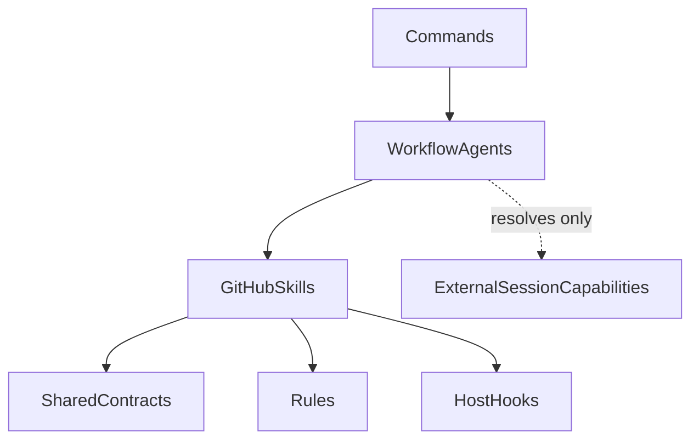

# GitHub Workflow Plugin Documentation

This documentation is the technical entry point for developers and AI agents
working with the CromeSDK `github` plugin. The plugin is also referred to as
the **GitHub Workflow Plugin** in architecture diagrams and workflow
descriptions.

The plugin coordinates evidence-backed GitHub collaboration from issue
preparation through pull-request integration, including internal
review-fix loops and CI wait/rerun/fix loops on existing pull-request head
branches. It does not implement the
product or project code being delivered. The operational behavior remains
defined by the plugin's Skills, Agents, Rules, Hooks, and Shared Contracts;
this documentation explains how those pieces fit together.

## Choose a reading path

### For developers integrating or extending the plugin

1. Read [System overview](architecture/system-overview.md) for boundaries and
   component responsibilities.
2. Read [Shared Contracts](architecture/contracts.md) before changing a
   handoff, schema, or workflow edge.
3. Read [Approval gates](architecture/approval-gates.md) before adding or
   changing a write operation or Hook.
4. Read [Extension points](development/extension-points.md) before adding a
   Command, Agent, Skill, Contract, or Hook.

### For AI agents operating the workflow

1. Confirm the target repository, issue or pull request, branch, and current
   revision from verified evidence.
2. Follow the [Issue-to-merge lifecycle](workflows/issue-to-merge.md) for
   sequencing and handoffs.
3. Resolve project-specific implementation capabilities through
   [External capability resolution](architecture/external-capabilities.md);
   never infer or copy them.
4. Apply the [Approval gates](architecture/approval-gates.md) before every
   mutation and preserve `blocked`, `partial`, and unavailable states.
5. Use the authoritative Skill, Agent, Rule, Hook, and Contract source linked
   from the relevant section rather than treating this overview as a
   replacement.

## Architecture at a glance

Commands are thin entry points. One Command resolves a target, starts one
Agent, and displays the result. Agents own orchestration and bounded dialogue.
Skills own atomic analysis or external operations. Rules own policy. Contracts
carry the structured handoffs. Hooks enforce deterministic, local safety
checks or observe completed operations.

## Source map

The following files are the sources of truth for the corresponding concerns:

| Concern | Source |
| --- | --- |
| Complete plugin inventory | [`../README.md`](../README.md) |
| Routing, ownership, synchronization, and repository boundaries | [`../AGENTS.md`](../AGENTS.md) |
| Portable and host-specific plugin metadata | [`../plugin.json`](../plugin.json), [`../.cursor-plugin/plugin.json`](../.cursor-plugin/plugin.json), [`../.codex-plugin/plugin.json`](../.codex-plugin/plugin.json), [`../.claude-plugin/plugin.json`](../.claude-plugin/plugin.json) |
| Command entry points | [`../commands/`](../commands/) |
| Agent orchestration | [`../agents/`](../agents/) |
| Atomic procedures | [`../skills/`](../skills/) |
| Policy and safety boundaries | [`../rules/`](../rules/) |
| Host Hook projections and checkers | [`../hooks/`](../hooks/) |
| Structured handoffs and contract inventory | [`../shared/schemas/README.md`](../shared/schemas/README.md) |
| Repository-owned configurable hook preferences | [`repository-policy.md`](repository-policy.md) |
| Explicit evidence migration for `0.3.112` | [`architecture/explicit-evidence-migration.md`](architecture/explicit-evidence-migration.md) |
| Immutable pull-request readiness evidence for `0.3.113` | [`architecture/contracts.md`](architecture/contracts.md), [`workflows/issue-to-merge.md`](workflows/issue-to-merge.md), and [`../skills/build-pr-readiness-evidence/SKILL.md`](../skills/build-pr-readiness-evidence/SKILL.md) |
| Contract producers, consumers, and workflow graph | [`../../tests/lib/handoff-graph.ts`](../../tests/lib/handoff-graph.ts), [`../../tests/scenarios/lib/workflow-graphs.ts`](../../tests/scenarios/lib/workflow-graphs.ts) |
| Host compatibility assumptions and limitations | [`../README.md`](../README.md) and the host manifests |

This documentation intentionally links to those sources instead of copying
their complete inventories or operational procedures.

## Scope boundary

The plugin owns:

- GitHub issue and pull-request collaboration.
- Repository identity, repository context, and convention discovery.
- Issue analysis, issue drafting, issue refinement, and issue publication.
- Branch naming, branch/worktree preparation, worktree verification, and
  cleanup coordination.
- Working-tree inspection, exact-scope commit preparation, local commits, and
  verified non-force pushes.
- Draft pull-request composition, issue linkage, publication, and verification.
- Ready-for-Review of one verified Draft pull request through one exact
  standalone transition, followed only when authorized by one exact reviewer
  `POST`; incomplete legacy gates and compound operations fail closed.
- Pull-request diff, check, review, and discussion analysis.
- Review finding composition and publication after the applicable decisions and
  authorization.
- Review-feedback follow-up, including bounded external implementation
  handoffs and validated thread replies or resolutions.
- Internal review-fix planning and delivery on an existing pull-request head
  branch, without publishing a review or mutating discussions.
- Target-branch refresh, rebase coordination, merge readiness, separately
  authorized merge, linked-issue closure verification, and cleanup decisions.
- Triage close of one verified GitHub issue without a merged pull request
  after exact authorization of the repository, issue, and close reason.

The plugin does **not** own source-code implementation, framework or
application architecture, project-specific test design, domain knowledge,
product behavior, or the resolution of implementation or rebase conflicts.
Those responsibilities remain external capabilities or separate workflows.
See [System overview](architecture/system-overview.md) for the full
non-goal list and [External capability resolution](architecture/external-capabilities.md)
for the handoff boundary.

## End-to-end lifecycle

```mermaid
flowchart LR
  issue[Issue]
  plan[ImplementationPlan]
  workspace[VerifiedWorkspace]
  implementation[ExternalImplementation]
  draft[DraftPullRequest]
  ready[ReadyForReview]
  review[ReviewAndFeedback]
  readiness[MergeReadiness]
  merged[MergedPullRequest]
  closure[IssueClosureVerification]
  cleanup[IndependentCleanup]

  issue --> plan
  plan --> workspace
  workspace --> implementation
  implementation --> draft
  draft --> ready
  ready --> review
  review --> readiness
  readiness --> merged
  merged --> closure
  closure --> cleanup
```

The implementation step is deliberately shown as an external capability. The
GitHub plugin prepares and delivers the work, but does not invent the
technology or domain logic required to implement it.

For detailed sequences, forbidden operations, and failure handling, read
[Issue to merge](workflows/issue-to-merge.md). For the data carried between
steps, read [Shared Contracts](architecture/contracts.md).
