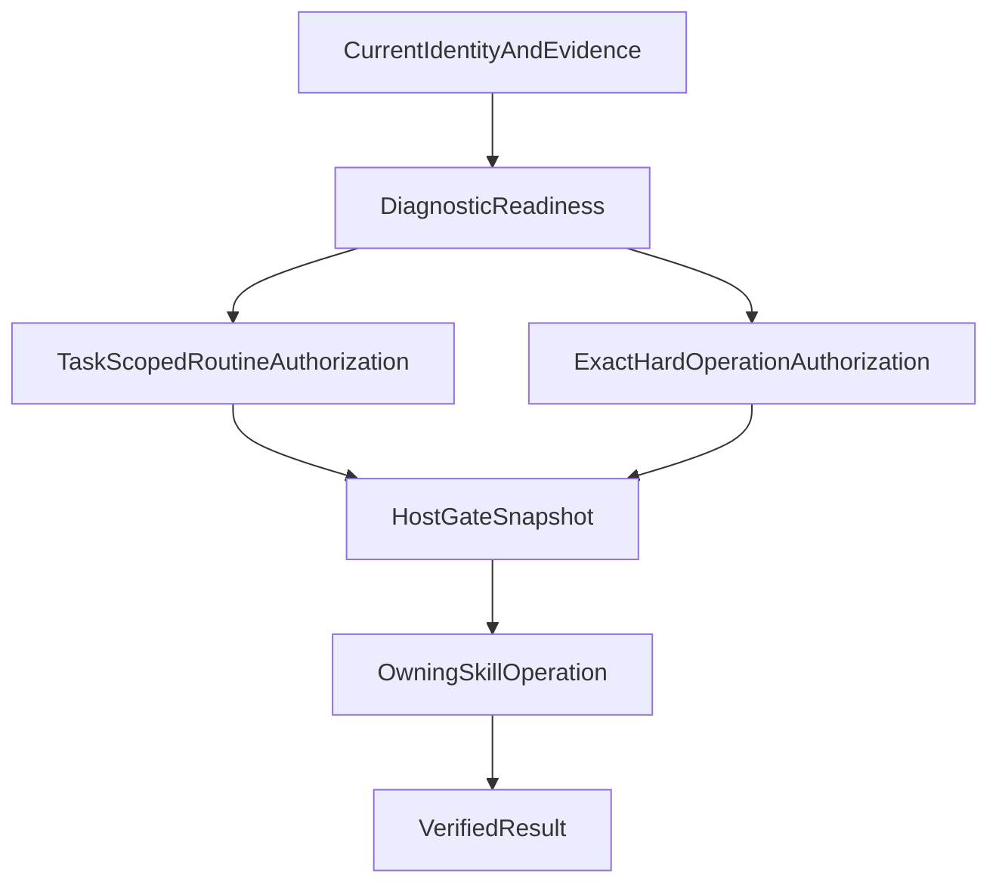

# Approval and safety gates

The GitHub plugin separates evidence, readiness, authorization, and
execution. A successful analysis or a completed earlier step never grants
permission for a different operation. Every write is bound to an exact
repository, target, revision, scope, and operation.

The normative sources are
[`interactive-approval.mdc`](../../rules/interactive-approval.mdc),
[`github-safety.mdc`](../../rules/github-safety.mdc),
[`commit-policy.mdc`](../../rules/commit-policy.mdc),
[`pull-request-policy.mdc`](../../rules/pull-request-policy.mdc), and
[`merge-policy.mdc`](../../rules/merge-policy.mdc).

## Gate layers

There are four related but distinct layers:

1. **Evidence gates** establish what is currently true.
2. **Routine delivery authorization** permits ordinary, bounded delivery
   writes inside one verified task scope.
3. **Independent hard-operation authorization** permits operations with
   irreversible, history-changing, review-state, or default-branch impact.
4. **Host Hooks** deterministically check the exact command and local gate
   immediately before a write, or observe the result afterward.

An authorization without current identity or validation is insufficient. A
Hook gate without the required authorization is insufficient. A positive
readiness result is diagnostic and cannot substitute for either authorization
layer.

## Routine delivery authorization

One task-scoped authorization can cover the ordinary delivery sequence when
the repository, task, branch/worktree, and path scope remain the same. It may
cover:

- publishing one new issue or one approved rewrite;
- applying one verified issue-field update;
- creating or reusing the authorized implementation worktree;
- creating one exact local commit;
- pushing the prepared branch without force;
- creating one Draft pull request.

The authorization record must preserve:

- verified repository identity;
- issue or stable task identity;
- target and working branch;
- verified worktree path;
- operations covered;
- source such as task intent, completed Plan Build, or repository policy;
- evidence and the last validated path scope.

Routine authorization does not cover a new repository, issue, pull request,
branch target, materially different scope, or any hard operation. A changed
file list inside the same task is re-inspected and revalidated; it is not
silently accepted.

The explicitly invoked `/implement-auto-issue` command establishes one
task-scoped routine authorization covering issue create and refine, workspace
creation or reuse, local commit, non-force push, and Draft pull-request
publication for the produced issue. It does not authorize review publication,
rebase, merge, Ready-for-Review, or cleanup.

The explicitly invoked `/refine-auto-issue` command establishes one
task-scoped routine authorization covering issue refine for the verified
existing issue, workspace creation or reuse, local commit, non-force push, and
Draft pull-request publication. It does not authorize issue create, review
publication, rebase, merge, Ready-for-Review, or cleanup. `/refine-issue`
remains the refine-only Command.

The explicitly invoked `/auto-review-fix-pr` command establishes one
task-scoped routine authorization for the exact `pr:<number>` identity,
existing head branch, and approved worktree. It covers attaching or reusing
that worktree, one exact local commit per confirmed iteration, and one
verified non-force push per iteration. It does not authorize review
publication, thread reply or resolution, a second pull request,
Ready-for-Review, rebase, merge, force-push, deletion, cleanup, or
default-branch writes. New candidate items require host-neutral
`ReviewFixPlan` confirmation; every push invalidates prior head evidence and
starts a fresh review pass.

The explicitly invoked `/auto-ci-fix-pr` command establishes one task-scoped
routine authorization for wait, exact required-check rerun, existing-head
worktree attachment, one exact commit per confirmed iteration, and one
verified non-force push. It does not authorize review publication, Ready-for-Review,
rebase, merge, optional-check reruns, or treating pending checks as pass.

The explicitly invoked `/ready-pr` command establishes authorization only for
the exact verified pull request, current head SHA, unique linked issue, and
confirmed typed reviewer set. Ready-for-Review and reviewer assignment remain
two separate mutations: `gh pr ready <number> --repo <owner>/<repo>` is
authorized and verified while the PR is Draft; only afterward may one exact
`requested_reviewers` `POST` use the authorized set. Neither mutation inherits
the other's authority. The command does not authorize review publication,
rebase, merge, or cleanup.

The explicitly invoked `/plan-product` command starts `product-planner-agent`
and establishes orchestration authorization for exactly one verified parent
issue. It covers analysis, interview, capability mapping, iterative
decomposition, atomicity review, dependency analysis, prioritization,
sub-issue drafting, and overall review. It does not authorize creating,
overwriting, or closing GitHub issues. Publication of the composed sub-issue
set requires one explicit user approval of the overall plan, including the
complete issue structure, order, parallel groups, priorities, open decisions,
and exact draft payloads, before one `create-product-sub-issues` handoff.

The explicitly invoked `/reprioritize-issues` command starts
`issue-reprioritize-agent` and establishes orchestration authorization for
exactly one verified repository. It covers listing currently open issues and
ranking unique consecutive P-number titles. It does not authorize GitHub
title writes. Applying those titles requires one explicit user approval of
the exact current open-issue set, order, and proposed titles.

The explicitly invoked `/close-issue` command starts `issue-close-agent` and
establishes orchestration authorization for exactly one verified issue. It
covers read-only loading. It does not authorize the GitHub close write.
Closing requires one explicit user approval of the repository, issue, and
close reason, including the duplicate target when the reason is `duplicate`.

## Independent hard-operation authorization

The following operations require their own exact user authorization or a clear,
scope-matched policy in the target repository:

| Operation | Why it is separate | Owning workflow |
| --- | --- | --- |
| Publish a review as `REQUEST_CHANGES` or another review event | Changes review state and may block or affect integration. | `review-agent` and [`submit-pr-review`](../../skills/submit-pr-review/SKILL.md) |
| Fetch a named target branch | Changes local remote-tracking state and must bind to one exact target. | [`fetch-target-branch`](../../skills/fetch-target-branch/SKILL.md) |
| Rebase a feature branch | Rewrites local history and invalidates previous readiness evidence. | [`rebase-branch`](../../skills/rebase-branch/SKILL.md) |
| Force-with-lease push | Rewrites the matching remote branch and requires exact lease evidence. | [`push-branch`](../../skills/push-branch/SKILL.md) |
| Merge a pull request | Changes the target branch and is irreversible at the collaboration level. | [`merge-pull-request`](../../skills/merge-pull-request/SKILL.md) |
| Mark a Draft pull request Ready-for-Review | Changes pull-request visibility and may request reviewers. | `pr-ready-agent` and [`mark-pr-ready`](../../skills/mark-pr-ready/SKILL.md) |
| Close a linked issue manually | Changes issue state after automatic closure was verified not to occur. An exact validated close-on-merge intent may replace the conversational approval only for the `integrate-pr` fallback. | [`close-linked-issue`](../../skills/close-linked-issue/SKILL.md) |
| Triage-close an issue without a merge | Changes issue state for duplicate, not-planned, or not-delivered outcomes without a merged pull request. | `issue-close-agent` and [`close-github-issue`](../../skills/close-github-issue/SKILL.md) |
| Delete a merged branch | Removes a local or remote reference. | [`delete-merged-branch`](../../skills/delete-merged-branch/SKILL.md) |
| Remove an implementation worktree | Deletes a workspace and can destroy uncommitted work if checks are wrong. | [`cleanup-worktree`](../../skills/cleanup-worktree/SKILL.md) |

Rebase and merge approvals are independent. A merge-ready pull request is not
an approved merge target until the final live preflight and exact strategy
authorization pass.

The `integrate-pr` workflow coordinates these phases but does not bundle their
approvals. Its lifecycle record must preserve deferred, blocked, and separately
authorized operations.

## Repository policy substitution

Before requesting a user approval, the workflow reads the applicable
target-repository `AGENTS.md`. A policy may replace the conversational gate
only when it clearly identifies:

- the exact operation;
- the repository and relevant issue, pull request, branches, worktree, or
  remote;
- the permitted scope, strategy, or target;
- the authorization condition.

The policy changes the approval source, not the evidence requirements. The
workflow must still verify identity, freshness, scope, validation, Hook
inputs, and post-operation results. An ambiguous, conflicting, or
scope-unclear policy leaves the normal gate in place.

No policy, task authorization, readiness result, or user request can authorize
publishing secrets, credentials, private keys, tokens, personal data, or
other confidential information.

## Readiness is not authorization

`MergeReadiness` is a diagnostic assessment. It can be `ready`,
`needs-attention`, or `blocked`, but even `ready` does not authorize a merge.
Immediately before the merge write, the workflow must still verify:

- the pull request is open and not Draft;
- the current head and base revisions match the approved target;
- no unresolved merge conflict exists;
- no blocking change request or required thread remains;
- required approvals and required checks are satisfied;
- exactly one issue is linked with evidence;
- the selected strategy is allowed and explicitly authorized.

After a rebase or push, every source handoff and the complete readiness
snapshot are invalidated. The branch must be validated, all reader sources
must be collected again, a new `PullRequestReadinessEvidence` must be built,
and `MergeReadiness` must be assessed again.

## Host gate snapshots

The owning Skill writes a local gate snapshot immediately before the command.
The host Hook consumes that snapshot and the command context. It does not
repair missing prerequisites or make a product judgment.

| Contract | Before | Required evidence | Hook result |
| --- | --- | --- | --- |
| [`PreCommitGate`](../../shared/schemas/PreCommitGate.yaml) | canonical `git -C <verified-worktree> commit --cleanup=verbatim --file=<approved-message-file>` | Version-4 gate with version-2 validation, every explicit evidence requirement satisfied (or an explicitly empty list), exact path union, clean identity, secret check, commit authorization, current `HEAD`, exact message-file bytes, cached staged-index fingerprint, and a fresh `GateLifecycle` authority. | Atomically claim and allow only the exact standalone approved commit; wrappers, extra segments, alternate message sources, pathspecs, options, index drift, replay, expiry, or unmet evidence fail closed. |
| [`PreRebaseGate`](../../shared/schemas/PreRebaseGate.yaml) | local `git rebase` start or standalone recovery | Version-2 gate with exact pull-request branch, clean worktree, selected target SHA, remote context, rebase authorization, and a lifecycle operation specific to `start`, `continue`, `skip`, or `abort`. | Allow only the one named bounded operation with a fresh claimed gate; a gate for one rebase phase never authorizes another phase. |
| [`PrePrCreateGate`](../../shared/schemas/PrePrCreateGate.yaml) | `gh pr create` | Version-3 gate with version-2 validation, every explicit evidence requirement satisfied (or an explicitly empty list), verified commit and push, complete Draft body, unique issue link, exact command, and a fresh lifecycle authority. | Allow only the approved Draft PR creation once; failure or replay cannot reuse the gate. |
| [`PreReviewSubmitGate`](../../shared/schemas/PreReviewSubmitGate.yaml) | canonical review API write | Version-2 gate with current head, exact findings, valid locations, deduplication, confirmation, publication authorization, and a fresh lifecycle authority. | Allow only the exact review payload once; the claim precedes semantic validation. |
| [`PrePrReadyGate`](../../shared/schemas/PrePrReadyGate.yaml) | one canonical `gh pr ready` and, separately, one `requested_reviewers POST` | Version-2 gate with exact URL/branches/SHA, phase-specific Draft state, exactly one linked issue, typed reviewer set, and operation-specific lifecycle authority (`pre-pr-ready` or `pre-reviewer-request`). | Allow only one standalone phase-appropriate operation; reject legacy/incomplete gates, compound commands, identity drift, replay, and payload mismatch. |
| [`PreMergeGate`](../../shared/schemas/PreMergeGate.yaml) | merge API write | Version-4 gate with final live preflight, version-3 `MergeReadiness`, one complete version-1 `PullRequestReadinessEvidence` snapshot, exact strategy, authorization, required head compare-and-set, and a fresh lifecycle authority. | Fail closed on any missing, mixed, stale, partial, unavailable, identity-mismatched, expired, or replayed state; one consumed gate may create at most one non-authorizing receipt. |
| [`PostMergeStatus`](../../shared/schemas/PostMergeStatus.yaml) | after merge | Completed command, PR state, merge commit, target branch, issue closure, and cleanup availability. | Return read-only status and open actions; never mutate cleanup state. |

The six pre-operation checkers are reached through the shared
[`hooks/dispatch.mjs`](../../hooks/dispatch.mjs). Cursor keeps its
operation-specific, fail-closed matchers, while Codex registers one dispatcher
for `PreToolUse` and one for `PostToolUse`; the latter routes only merge
completion to `post-merge.mjs`. The dispatcher classifies quoted shell tokens
without live reads, rejects compound protected commands before a checker starts,
and returns the native host envelope for irrelevant commands. The canonical
runtime state used by the checkers is ignored local state at
`.github/github-plugin/state/`. The state is host-neutral: Cursor and Codex
copy and invoke the same `hooks/lib/gate-state.mjs` helper. A gate snapshot
records evidence and an already-authorized operation; it does not create
conversation approval by itself.

## Canonical one-shot lifecycle

Every authorizing gate contains a version-1 `GateLifecycle` object. Its
`operation` identifies exactly one protected mutation, `nonce` is a fresh
cryptographically random operation identifier, and `issued_at`/`expires_at`
are the authoritative five-minute lifetime. `issued_at` may be at most 60
seconds in the future. An authority has `state: authority`, `authorizes: true`,
and null consumption fields. `written_at` remains domain evidence and never
replaces the lifecycle clock.

Owner Skills publish through the common helper with a same-directory temporary
file, flush/sync, non-overwriting atomic publish, and final-byte reread. The
Hook first atomically claims the authority out of the canonical path and only
then performs the existing semantic checks. A persistent plugin-owned
consumption marker prevents nonce replay after allow, command failure,
semantic denial, timeout, or process restart. Missing, malformed, mismatched,
expired, future-skewed, old-version, or already-consumed state is fail-closed
and is quarantined without recursive deletion. Processing and cleanup errors
remain bounded diagnostics and never become permission.

`pre-pr-ready` and `pre-reviewer-request` are separate one-shot operations,
as are `pre-rebase-start`, `pre-rebase-continue`, `pre-rebase-skip`, and
`pre-rebase-abort`. A consumed `pre-merge` authority may create exactly one
`post-merge-receipt.json`; the receipt has `state: receipt`,
`authorizes: false`, `operation: pre-merge`, the consumed nonce,
`consumed_at`, and a five-minute `receipt_expires_at`. `post-merge` observes,
atomically consumes, and removes it once. A replay, missing receipt, or older
plugin version cannot derive merge, issue-closure, branch-deletion, or
worktree-cleanup authority.

## Deterministic dispatch and bounded runtime

`dispatch.mjs` reads the host event with a 2 MiB input limit and selects no more
than one checker. `lib/run-command.mjs` gives every Git and `gh` child a fixed
5-second timeout, explicit output limits, and structured error classes for
timeouts, output overflow, authentication or network failure, malformed output,
and ordinary command failure. The total budget is 25 seconds for every
pre-operation checker and 40 seconds for post-merge observation, leaving
headroom below the Cursor and Codex host limits.

The adjacent `lib/run-command-worker.mjs` owns child termination and reaping.
On Windows it uses process-tree cleanup so a timed-out GitHub CLI or credential
helper cannot outlive the hook; on supported POSIX runtimes it terminates the
process group and waits for the child. There are no retries after timeout,
partial output, network failure, or ambiguous command completion. A protected
pre-hook maps these conditions to its existing native deny envelope. A
post-hook preserves its read-only `PostMergeStatus` contract and marks
incomplete or malformed relationship evidence unavailable rather than treating
it as complete.

## Project-hook generation

The explicit
[`generate-project-hooks`](../../skills/generate-project-hooks/SKILL.md) Skill
asks the user interactively to select Cursor, Codex, or both before writing a
projection into one verified target repository. Cursor's thin
[`generate-project-hooks`](../../commands/generate-project-hooks.md) Command
starts `host-hooks-agent`; Codex invokes the Skill directly because its plugin
manifest does not register Commands.

The deterministic
[`generate-project-hooks.mjs`](../../hooks/generate-project-hooks.mjs) script
writes only the selected `.cursor/hooks.json` and/or `.codex/hooks.json`,
the shared dispatcher, checker and runner copies, local-state ignore paths, and
the marked `AGENTS.md` guidance block, and the version-1 ownership manifest at
`.github/github-plugin/project-hooks-manifest.json`. It computes the complete
desired state in memory and preflights every target path, directory, symlink,
marker, ownership record, and conflict before the first target write. It may
replace only an unchanged manifest-owned artifact or a legacy artifact whose
generated header/source hash/readme configuration hash proves ownership.

The write lifecycle is all-or-nothing: same-filesystem staging, a persisted
journal, byte-exact backups, controlled rename/replace steps, and final
manifest/artifact hash verification. Normal failures roll back the complete
old state. An incomplete journal under
`.github/github-plugin/.project-hooks-transaction/` is deterministically
restored on the next run; a committed journal is accepted only after its
manifest and artifact hashes are reverified. Cleanup failures remain explicit
`partial` evidence. Host deselection removes only unchanged artifacts listed
for the removed host in the manifest, while unknown files and user content are
preserved.

The generator copies the common `gate-state.mjs` helper into both projections,
emits only `.github/github-plugin/state/` and the temporary transaction path in
its managed ignore block, and never creates gate files or placeholders. Unknown
files are never claimed or recursively deleted. Missing, stale, or mismatched
canonical state remains an intentional fail-closed result rather than a setup
failure the generator may repair.

## Stop conditions

Stop and preserve the failure when:

- repository, branch, worktree, issue, pull request, or head identity is
  missing or ambiguous;
- a handoff has the wrong contract version or missing required fields;
- the working tree contains foreign, staged, deleted, or unapproved paths;
- validation is failed, partial, skipped, not run, or lacks reproducible
  evidence;
- a required approval or required check is missing, failed, pending, skipped,
  or unavailable;
- the target head or base changed after analysis;
- a Hook cannot verify the exact command and gate;
- a rebase conflict, merge conflict, or unsafe cleanup state is present;
- a required authorization is absent or does not identify the exact operation;
- a secret or confidential value is found.

Use `blocked` or `partial` with concrete evidence and a next step. Do not
convert uncertainty into approval, and do not use `--no-verify`, force
operations, resets, or cleanup to make a gate pass.
