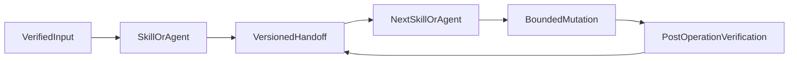

# Shared Contracts

Shared Contracts are versioned, human-readable YAML descriptions of the
handoffs between GitHub Skills and Agents. They are not a runtime schema
library and they do not authorize an operation by themselves. The complete
inventory and handoff graph are maintained in
[`shared/schemas/README.md`](../../shared/schemas/README.md).

The contract system keeps GitHub collaboration independent from the
implementation language and architecture of the target repository. A
handoff preserves identity, evidence, availability, uncertainty, scope, and
authorization state so the next Skill can make a bounded decision.

## Contract families

The plugin currently defines 83 versioned contracts.

### Issue and linkage contracts

| Contract | Purpose |
| --- | --- |
| `LoadedIssue` | Read-only snapshot of one issue, including preserved content, metadata, comments, related pull requests, and availability evidence. |
| `IssueAnalysis` | Evidence-based requirements, gaps, contradictions, findings, and implementation-readiness analysis. |
| `ProductAssessment` | Read-only product-topic extraction from one parent issue as interview-prep, including mixed features, implicit requirements, and unclear decisions, without creating sub-issues. |
| `ProductInterview` | Adaptive product-interview record from one ProductAssessment, including confirmed decisions, assumptions, and open questions for later decomposition, without creating sub-issues. |
| `ProductCapabilityMap` | Hierarchical Capability Map from one parent issue and one confirmed ProductInterview, grouping requirements by independently understandable Product Value without creating sub-issues. |
| `ProductCapabilityDecomposition` | Iterative decomposition of confirmed Product Capabilities into the smallest value-oriented units with one observable outcome and independent acceptance, without creating sub-issues. |
| `IssueAtomicityAssessment` | Read-only atomicity classification of each proposed sub-issue candidate as too-large, atomic-enough, or over-fragmented, without creating sub-issues. |
| `ProductDependencyGraph` | Read-only directed dependency graph of classified sub-issue candidates, distinguishing evidenced product and mandatory technical relations without ranking slices by technical order or creating sub-issues. |
| `ProductIssuePrioritization` | Read-only MoSCoW ranking of classified sub-issue candidates with recommended versus confirmed classes, six-dimension rationales, explicit user decisions, and divergences between product priority and required implementation order, without creating sub-issues. |
| `ProductSubIssueDrafts` | Read-only complete English sub-issue drafts from confirmed atomic units, preserving parent, capability, requirement, dependency, priority, and constraint traceability without creating or publishing sub-issues. |
| `IssueAssessment` | Clarification state, locked requirements, non-goals, assumptions, and readiness. |
| `IssueDraft` | Task-authorized create or edit payload, labels, publication mode, and verification evidence. |
| `IssueUpdate` | Task-authorized partial field update with live baseline, preview, applied effects, and verification. |
| `OpenIssueInventory` | Read-only inventory of currently open GitHub issues in one repository, excluding pull requests. |
| `OpenIssueRanking` | Unique consecutive P1-through-Pn ranking of that inventory with exact proposed titles and exact-set authorization. |
| `IssueReprioritization` | Exact-set title-application result with live-identity preflight, per-issue updates, and verification. |
| `IssueClosure` | Exact authorized triage close of one verified issue without a merged pull request, including close reason, duplicate target, live preflight, and verification. |
| `IssueRevisionComparison` | Semantic comparison of an original issue and proposed revision, including scope drift and contradictions. |
| `LinkedIssue` | Resolution of one pull request's issue candidates, distinguishing unique linkage from mentions and ambiguity. |
| `LinkedIssueStatusAssessment` | Current linked-issue state, acceptance-criteria coverage, closing relationship, and integration blockers. |
| `LinkedIssueClosureVerification` | Read-only post-merge verification of expected automatic issue closure. |
| `LinkedIssueClosure` | Version 2 separately authorized narrow closure after automatic closure did not occur, including the exact validated close-on-merge fallback authorization. |

### Repository, planning, and capability contracts

| Contract | Purpose |
| --- | --- |
| `RepositoryContext` | Verified repository identity, Git state, remotes, instructions, relevant paths, technologies, and commands. |
| `RepositoryConventions` | Evidence-backed mandatory and observed repository practices with authority, confidence, and conflicts. |
| `AffectedAreas` | Direct, indirect, and uncertain repository impact mapped from a task or issue. |
| `ImplementationEvaluation` | Feasibility, architectural fit, complexity, compatibility, dependencies, risks, testing implications, and alternatives. |
| `ContextCapabilities` | Relevant available or missing Skills, Rules, Agents, Tools, and domain capabilities for planning. |
| `ImplementationPlan` | Task-authorized objective, ordered steps, dependencies, validation, workspace, risks, blockers, assumptions, and delivery authorization. |
| `BranchNameProposal` | Evidence-backed branch name candidate, convention, rationale, and alternatives. |

### Workspace and delivery contracts

| Contract | Purpose |
| --- | --- |
| `TargetBranchFetch` | Exact authorized remote target-branch fetch and SHA verification. |
| `RebaseConflictAnalysis` | Read-only analysis of a planned or stopped rebase conflict. |
| `BranchRebase` | Exact authorized local rebase result, including preflight, conflict or success state, and post-rebase verification. |
| `BranchWorkspace` | Branch/worktree identity, base revision, isolation mode, cleanup authorization, and verification evidence. |
| `WorkingTreeInspection` | Read-only branch/worktree status, changed paths, diff statistics, and unexpected-state markers. |
| `ChangeClassification` | Purpose, component, issue/plan relationship, and evidence-backed scope classification for each path. |
| `UnrelatedChangeDetection` | Foreign, uncertain, or necessary technical side effects and independent commit/PR scope gates. |
| `ValidationResult` | Version-2 plan completion, acceptance, required validations, explicit evidence requirements, scope, blockers, warnings, and diagnostic readiness. |
| `CommitProposal` | Exact repository-relative path scope, English commit message, rationale, validation evidence, authorization, and result. |
| `BranchPush` | Verified branch, remote, upstream, local status, authorization, and post-push SHA. |
| `PullRequestDraft` | Evidence-backed English Draft PR title/body, issue linkage, branch identity, validations, and publication result. |
| `PullRequestIssueLink` | One evidence-backed relationship between one Draft PR and exactly one issue. |
| `PullRequestReady` | Exact authorized Ready-for-Review intent, optional confirmed reviewers, live preflight, and verification. |

### Pull-request evidence and review contracts

| Contract | Purpose |
| --- | --- |
| `LoadedPullRequest` | Read-only PR snapshot with content, head/base revisions, commits, files, checks, reviews, draft state, and metadata. |
| `PullRequestDiffAnalysis` | Evidence-backed diff analysis across correctness, architecture, security, performance, maintainability, tests, documentation, and scope. |
| `PullRequestCheckInspection` | Check, status, CI, branch-protection, and ruleset evidence with pass, fail, pending, skipped, or missing outcomes. |
| `RequiredCheckWait` | Wait for required checks after a verified head without treating pending or unavailable policy as a pass. |
| `RequiredCheckRerun` | Exact authorized rerun of failed required checks with live run-identity verification. |
| `CiFixPlan` | Host-neutral confirmed plan of remaining failed required checks on an existing PR head. |
| `CiFixRun` | Lifecycle record for wait, authorized rerun, and bounded CI-fix iterations. |
| `RequiredApprovalInspection` | Explicit review requirements, effective approvals, change requests, pending requests, and missing conditions. |
| `LoadedPullRequestDiscussions` | Reviews, grouped threads, replies, comments, authors, locations, timestamps, and resolution state. |
| `OpenReviewThreadAssessment` | Open, resolved, outdated, and unknown thread states, required problems, optional discussions, and uncertainties. |
| `DetectedReviewFindings` | Source-level aggregation of diff, issue, check, discussion, and external-rule evidence. |
| `DeduplicatedReviewFindings` | Content-level comparison that merges equivalent findings and records auditable suppressions. |
| `ClassifiedReviewFindings` | Evidence-supported severity and domain classification of every deduplicated finding. |
| `ReviewFinding` | One evidence-backed finding with location, impact, recommendation, severity, and verification. |
| `ReviewDecision` | Composition or authorized publication payload for a comment, approval, or request for changes. |
| `MergeReadiness` | Diagnostic readiness from current draft state, reviews, threads, approvals, checks, conflicts, linkage, and blockers. |

### Feedback and thread-action contracts

| Contract | Purpose |
| --- | --- |
| `CollectedReviewFeedback` | Grouped open, resolved, outdated, or addressed feedback from threads, findings, comments, and checks. |
| `ClassifiedReviewFeedback` | Cause, severity, affected component, and required action for selected open feedback. |
| `FeedbackResolutionCapabilities` | External capabilities available or missing for explicitly confirmed feedback IDs at one PR head. |
| `FeedbackResolutionPlan` | Bounded corrections, dependencies, validations, risks, and external implementation handoffs. |
| `ResolvedReviewFeedback` | Advisory candidates supported by later commits, diff, tests, and current discussion evidence. |
| `FeedbackResolutionValidation` | Per-item addressed, partial, not-addressed, or unverifiable result with current evidence. |
| `FeedbackResolutionSummary` | Resolved, open, disputed, and blocked feedback outcomes with next steps and diagnostic merge impact. |
| `ReviewThreadReply` | Exact evidence-backed reply to one thread without resolving it. |
| `ReviewThreadResolution` | Exact eligible resolution of one validated open thread. |

### Integration, cleanup, and host-gate contracts

| Contract | Purpose |
| --- | --- |
| `PullRequestMerge` | Exact authorized merge intent, current readiness, live preflight, selected strategy, and result. |
| `PullRequestIntegration` | Lifecycle record for readiness, target refresh, rebase, validation, push, merge, closure verification, and cleanup decisions. |
| `LifecycleRun` | Autonomous issue-to-draft-PR record through create or existing-issue refine, then preparation, external implementation, and Draft PR delivery. |
| `ProductPlannerRun` | Interactive parent-issue product-planning record through analysis, interview, mapping, decomposition, atomicity, dependencies, prioritization, sub-issue drafting, and publication handoff only after exact user approval. |
| `ProductSubIssuePublication` | Exact-set publication result mapping approved product-plan unit IDs to GitHub issue numbers and URLs, with parent and hard-dependency relationship outcomes and failed operations. |
| `CleanupResult` | Authorized branch/worktree cleanup results, preserved unsafe targets, and local/remote outcomes. |
| `PreCommitGate` | Version-3 local snapshot binding one exact canonical commit to validated scope, worktree identity, authorization, exact message bytes, and cached staged-index contents. |
| `PreRebaseGate` | Local snapshot binding one exact rebase start to the verified branch, target, worktree, and authorization; its identity evidence can be reused only for a matching active-rebase recovery. |
| `PrePrCreateGate` | Version-2 local snapshot binding one exact Draft PR publication to commit, push, issue link, description, and version-2 validation. |
| `PreReviewSubmitGate` | Local snapshot binding one exact review payload to current evidence, deduplication, confirmation, and authorization. |
| `PrePrReadyGate` | Version-1 local snapshot binding one standalone Ready-for-Review transition and, only when authorized after that transition, one exact requested-reviewers POST to complete Draft/URL/branch/SHA identity, unique issue, typed reviewer set, and authorization. |
| `PreMergeGate` | Local snapshot binding one exact merge to current readiness and exact merge authorization. |
| `PostMergeStatus` | Read-only post-merge PR, merge-commit, linked-issue, and cleanup status. |

The grouping is explanatory. A contract's authoritative fields, versions,
status values, and approval semantics are defined only in its YAML file.

## Handoff rules

Every consumer must verify the supplied handoff before using it:

- accept only the declared contract version;
- preserve repository, issue, pull request, branch, worktree, and revision
  identity;
- preserve source status, unavailable fields, conflicts, assumptions, and
  uncertainty;
- confirm that the input's scope matches the current task and operation;
- reject missing required fields and incompatible producer/consumer edges;
- return `partial` or `blocked` instead of fabricating unavailable evidence.

An `ImplementationContext` may be used as prose in the workflow; it is not a
versioned Shared Contract. External implementation capabilities are referenced
by session identity rather than embedded content.

## Status and authorization semantics

Common statuses describe evidence state, not permission:

- `resolved` means the required input or capability is available and
  identity-matched.
- `partial` means some evidence exists but a required field, check, or
  capability is unresolved.
- `blocked` means the workflow cannot safely continue.
- `passed` or `ready` means the relevant validation or diagnostic condition
  passed; it does not create authorization.
- `failed`, `skipped`, `not_run`, `pending`, `missing`, or `unverified` must
  remain explicit and must not be reported as success.

Routine authorization and hard-operation authorization are carried as
structured evidence where the contract defines them. A `Pre*Gate` records the
last validated facts immediately before a command; it is not an approval
source. See [Approval gates](approval-gates.md).

## Versioning and change procedure

Apply the [`plugin-versioning`](../../rules/plugin-versioning.mdc) Rule as the
policy source for change classification, package-version synchronization,
public migration and changelog requirements, and external capability
compatibility. The contract-specific procedure is:

Change a contract only when the producer, consumer, fixture, and tests can be
updated together. The required sequence is:

1. Classify the change as additive and compatible, breaking, or internal
   refactoring under the `plugin-versioning` Rule.
2. Keep the existing version for compatible optional additions only when the
   Rule and the contract's source rules permit them.
3. Increment the contract version for a breaking field, status, identity, or
   authorization change.
4. Update the YAML description and
   [`shared/schemas/README.md`](../../shared/schemas/README.md).
5. Update valid fixtures, the handoff graph, invariant helpers, and contract
   tests.
6. Update the affected Skill, Agent, Command, and inventory documentation.
7. Run `npm run typecheck` when TypeScript helpers change and `npm test` from
   the repository root.

Do not add a contract only to make an undocumented operation appear
supported. The contract must describe a real bounded handoff with an owning
producer and consumer.

## Contract validation

The plugin's contract tests validate:

- all 83 schema descriptions and minimal valid fixtures;
- required fields, versions, enums, and nested payloads;
- producer/consumer compatibility;
- Command-to-Agent ownership and forbidden operation graphs;
- deep invariants for planning, review findings, validation,
  merge-readiness, and cleanup;
- fail-closed write and approval gates in deterministic scenarios.

The main sources are
[`tests/lib/handoff-graph.ts`](../../../tests/lib/handoff-graph.ts),
[`tests/lib/contract-invariants.ts`](../../../tests/lib/contract-invariants.ts),
[`tests/contract/`](../../../tests/contract/), and
[`tests/scenarios/`](../../../tests/scenarios/). The complete test instructions
remain in [`../../README.md`](../../README.md).
