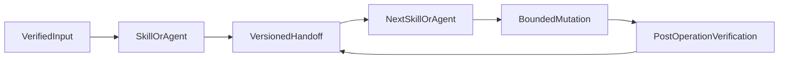

# Shared Contracts

Shared Contracts are versioned, human-readable YAML descriptions of the
handoffs between GitHub Skills and Agents. They are not a runtime schema
library and they do not authorize an operation by themselves. The complete
contract inventory is maintained in
[`shared/schemas/README.md`](../../shared/schemas/README.md); workflow ownership
is maintained by the owning Agent, Command, and Skill sources.

The contract system keeps GitHub collaboration independent from the
implementation language and architecture of the target repository. A
handoff preserves identity, evidence, availability, uncertainty, scope, and
authorization state so the next Skill can make a bounded decision.

## HandoffGraph v1

`HandoffGraph v1` is the structural meta-schema for the plugin's architecture source; it is not a runtime workflow payload. The exact schema is [`../../shared/schemas/HandoffGraph.yaml`](../../shared/schemas/HandoffGraph.yaml), and the canonical data is [`../../shared/graphs/handoff-graph.yaml`](../../shared/graphs/handoff-graph.yaml). [`../../shared/graphs/handoff-graph.mmd`](../../shared/graphs/handoff-graph.mmd) is its parity-checked Mermaid projection.

The graph distinguishes:

- `entry` edges from each current Command to exactly one Agent;
- ordered `capability` edges from Agents to the Skills they explicitly delegate;
- `handoff` edges carrying an existing Shared Contract and the exact source version; and
- `terminal` edges carrying a versioned result with an explicit rationale.

Entry and capability edges are control edges and therefore carry explicit `contract: null` and `contract_version: null`. Handoff and terminal edges must reference existing `contract:<name>` nodes with an exact `contract_version`. Every edge also records its owning workflow, visibility, optionality, mode/condition, identity requirements, freshness requirements, mutation boundary, terminal state, rationale, and evidence paths.

A temporary orphan is classified in `contract_classifications` only when the current plugin sources do not provide a directly declared producer/consumer edge. It must carry an existing `AUD-*` or `S*` key, owner, and rationale. `audited_gap` and `terminal` are mutually exclusive. The `HandoffGraph` meta-schema is excluded from orphan classification.

The canonical graph requires complete traversals for Product Planning, Feedback, CI-Fix, Review, Delivery, and Integration. It also inventories the remaining current plugin workflows without treating text-only contract mentions as runtime edges. The removed root test workspace is not a graph source; executable graph validation is an external capability and the plugin-only static checks remain the applicable repository evidence.

### Graph versioning

Graph schema changes follow the same producer/consumer review discipline as other Shared Contracts. A structural breaking change increments `HandoffGraph`'s version and updates the YAML source, Mermaid projection, documentation, and external validator together. A graph-only change does not authorize a plugin version bump or a runtime handoff change.

## Contract families

The plugin currently defines 91 versioned YAML schemas: 90 runtime handoff
contracts plus the `HandoffGraph v1` architecture meta-schema.

### Issue and linkage contracts

| Contract | Purpose |
| --- | --- |
| `LoadedIssue` | Read-only snapshot of one issue, including preserved content, metadata, comments, related pull requests, and availability evidence. |
| `IssueAnalysis` | Evidence-based requirements, gaps, contradictions, findings, and implementation-readiness analysis. |
| `ProductAssessment` | Read-only product-topic extraction from one parent issue as interview-prep, including mixed features, implicit requirements, and unclear decisions, without creating sub-issues. |
| `ProductInterview` | Version 2 canonical adaptive product-interview record for either a normalized new request or a loaded issue, including confirmed decisions, assumptions, open questions, accepted uncertainties, and source provenance without creating sub-issues. |
| `ProductInterviewPrerequisite` | Version 1 typed prerequisite emitted by deterministic requirements, criteria, and rewrite consumers when ProductInterview v2 is missing, incomplete, unsupported, or mismatched. |
| `ProductCapabilityMap` | Hierarchical Capability Map from one parent issue and one confirmed ProductInterview v2, grouping requirements by independently understandable Product Value without creating sub-issues. |
| `ProductCapabilityDecomposition` | Iterative decomposition of confirmed Product Capabilities into the smallest value-oriented units with one observable outcome and independent acceptance, without creating sub-issues. |
| `IssueAtomicityAssessment` | Read-only atomicity classification of each proposed sub-issue candidate as too-large, atomic-enough, or over-fragmented, without creating sub-issues. |
| `ProductDependencyGraph` | Read-only directed dependency graph of classified sub-issue candidates, distinguishing evidenced product and mandatory technical relations without ranking slices by technical order or creating sub-issues. |
| `ProductIssuePrioritization` | Read-only MoSCoW ranking of classified sub-issue candidates with recommended versus confirmed classes, six-dimension rationales, explicit user decisions, and divergences between product priority and required implementation order, without creating sub-issues. |
| `ProductSubIssueDrafts` | Version-2 read-only canonical English sub-issue draft set from confirmed atomic units, carrying exact title, body, add/remove/preserve labels, parent, hard dependencies, priority, traceability, and a deterministic SHA-256 identity without authorizing publication. |
| `IssueAssessment` | Clarification state, locked requirements, non-goals, assumptions, and readiness. |
| `IssueDraft` | Task-authorized create or edit payload, labels, publication mode, and verification evidence. |
| `IssueUpdate` | Task-authorized partial field update with live baseline, preview, applied effects, and verification. |
| `OpenIssueInventory` | Read-only inventory of currently open GitHub issues in one repository, excluding pull requests. |
| `OpenIssueRanking` | Unique consecutive P1-through-Pn ranking of that inventory with exact proposed titles and exact-set authorization. |
| `IssueReprioritization` | Exact-set title-application result with live-identity preflight, per-issue updates, and verification. |
| `IssueClosure` | Exact authorized triage close of one verified issue without a merged pull request, including close reason, duplicate target, live preflight, and verification. |
| `IssueRevisionComparison` | Semantic comparison of an original issue and proposed revision, including scope drift and contradictions. |
| `LinkedIssue` | Resolution of one pull request's issue candidates, distinguishing unique linkage from mentions and ambiguity. |
| `LinkedIssueStatusAssessment` | Current linked-issue state, acceptance-criteria coverage, closing relationship, and integration blockers. |
| `LinkedIssueClosureVerification` | Read-only post-merge verification of expected automatic issue closure. |
| `LinkedIssueClosure` | Version 2 separately authorized narrow closure after automatic closure did not occur, including the exact validated close-on-merge fallback authorization. |

### Repository, planning, and capability contracts

| Contract | Purpose |
| --- | --- |
| `RepositoryContext` | Verified repository identity, Git state, remotes, instructions, relevant paths, technologies, and commands. |
| `RepositoryConventions` | Evidence-backed mandatory and observed repository practices with authority, confidence, and conflicts. |
| `AffectedAreas` | Direct, indirect, and uncertain repository impact mapped from a task or issue. |
| `ImplementationEvaluation` | Feasibility, architectural fit, complexity, compatibility, dependencies, risks, testing implications, and alternatives. |
| `ExternalCapabilityResolution` | Canonical pure resolution of normalized context or feedback requirements against current host-session evidence, including availability, ambiguity, provenance, stale-session, and fail-closed gap semantics. |
| `ContextCapabilities` | Legacy lossless, fail-closed transition projection of ExternalCapabilityResolution for planning. |
| `PullRequestFixPlan` | Version 1 common head-bound fix plan for review, feedback, and CI sources with a top-level discriminator, lossless tagged candidates, shared scope/authorization/validation semantics, and explicit legacy adapters. |
| `ImplementationPlan` | Task-authorized objective, ordered steps, dependencies, validation, workspace, risks, blockers, assumptions, and delivery authorization. |
| `BranchNameProposal` | Evidence-backed branch name candidate, convention, rationale, and alternatives. |

### Workspace and delivery contracts

| Contract | Purpose |
| --- | --- |
| `TargetBranchFetch` | Exact authorized remote target-branch fetch and SHA verification. |
| `RebaseConflictAnalysis` | Read-only analysis of a planned or stopped rebase conflict. |
| `BranchRebase` | Exact authorized local rebase result, including preflight, conflict or success state, and post-rebase verification. |
| `BranchWorkspace` | Branch/worktree identity, base revision, isolation mode, cleanup authorization, and verification evidence. |
| `WorkingTreeInspection` | Read-only branch/worktree status, changed paths, diff statistics, and unexpected-state markers. |
| `ChangeClassification` | Purpose, component, issue/plan relationship, and evidence-backed scope classification for each path. |
| `UnrelatedChangeDetection` | Foreign, uncertain, or necessary technical side effects and independent commit/PR scope gates. |
| `ValidationResult` | Version-2 plan completion, acceptance, required validations, explicit evidence requirements, scope, blockers, warnings, and diagnostic readiness. |
| `CommitProposal` | Exact repository-relative path scope, English commit message, rationale, validation evidence, authorization, and result. |
| `BranchPush` | Verified branch, remote, upstream, local status, authorization, and post-push SHA. |
| `PullRequestDraft` | Evidence-backed English Draft PR title/body, issue linkage, branch identity, validations, and publication result. |
| `PullRequestIssueLink` | One evidence-backed relationship between one Draft PR and exactly one issue. |
| `PullRequestReady` | Exact authorized Ready-for-Review intent, optional confirmed reviewers, live preflight, and verification. |

### Pull-request evidence and review contracts

| Contract | Purpose |
| --- | --- |
| `LoadedPullRequest` | Read-only PR snapshot with content, head/base revisions, commits, files, checks, reviews, draft state, and metadata. |
| `PullRequestDiffAnalysis` | Evidence-backed diff analysis across correctness, architecture, security, performance, maintainability, tests, documentation, and scope. |
| `PullRequestCheckInspection` | Check, status, CI, branch-protection, and ruleset evidence with pass, fail, pending, skipped, or missing outcomes. |
| `RequiredCheckWait` | Wait for required checks after a verified head without treating pending or unavailable policy as a pass. |
| `RequiredCheckRerun` | Exact authorized rerun of failed required checks with live run-identity verification. |
| `CiFixPlan` | Legacy version 1 plan retained as a lossless, fail-closed ingress shape for `PullRequestFixPlan`. |
| `CiFixRun` | Lifecycle record for wait, authorized rerun, and bounded CI-fix iterations. |
| `RequiredApprovalInspection` | Explicit review requirements, effective approvals, change requests, pending requests, and missing conditions. |
| `LoadedPullRequestDiscussions` | Version-2 reviews, grouped threads, replies, comments, authors, locations, timestamps, resolution state, and exact PR/head/base identity with retrieval provenance. |
| `OpenReviewThreadAssessment` | Open, resolved, outdated, and unknown thread states, required problems, optional discussions, and uncertainties. |
| `DetectedReviewFindings` | Source-level aggregation of diff, issue, check, discussion, and external-rule evidence. |
| `DeduplicatedReviewFindings` | Content-level comparison that merges equivalent findings and records auditable suppressions. |
| `ClassifiedReviewFindings` | Evidence-supported severity and domain classification of every deduplicated finding. |
| `ReviewFinding` | One evidence-backed finding with location, impact, recommendation, severity, and verification. |
| `ReviewDecision` | Composition or authorized publication payload for a comment, approval, or request for changes. |
| `MergeReadiness` | Version-3 deterministic diagnostic readiness derived from exactly one complete immutable `PullRequestReadinessEvidence` snapshot. |
| `PullRequestReadinessEvidence` | Version-1 immutable, identity-bound snapshot of PR/head/base identity, policy, checks, approvals, discussions, linkage, conditional merge method, freshness, and source provenance. |

### Feedback and thread-action contracts

| Contract | Purpose |
| --- | --- |
| `CollectedReviewFeedback` | Grouped open, resolved, outdated, or addressed feedback from threads, findings, comments, and checks. |
| `ClassifiedReviewFeedback` | Cause, severity, affected component, and required action for selected open feedback. |
| `FeedbackResolutionCapabilities` | Legacy lossless, fail-closed transition projection of ExternalCapabilityResolution for explicitly confirmed feedback IDs at one PR head. |
| `FeedbackResolutionPlan` | Legacy version 1 feedback plan retained as a lossless, fail-closed ingress shape for `PullRequestFixPlan`. |
| `ResolvedReviewFeedback` | Advisory candidates supported by later commits, diff, tests, and current discussion evidence. |
| `FeedbackResolutionValidation` | Per-item addressed, partial, not-addressed, or unverifiable result with current evidence. |
| `FeedbackResolutionSummary` | Resolved, open, disputed, and blocked feedback outcomes with next steps and diagnostic merge impact. |
| `FeedbackLifecyclePlan` | Canonical v1 plan with explicit `fix`, `full`, and `follow_up` modes, typed transitions, head binding, validation, and independent effect authorization. |
| `FeedbackLifecycleRun` | Canonical v1 lifecycle state preserving current head, transitions, delivery evidence, blockers, and separate thread effects. |
| `ReviewThreadReply` | Version-3 exact evidence-backed reply to one thread without resolving it, bound to a lifecycle transition and validated head. |
| `ReviewThreadResolution` | Version-3 exact eligible resolution of one validated open thread, bound to a lifecycle transition and validated head. |

### Integration, cleanup, and host-gate contracts

| Contract | Purpose |
| --- | --- |
| `PullRequestMerge` | Version-2 exact authorized merge intent, snapshot-backed version-3 readiness, preflight, selected strategy, and result. |
| `PullRequestIntegration` | Lifecycle record for readiness, target refresh, rebase, validation, push, merge, closure verification, and cleanup decisions. |
| `LifecycleRun` | Autonomous issue-to-draft-PR record through create or existing-issue refine, then preparation, external implementation, and Draft PR delivery. |
| `ProductPlannerRun` | Version-2 interactive parent-issue product-planning lifecycle record that consumes one canonical ProductSubIssueDrafts v2 identity and binds exact-set approval to its digest without carrying an independent publishable title/body set. |
| `ProductSubIssuePublication` | Version-2 exact-set publication result recording the approved canonical identity, exact unit set, lossless IssueDraft v2 adapter verification, GitHub mappings, parent and hard-dependency outcomes, retry evidence, and failed operations. |
| `CleanupResult` | Authorized branch/worktree cleanup results, preserved unsafe targets, and local/remote outcomes. |
| `GateLifecycle` | Version-1 host-neutral lifecycle authority or non-authorizing receipt with operation-specific nonce, five-minute expiry, bounded future skew, consumption, and receipt-expiry semantics. |
| `PreCommitGate` | Version-4 local snapshot binding one exact canonical commit to validated scope, worktree identity, authorization, exact message bytes, cached staged-index contents, and one-shot lifecycle authority. |
| `PreRebaseGate` | Version-2 local snapshot binding one exact rebase phase to the verified branch, target, worktree, authorization, and a fresh phase-specific lifecycle authority. |
| `PrePrCreateGate` | Version-3 local snapshot binding one exact Draft PR publication to commit, push, issue link, description, version-2 validation, and one-shot lifecycle authority. |
| `PreReviewSubmitGate` | Version-2 local snapshot binding one exact review payload to current evidence, deduplication, confirmation, authorization, and one-shot lifecycle authority. |
| `PrePrReadyGate` | Version-2 local snapshot binding one standalone Ready-for-Review transition or one separately authorized requested-reviewers POST to complete Draft/URL/branch/SHA identity, unique issue, typed reviewer set, and phase-specific lifecycle authority. |
| `PreMergeGate` | Version-4 local snapshot binding one exact merge to a final live preflight, version-3 readiness with an embedded version-1 immutable snapshot, exact merge authorization, and one-shot lifecycle authority. |
| `PostMergeStatus` | Read-only post-merge PR, merge-commit, linked-issue, and cleanup status sourced from one non-authorizing, one-time receipt when available. |

The grouping is explanatory. A contract's authoritative fields, versions,
status values, and approval semantics are defined only in its YAML file.

## Handoff rules

Every consumer must verify the supplied handoff before using it:

- accept only the declared contract version;
- preserve repository, issue, pull request, branch, worktree, and revision
  identity;
- preserve source status, unavailable fields, conflicts, assumptions, and
  uncertainty;
- confirm that the input's scope matches the current task and operation;
- reject missing required fields and incompatible producer/consumer edges;
- return `partial` or `blocked` instead of fabricating unavailable evidence.

### Common pull-request fix plan

`PullRequestFixPlan v1` is the normative plan input for review, feedback, and
CI-fix implementation delivery. It binds one repository, pull request, base
branch/SHA, and current head branch/SHA. Its top-level `source_kind` is one of
`review`, `feedback`, or `ci`, and its tagged candidate union preserves
`review_finding`, `review_feedback`, and `required_check_failure` evidence in
source-specific fields without flattening.

The common fields for selection, scope, implementation steps, capabilities,
workspace, authorization, blockers, unresolved questions, validation, risks,
rollback, metadata, and failure are defined once in
[`PullRequestFixPlan.yaml`](../../shared/schemas/PullRequestFixPlan.yaml).
All downstream consumers validate the common head binding and reject mixed
heads, source-kind conflicts, scope drift, optional-to-required check drift,
stale evidence, and authorization mismatches. `clarify` candidates and
blockers never enter the mandatory set.

`ReviewFixPlan v1`, `CiFixPlan v1`, and `FeedbackResolutionPlan v1` remain
historical legacy contracts. Their only supported ingress is an explicit,
lossless, fail-closed adapter to `PullRequestFixPlan v1`; missing fields,
unrepresentable states, stale evidence, mixed identities, or source-kind
conflicts block conversion. Adapters preserve authorization exactly and never
create commit, push, review, thread, Ready-for-Review, rebase, merge,
deletion, cleanup, or default-branch authorization. `FeedbackLifecyclePlan v1`
remains the separate lifecycle/effect authority.

The adapter matrix is deliberately limited to these mappings:

| Legacy input | Common output | Required source preservation |
| --- | --- | --- |
| `ReviewFixPlan v1` | `PullRequestFixPlan v1`, `source_kind: review` | finding locations, severity, confidence, success criteria, review-feedback IDs, resolution groups, and source evidence when present |
| `CiFixPlan v1` | `PullRequestFixPlan v1`, `source_kind: ci` | required check names, wait/rerun references, failure evidence, required flags, and reassessment requirements |
| `FeedbackResolutionPlan v1` | `PullRequestFixPlan v1`, `source_kind: feedback` | feedback IDs, resolution groups, affected areas, dependencies, non-goals, external handoffs, scope, and non-authorizing state |

Any missing source-specific field, mixed head, source-kind conflict, stale
evidence, scope drift, or non-representable authorization blocks the adapter.

An `ImplementationContext` may be used as prose in the workflow; it is not a
versioned Shared Contract. External implementation capabilities are referenced
by session identity rather than embedded content.

## Status and authorization semantics

Common statuses describe evidence state, not permission:

- `resolved` means the required input or capability is available and
  identity-matched.
- `partial` means some evidence exists but a required field, check, or
  capability is unresolved.
- `blocked` means the workflow cannot safely continue.
- `passed` or `ready` means the relevant validation or diagnostic condition
  passed; it does not create authorization.
- `failed`, `skipped`, `not_run`, `pending`, `missing`, or `unverified` must
  remain explicit and must not be reported as success.

Routine authorization and hard-operation authorization are carried as
structured evidence where the contract defines them. A `Pre*Gate` records the
last validated facts immediately before a command; it is not an approval
source. See [Approval gates](approval-gates.md).

## Versioning and change procedure

Apply the [`plugin-versioning`](../../rules/plugin-versioning.mdc) Rule as the
policy source for change classification, package-version synchronization,
public migration and changelog requirements, and external capability
compatibility. The contract-specific procedure is:

Change a contract only when its producer, consumer, schema inventory, and
affected documentation can be updated together. The required sequence is:

1. Classify the change as additive and compatible, breaking, or internal
   refactoring under the `plugin-versioning` Rule.
2. Keep the existing version for compatible optional additions only when the
   Rule and the contract's source rules permit them.
3. Increment the contract version for a breaking field, status, identity, or
   authorization change.
4. Update the YAML description and
   [`shared/schemas/README.md`](../../shared/schemas/README.md).
5. Update the affected producer and consumer references, payload validation
   requirements, and external validation plan.
6. Update the affected Skill, Agent, Command, and inventory documentation.
7. Run `git diff --check`, syntax checks for affected scripts, and any required
   external contract or scenario validation.

Do not add a contract only to make an undocumented operation appear
supported. The contract must describe a real bounded handoff with an owning
producer and consumer.

## Contract validation

The plugin's contract definitions are maintained through the versioned YAML
descriptions, the shared contract inventory, and the owning Skill, Agent, and
Command sources. Those sources preserve required fields, versions, enums,
producer/consumer compatibility, ownership, forbidden operations, and
fail-closed authorization semantics.

This repository intentionally does not ship a local contract or scenario test
harness. When executable contract, invariant, runtime, or scenario evidence is
needed, it must be obtained from the applicable external testing capability or
target repository and recorded as such; the absence of that evidence is not a
passing result.
