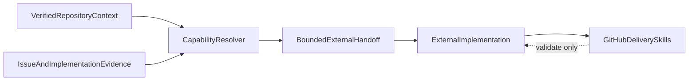

# External capability resolution

The GitHub plugin coordinates collaboration; it does not contain the
technology, architecture, testing, security, documentation, or domain
knowledge needed to implement an application change. External capabilities
are therefore resolved by identity and handed a bounded task. They are not
copied into the plugin and are never silently invented.

This boundary is normative in
[`github-scope-contract.mdc`](../../rules/github-scope-contract.mdc) and
[AGENTS.md](../../../AGENTS.md).

## Capability firewall



The resolver may identify a capability and describe its intended use. It may
not execute that capability, install it, authenticate it, configure it, or
copy its content into this plugin. The external capability returns evidence
about completed work; the GitHub plugin validates that evidence against the
current task and pull-request state.

## Two resolution points

### Planning resolution

[`resolve-context-capabilities`](../../skills/resolve-context-capabilities/SKILL.md)
runs after repository inspection, convention detection, affected-area
mapping, and implementation evaluation. It produces the version-1
[`ContextCapabilities`](../../shared/schemas/ContextCapabilities.yaml)
handoff.

It records:

- the task or loaded issue and verified repository context;
- technologies, architecture signals, risks, planned work, and paths of
  interest;
- each relevant Skill, Rule, Agent, Tool, or domain capability;
- whether the capability is required or optional;
- priority, relevance, rationale, and intended usage;
- availability in the current host session;
- missing capabilities, including whether they are blocking or require
  manual work;
- the recommended next planning Skill.

It normally feeds
[`build-implementation-plan`](../../skills/build-implementation-plan/SKILL.md).
It does not implement the issue or create the worktree by itself.

### Feedback resolution

[`resolve-feedback-capabilities`](../../skills/resolve-feedback-capabilities/SKILL.md)
runs only for explicitly confirmed open feedback items. It produces the
version-1
[`FeedbackResolutionCapabilities`](../../shared/schemas/FeedbackResolutionCapabilities.yaml)
handoff tied to the exact pull-request head and selected feedback IDs.

It selects the narrowest current-session capabilities needed for a bounded
correction across areas such as:

- project technology and architecture;
- test or verification strategy;
- security review;
- documentation;
- external dependencies.

It normally feeds
[`build-feedback-resolution-plan`](../../skills/build-feedback-resolution-plan/SKILL.md).
The feedback Agent does not implement the correction. After the external
capability returns, [`validate-feedback-resolution`](../../skills/validate-feedback-resolution/SKILL.md)
checks the current diff, commits, tests, checks, and discussion context.

### Review-fix implementation

The `/auto-review-fix-pr` workflow resolves capabilities only after a
host-neutral `ReviewFixPlan` confirms mandatory items for the exact current
pull-request head. The handoff contains the bounded candidate-linked scope,
implementation steps, validation requirements, existing head-branch worktree,
and `pr:<number>` authorization. The external capability may edit project
files in that worktree; the GitHub plugin remains responsible for inspecting
scope, validating evidence, creating one exact commit, and pushing non-force.
After the push, the Agent reloads the pull request and does not carry findings
across the new head.

Missing capability evidence blocks the iteration. The workflow never asks an
external capability to publish a review, mutate a thread, create a second PR,
rebase, merge, or clean up a workspace.

### CI-fix implementation

The `/auto-ci-fix-pr` workflow resolves capabilities only after a host-neutral
`CiFixPlan` confirms remaining failed required checks for the exact current
pull-request head. The GitHub plugin inspects scope, validates evidence,
creates one exact commit, pushes non-force, and waits for required checks
again. Missing capability evidence blocks the iteration. The workflow never
asks an external capability to publish a review, merge, or treat pending
checks as pass.

## Session identity

Availability must be evidenced by the current host-session capability
inventory. A repository path, technology name, package directory, README
mention, or generic framework pattern is not proof that a capability is
available.

Use stable, exact identities such as:

```text
session:skill:typescript-implementation
session:skill:project-testing
session:rule:project-security
session:agent:domain-review
```

These values identify an exposed session capability; they do not copy its
instructions or grant it authority over the GitHub workflow. The identity
must remain attributable to the current session and task. Descriptions should
state the capability's boundary and intended use, not reproduce its
implementation knowledge.

Repository-local capability paths, if the plugin must reference one, remain
under `plugin/`. A GitHub workflow must not point to a Skill, Rule,
Agent, Hook, or asset under another plugin as if it owned that artifact.

## Required resolution behavior

1. Verify the repository and task or pull-request identity.
2. Collect the bounded repository, issue, affected-area, convention, and
   implementation evidence required by the resolver.
3. Select only the narrowest applicable capabilities.
4. Record required and optional usage separately.
5. Preserve unavailable inputs, conflicts, assumptions, and capability gaps.
6. Return `partial` or `blocked` when a capability cannot be verified.
7. Hand the exact bounded scope to the external capability.
8. Validate the returned implementation evidence before delivery or thread
   actions.

The resolver does not use model confidence, a likely framework match, or a
previous task's capability inventory as authority. Reusing an identity for a
different repository, task, pull-request head, or scope is not valid.

## Handoff boundaries

### Implementation delivery

The normal implementation flow is:

1. `prepare-issue` produces a verified `ImplementationPlan` and
   `BranchWorkspace`.
2. An external implementation capability applies the plan in that workspace.
3. `publish-draft-pr` inspects and classifies the resulting changes.
4. The delivery workflow validates scope, completion, and required checks.
5. The delivery Skills commit, push, link the issue, and publish one Draft PR.

The GitHub plugin can report that implementation evidence is incomplete or
out of scope. It cannot repair source code or decide a project-specific
technical solution.

### Feedback resolution

The feedback flow is:

1. `address-pr-feedback` loads the exact PR head and collects feedback.
2. The user or applicable repository policy selects specific open items.
3. The resolver identifies external capabilities for those item IDs.
4. The feedback Agent builds a bounded `FeedbackResolutionPlan`.
5. An external capability performs the correction.
6. The plugin validates each selected item against current evidence.
7. Only eligible, authorized replies or thread resolutions are handed to
   their owning Skills.

Feedback authorization does not authorize a rebase, merge, review
publication, unrelated thread action, or cleanup.

## Missing capability behavior

Missing or unverified capability evidence is explicit:

- `resolved` means the required capability is available and its identity and
  intended usage are recorded.
- `partial` means some relevant evidence is available but a required input,
  capability, or boundary remains unresolved.
- `blocked` means the workflow cannot safely continue without the missing
  capability or a manual decision.

The plugin must not substitute a generic implementation, claim that a test
passed, or convert a manual requirement into a successful handoff. The next
step must identify the missing capability or ask for the specific information
needed to continue.
