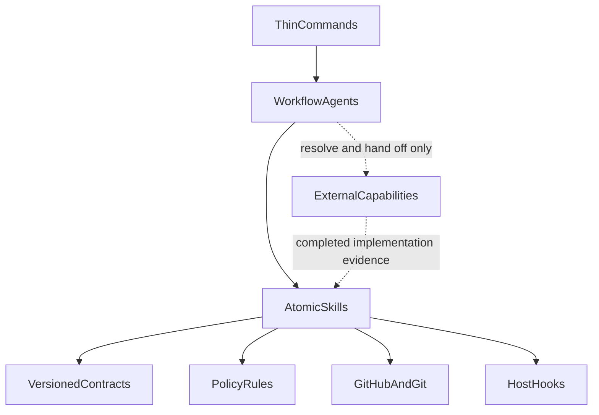

# System overview

The CromeSDK `github` plugin is a collaboration control plane for one
verified GitHub issue, repository, branch/worktree, or pull request at a time.
It turns repository and GitHub state into evidence-backed handoffs, coordinates
the next bounded operation, and prevents a later operation from being inferred
from incomplete or stale evidence.

The plugin is not a general-purpose implementation agent. Its responsibility
ends at the boundary where a project-specific capability must write source
code, tests, documentation, or domain behavior.

## Responsibilities

The plugin owns the following collaboration concerns:

- Resolving and loading one exact repository, issue, or pull request.
- Inspecting repository context, Git state, conventions, branches, and
  worktrees without guessing identity.
- Structuring, analyzing, refining, publishing, and verifying GitHub issues.
- Turning one too-large parent issue into a prioritized graph of nearly
  atomic product sub-issues without inventing product decisions.
- Re-ranking every currently open GitHub issue in one repository as unique
  consecutive P-number title prefixes after exact ranked-set authorization.
- Triage-closing one verified GitHub issue without a merged pull request
  after exact authorization of the repository, issue, and close reason.
- Mapping a task to affected repository areas and evaluating implementation
  approaches without implementing them.
- Preparing and verifying an authorized branch/worktree.
- Inspecting, classifying, validating, committing, and pushing an existing
  implementation within exact scope.
- Coordinating an internal review-fix loop that confirms mandatory findings
  and open feedback, attaches the existing pull-request head worktree, and
  re-reviews each verified pushed head.
- Composing, linking, publishing, and verifying one Draft pull request.
- Marking one verified Draft pull request Ready-for-Review through one exact
  standalone transition, followed only when authorized by one exact typed
  reviewer request after the PR is non-Draft.
- Loading and analyzing pull-request diffs, checks, reviews, threads, and
  linked issues.
- Composing and publishing an explicitly authorized review.
- Coordinating selected feedback through external implementation capabilities,
  current validation, evidence-backed replies, and eligible thread resolution.
- Coordinating target refresh, rebase, post-rebase validation, merge
  readiness, separately authorized merge, linked-issue closure verification,
  and independently authorized cleanup.

Each operation preserves the repository, branch, pull-request, issue, and
revision identities needed by the next operation. Missing, stale, ambiguous,
or contradictory evidence is a workflow state, not an invitation to guess.

## Explicit non-goals

The following responsibilities are deliberately outside this plugin:

- Implementing source code, tests, migrations, infrastructure, or product
  behavior.
- Choosing or owning TypeScript, Angular, React, NestJS, Nx, ModernUO, or
  another project's framework architecture.
- Designing project-specific test strategies, interpreting domain rules, or
  making product decisions.
- Copying, packaging, executing, or claiming ownership of external
  implementation, testing, security, documentation, or domain capabilities.
- Resolving implementation feedback by editing the external project. The
  plugin creates a bounded handoff and validates the returned result.
- Resolving rebase conflicts or choosing a recovery outcome. A conflict remains
  stopped for a separate resolution capability; the host Hook can only guard a
  later standalone recovery of the same already-authorized operation.
- Enabling auto-merge or a merge queue, or silently merging from readiness
  evidence.
- Treating a successful build, test, review, or Hook as approval, release, or
  permission for another operation.
- Deleting branches or worktrees as an incidental side effect of a merge.

These boundaries are defined by
[`github-scope-contract.mdc`](../../rules/github-scope-contract.mdc) and
[AGENTS.md](../../../AGENTS.md). External capability resolution is described in
[External capabilities](external-capabilities.md).

## Layered architecture

### Commands

Commands are thin, explicitly invoked entry points. A Command resolves one
target, starts one Agent, and displays that Agent's exact result. Commands do
not contain Skill chains, perform a second write, or invoke another Agent.

| Command | Agent and mode | Result |
| --- | --- | --- |
| `create-issue` | `issue-agent` / `create` | One validated new `IssueDraft` and its publication result. |
| `refine-issue` | `issue-agent` / `refine` | One validated edit `IssueDraft` for one loaded issue and its publication result. |
| `prepare-issue` | `preparation-agent` | One `ImplementationPlan` and verified `BranchWorkspace`; no implementation. |
| `publish-draft-pr` | `delivery-agent` | One validated commit, verified branch push, issue link, and Draft PR result. |
| `review-pr` | `review-agent` | Evidence-backed findings and one `ReviewDecision`, with publication only after the applicable gate. |
| `address-pr-feedback` | `feedback-agent` | Feedback collection, external resolution handoff, validation, and eligible thread actions. |
| `integrate-pr` | `integration-agent` | `PullRequestIntegration` covering readiness, refresh, rebase, merge, closure verification, and cleanup decisions. |
| `implement-auto-issue` | `lifecycle-agent` | One `LifecycleRun` through issue create, refine, preparation, external implementation, and Draft PR publication. |
| `refine-auto-issue` | `lifecycle-agent` | One `LifecycleRun` through refine of a verified existing issue, preparation, external implementation, and Draft PR publication. |
| `auto-review-fix-pr` | `review-fix-agent` | One `ReviewFixRun` that confirms mandatory fixes, commits and non-force pushes on the existing pull-request head branch, and re-reviews until complete or blocked. |
| `auto-ci-fix-pr` | `ci-fix-agent` | One `CiFixRun` that waits for required checks, reruns only authorized required names, and coordinates a bounded external fix on the existing head without merge or review publication. |
| `ready-pr` | `pr-ready-agent` | One `PullRequestReady` result that marks an exact Draft Ready-for-Review after unique-issue and reviewer-set authorization. |
| `plan-product` | `product-planner-agent` | One `ProductPlannerRun` for a verified parent issue through product analysis, interview, mapping, decomposition, graphing, prioritization, overall-plan review, and approved sub-issue publication. |
| `reprioritize-issues` | `issue-reprioritize-agent` | One `IssueReprioritization` for a verified repository after unique consecutive P-number ranking and exact ranked-set title application. |
| `close-issue` | `issue-close-agent` | One `IssueClosure` that closes a verified issue without a merged pull request after exact close-reason authorization. |

The registered Command graphs, including forbidden operations, are tested in
[`workflow-graphs.ts`](../../../tests/scenarios/lib/workflow-graphs.ts).

### Agents

Agents are workflow orchestrators. They sequence Skills, validate handoffs,
preserve task identity, and ask only the bounded questions or approvals
required by the applicable policy. They do not replace Skill procedures and
do not implement project code.

| Agent | Responsibility |
| --- | --- |
| [`issue-agent`](../../agents/issue-agent.md) | Create one issue or refine one verified issue, then hand an exact `IssueDraft` to the publication Skill. |
| [`preparation-agent`](../../agents/preparation-agent.md) | Turn one qualified issue into an `ImplementationPlan` and a verified workspace without implementing it. |
| [`delivery-agent`](../../agents/delivery-agent.md) | Turn one completed implementation into an exact commit, verified push, linked Draft PR, and delivery report. |
| [`review-agent`](../../agents/review-agent.md) | Analyze one PR, deduplicate and classify findings, collect decisions, and hand publication to the review Skill. |
| [`feedback-agent`](../../agents/feedback-agent.md) | Collect and classify feedback, resolve external capabilities, validate results, and hand off thread actions. |
| [`integration-agent`](../../agents/integration-agent.md) | Coordinate readiness, target refresh, rebase, post-rebase validation, merge, closure verification, and separate cleanup. |
| [`lifecycle-agent`](../../agents/lifecycle-agent.md) | Sequence create or existing-issue refine, then preparation, external implementation, and Draft PR delivery by starting the existing delivery Agents. |
| [`review-fix-agent`](../../agents/review-fix-agent.md) | Review one verified pull request, confirm mandatory fixes in a host-neutral plan, coordinate external implementation on the existing head branch, and repeat verified commit/push iterations. |
| [`ci-fix-agent`](../../agents/ci-fix-agent.md) | Wait for required checks, rerun only authorized required names, confirm remaining CI failures, and repeat verified commit/push iterations on the existing head. |
| [`pr-ready-agent`](../../agents/pr-ready-agent.md) | Verify one Draft PR, unique linked issue, and optional reviewer set, then mark it Ready-for-Review after exact authorization. |
| [`product-planner-agent`](../../agents/product-planner-agent.md) | Turn one verified parent issue into a prioritized graph of nearly atomic product sub-issues and hand the approved create set to `create-product-sub-issues` only after exact user approval. |
| [`issue-reprioritize-agent`](../../agents/issue-reprioritize-agent.md) | Inventory currently open issues, rank unique consecutive P-number titles with the user, and apply them only after exact ranked-set authorization. |
| [`issue-close-agent`](../../agents/issue-close-agent.md) | Load one verified issue, require an exact close reason, and close it without a merged pull request after exact authorization. |

`feedback-agent` owns feedback mode and `integration-agent` owns integration
mode. They must not invoke one another. `lifecycle-agent` may start
`issue-agent`, `preparation-agent`, and `delivery-agent` sequentially and
must not start review, feedback, integration, host-hooks, product-planner,
Ready-for-Review, open-issue-reprioritize, triage-close, or CI-fix Agents. `/implement-auto-issue` starts it at create;
`/refine-auto-issue` starts it at refine for one verified existing issue.

### Skills

Skills are the atomic procedure and mutation boundaries. Each Skill accepts
specific evidence, returns a structured handoff where one exists, and states
what it must not do. Invocation mode does not change ownership: a Skill's
source declares whether it is read-only, diagnostic, or a bounded mutation.
Mutating Skills require their documented authorization and host gate.

The Skills are grouped by responsibility:

| Skill family | Responsibilities | Representative sources |
| --- | --- | --- |
| Repository and planning | Inspect repository state, detect conventions, analyze issues, map affected areas, evaluate approaches, resolve capabilities, define acceptance criteria, and build plans. | [`inspect-repository`](../../skills/inspect-repository/SKILL.md), [`build-implementation-plan`](../../skills/build-implementation-plan/SKILL.md) |
| Issue publication | Load, structure, rewrite, compare, create, and partially update GitHub issues, including parent-issue product assessment, adaptive product interview, Capability Map, atomic decomposition, atomicity assessment, product dependency graphing, product prioritization, draft-only composition of complete atomic sub-issue sets, exact-set sub-issue publication, open-issue inventory, unique P-number ranking, exact-set title application, and triage close without a merged pull request. | [`create-github-issue`](../../skills/create-github-issue/SKILL.md), [`create-product-sub-issues`](../../skills/create-product-sub-issues/SKILL.md), [`list-open-issues`](../../skills/list-open-issues/SKILL.md), [`rank-open-issues`](../../skills/rank-open-issues/SKILL.md), [`apply-issue-priority-titles`](../../skills/apply-issue-priority-titles/SKILL.md), [`close-github-issue`](../../skills/close-github-issue/SKILL.md), [`analyze-product-issue`](../../skills/analyze-product-issue/SKILL.md), [`conduct-product-interview`](../../skills/conduct-product-interview/SKILL.md), [`identify-product-capabilities`](../../skills/identify-product-capabilities/SKILL.md), [`decompose-product-capabilities`](../../skills/decompose-product-capabilities/SKILL.md), [`assess-issue-atomicity`](../../skills/assess-issue-atomicity/SKILL.md), [`build-product-dependency-graph`](../../skills/build-product-dependency-graph/SKILL.md), [`prioritize-product-issues`](../../skills/prioritize-product-issues/SKILL.md), [`compose-product-sub-issues`](../../skills/compose-product-sub-issues/SKILL.md) |
| Workspace and delivery | Derive branches, create or attach and verify worktrees, inspect and classify changes, detect scope drift, validate results, compose commits and PR descriptions, commit, push, link issues, and create Draft PRs. | [`validate-implementation-result`](../../skills/validate-implementation-result/SKILL.md), [`create-worktree`](../../skills/create-worktree/SKILL.md) |
| Pull-request evidence | Load PRs and discussions, analyze diffs, inspect checks, assess linked issues, and assess merge readiness. | [`analyze-pr-diff`](../../skills/analyze-pr-diff/SKILL.md), [`assess-merge-readiness`](../../skills/assess-merge-readiness/SKILL.md) |
| Ready-for-Review | Propose optional reviewers as suggestions and mark one authorized open Draft ready. | [`propose-pr-reviewers`](../../skills/propose-pr-reviewers/SKILL.md), [`mark-pr-ready`](../../skills/mark-pr-ready/SKILL.md) |
| Review and feedback | Detect, deduplicate, classify, collect, resolve, validate, summarize, compose, publish, reply to, and resolve review findings or threads. | [`detect-review-findings`](../../skills/detect-review-findings/SKILL.md), [`collect-review-feedback`](../../skills/collect-review-feedback/SKILL.md) |
| Integration and cleanup | Fetch a target branch, analyze and perform an approved rebase, validate the result, merge, verify linked-issue closure, delete a merged branch, and clean a worktree. | [`rebase-branch`](../../skills/rebase-branch/SKILL.md), [`merge-pull-request`](../../skills/merge-pull-request/SKILL.md) |

The concise Skill inventory and activation routing remain in the plugin
[README.md](../README.md). The individual SKILL.md files are the authoritative
procedures.

### Rules

Rules are always-active policy boundaries. Agents and Skills reference them;
they must not copy their complete approval or safety semantics into workflow
prose.

| Rule | Responsibility |
| --- | --- |
| [`github-scope-contract.mdc`](../../rules/github-scope-contract.mdc) | Keeps the plugin within GitHub collaboration scope and defines the external-capability firewall. |
| [`github-safety.mdc`](../../rules/github-safety.mdc) | Defines identity, scope, verification, secret, and hard-operation safety. |
| [`branch-worktree-policy.mdc`](../../rules/branch-worktree-policy.mdc) | Defines isolated workspace selection, branch identity, base ancestry, clean-state checks, and reuse boundaries. |
| [`github-evidence.mdc`](../../rules/github-evidence.mdc) | Requires observable evidence for GitHub facts and review findings. |
| [`interactive-approval.mdc`](../../rules/interactive-approval.mdc) | Defines task-scoped routine autonomy and independent hard-operation authorization. |
| [`commit-policy.mdc`](../../rules/commit-policy.mdc) | Requires exact-scope, validated, secret-free, authorized commits. |
| [`pull-request-policy.mdc`](../../rules/pull-request-policy.mdc) | Requires validated Draft PRs, complete descriptions, exact issue linkage, and duplicate prevention. |
| [`merge-policy.mdc`](../../rules/merge-policy.mdc) | Requires current merge evidence, selected strategy, exact authorization, and post-merge boundaries. |
| [`cli-transport-file-lifecycle.mdc`](../../rules/cli-transport-file-lifecycle.mdc) | Requires byte-exact, restrictive, uniquely named temporary CLI transport files and guaranteed validated cleanup with separate sanitized diagnostics. |
| [`product-decomposition-policy.mdc`](../../rules/product-decomposition-policy.mdc) | Requires nearly atomic GitHub product issues with one outcome, verifiable acceptance criteria, independent value, and justified dependency limits. |
| [`product-interview-policy.mdc`](../../rules/product-interview-policy.mdc) | Requires an adaptive user interview to gather those product decisions without inventing essential choices or ending while unaccepted uncertainties remain. |

### Hooks

Hooks are deterministic host projections around specific shell or tool
events. They do not plan, implement, repair, approve, release, or activate
capabilities. `dispatch.mjs` is the shared host-neutral entrypoint: it reads and
classifies one bounded event, short-circuits irrelevant commands without live
work, rejects ambiguity, and routes one protected operation to its checker. The
six pre-operation checkers fail closed when their local gate is missing, stale,
incomplete, inconsistent, timed out, or backed by incomplete external evidence.
The post-operation checker is read-only.

| Hook | Host events | Contract and behavior |
| --- | --- | --- |
| `pre-commit.mjs` | Cursor `beforeShellExecution`; Codex `PreToolUse` for `Bash` | Verifies exact commit scope, version-2 validation and explicit evidence requirements, worktree identity, authorization, and secret hygiene through `PreCommitGate v3`. |
| `pre-rebase.mjs` | Cursor `beforeShellExecution`; Codex `PreToolUse` for `Bash` | Verifies a new start through the exact target branch, clean workspace, target revision, and `PreRebaseGate`; separately guards only standalone recovery whose active rebase metadata and registered worktree match that gate. |
| `pre-pr-create.mjs` | Cursor `beforeShellExecution`; Codex `PreToolUse` for `Bash` | Verifies the commit, push, issue link, description, version-2 validation and explicit evidence requirements, and exact Draft command through `PrePrCreateGate v2`. |
| `pre-review-submit.mjs` | Cursor `beforeShellExecution`; Codex `PreToolUse` for `Bash` | Verifies the current head, finding evidence, locations, deduplication, confirmation, and exact payload through `PreReviewSubmitGate`. |
| `pre-pr-ready.mjs` | Cursor `beforeShellExecution`; Codex `PreToolUse` for `Bash` | Verifies one exact standalone Ready-for-Review transition or phase-appropriate requested-reviewers POST, complete URL/branch/SHA identity, one linked issue, typed reviewer payload, and `PrePrReadyGate`; rejects incomplete legacy gates and compound commands. |
| `pre-merge.mjs` | Cursor `beforeShellExecution`; Codex `PreToolUse` for `Bash` | Verifies the exact local `PreMergeGate v3`, final live preflight, embedded `MergeReadiness v3`, and complete identity-bound `PullRequestReadinessEvidence v1` without live GitHub or GraphQL reads; every merge command must carry an exact head compare-and-set. |
| `post-merge.mjs` | Cursor `afterShellExecution`; Codex `PostToolUse` for `Bash` | Observes the completed merge and returns `PostMergeStatus`; it never closes issues, deletes branches, or removes worktrees. |

Cursor and Codex use separate projections in
[`hooks/cursor-hooks.json`](../../hooks/cursor-hooks.json) and
[`hooks/codex-hooks.json`](../../hooks/codex-hooks.json). The portable
[`plugin.json`](../../plugin.json) deliberately contains no Hook declaration.
The explicit [`generate-project-hooks`](../../skills/generate-project-hooks/SKILL.md)
Skill asks interactively which host projections to write and uses the
deterministic [`generate-project-hooks.mjs`](../../hooks/generate-project-hooks.mjs)
generator to copy them into a target repository. It never writes runtime gate
snapshots; those remain owning-Skill evidence and continue to fail closed when
missing or mismatched.

The projections deliberately differ only at the host boundary. Cursor keeps
operation-specific matchers, all invoking the shared dispatcher with
`failClosed: true`. Codex has one `PreToolUse` dispatcher registration and one
`PostToolUse` dispatcher registration, so an irrelevant `Bash` command cannot
start all six checkers. Merge completion is the only post-event routed to
`post-merge.mjs`; other post-events return the existing empty response.

The shared command runtime uses a 5-second deadline per Git/`gh` child, a
25-second pre-hook total budget, and a 40-second post-merge total budget. It
bounds stdout/stderr, terminates and reaps process trees (including Windows
credential-helper descendants), never retries ambiguous or partial results,
and maps protected failures to native deny responses. Incomplete GraphQL pages
are never accepted as complete: pre-hooks deny, while post-merge reports
relationship evidence as unavailable or uncertain.

### Shared Contracts

Versioned YAML contracts connect Skills and Agents without coupling the
plugin to a project's implementation language. The principal handoff
families are:

- issue snapshots, issue analysis, issue assessment, issue drafts, updates,
  and revision comparisons;
- repository context, conventions, affected areas, implementation
  evaluations, capability resolution, and implementation plans;
- branch names, target-branch fetches, workspaces, working-tree inspection,
  change classification, scope detection, validation, commits, pushes, and
  Draft PRs;
- pull-request snapshots, diffs, checks, discussions, linked issues, review
  findings, review decisions, review-fix plans and runs, feedback resolution,
  and thread actions;
- merge readiness, approvals, rebases, integration, linked-issue closure, and
  cleanup;
- product-planning runs and exact-set sub-issue publication results;
- local pre-operation gates and read-only post-merge status.

See [Shared Contracts](contracts.md) for the contract rules and the complete
inventory in [`shared/schemas/README.md`](../../shared/schemas/README.md).

## Host boundary

The root portable manifest registers local component directories, but Hook
events are host-specific. Cursor and Codex therefore have separate Hook
projections. The documented Codex plugin manifest does not register the
Cursor-style Commands and Agents; the portable package must not invent
equivalent native fields. The full evidence and limitations are recorded in
the host manifests and the standalone [repository README](../../../README.md).

## Design invariants

1. Verify repository and target identity before interpreting state.
2. Preserve exact revisions and invalidate stale evidence after a rebase or
   other head change.
3. Separate read-only evidence, composition, authorization, and mutation.
4. Treat readiness as diagnostic evidence, never as authorization.
5. Keep routine delivery authorization separate from hard operations.
6. Keep external implementation knowledge outside the plugin.
7. Keep every mutation narrow, verifiable, and attributable to one owner.
8. Preserve unavailable, uncertain, partial, and blocked results explicitly.
