# Issue-to-merge lifecycle

This document describes the normal path from one GitHub issue to one
integrated pull request. It is a coordination lifecycle, not an instruction
to implement application code. Every phase consumes verified evidence and
returns a handoff for the next phase.

The Commands are independent entry points. A user or host may start at
an existing issue, completed implementation, review, feedback, or pull
request. `/implement-auto-issue` is the composed entry point that sequences
create, refine, preparation, external implementation, and Draft PR delivery,
then stops. `/refine-auto-issue` is the composed entry point that starts at
refine for one verified existing issue and continues through preparation,
external implementation, and Draft PR delivery, then stops. `/refine-issue`
remains the refine-only Command. `/ready-pr` is the separate Ready-for-Review entry point.
`/plan-product` is the separate product-planning entry point that
splits one verified parent issue into a prioritized graph of nearly atomic
product sub-issues; it does not perform technical implementation planning.
`/reprioritize-issues` is the separate open-issue ranking entry point that
assigns unique consecutive P-number title prefixes after exact ranked-set
authorization.
`/close-issue` is the separate triage-close entry point that closes one
verified issue without a merged pull request after exact close-reason
authorization.
The full sequence is shown here to make the boundaries explicit.

## Lifecycle map

```mermaid
flowchart LR
  issue[IssueRequest]
  issueDraft[IssueDraft]
  plan[ImplementationPlan]
  workspace[BranchWorkspace]
  externalImplementation[ExternalImplementation]
  validation[ValidationResult]
  draft[DraftPullRequest]
  ready[PullRequestReady]
  review[ReviewDecision]
  feedback[FeedbackResolution]
  sourceReaders[PR evidence readers]
  snapshot[PullRequestReadinessEvidence]
  readiness[MergeReadiness v3]
  rebase[ValidatedRebase]
  merged[VerifiedMerge]
  closure[IssueClosureVerification]
  cleanup[SeparateCleanup]

  issue --> issueDraft
  issueDraft --> plan
  plan --> workspace
  workspace --> externalImplementation
  externalImplementation --> validation
  validation --> draft
  draft --> ready
  ready --> review
  review --> feedback
  feedback --> sourceReaders
  sourceReaders --> snapshot
  snapshot --> readiness
  readiness --> rebase
  rebase --> sourceReaders
  readiness --> merged
  merged --> closure
  closure --> cleanup
```



The `externalImplementation` node is intentional. The GitHub plugin prepares
the task, verifies the workspace, validates the result, and delivers the
change; a separately resolved implementation capability writes project code.
Review and feedback may loop more than once before integration.

## Phase 0: establish identity and authorization

Before any workflow:

1. Resolve the exact repository and target branch from verified metadata or
   explicit input.
2. Resolve exactly one issue or pull request when the Command requires one.
3. Read applicable repository instructions, especially the target repository's
   `AGENTS.md`.
4. Record task-scoped routine authorization and distinguish hard-operation
   authorization.
5. Preserve current branch, worktree, head SHA, base SHA, and path scope.

No branch name, commit message, filename, or prose reference is sufficient to
infer an issue or pull request identity. The workflow returns a clarification
when identity is ambiguous.

## Phase 1: issue creation or refinement

### `create-issue`

Typical sequence:

```text
verify repository
  -> issue-agent:create
  -> conduct an adaptive product interview
  -> structure requirements
  -> define acceptance criteria
  -> assess quality and resolve material gaps
  -> create-github-issue
  -> verify the created issue
```

The Agent produces one task-authorized `IssueDraft` with an English durable
title and body. Apply
[`product-interview-policy.mdc`](../../rules/product-interview-policy.mdc)
and
[`product-decomposition-policy.mdc`](../../rules/product-decomposition-policy.mdc)
before publication: gather missing product decisions through the adaptive
user dialog, split a too-large product request into proposed nearly
atomic sub-issues, and still publish exactly one selected issue.
The publication Skill owns the GitHub write. This flow does not create a
branch, worktree, commit, pull request, review, or merge.

### `refine-issue`

Typical sequence:

```text
verify repository
  -> load one exact issue
  -> issue-agent:refine
  -> assess the parent issue from a product perspective
  -> conduct-product-interview
  -> identify-product-capabilities
  -> decompose-product-capabilities
  -> assess-issue-atomicity
  -> build-product-dependency-graph
  -> prioritize-product-issues
  -> draft the refinement
  -> compare original and proposed revision
  -> create-github-issue in edit mode
  -> verify the updated issue
```

`issue-agent` mode `refine` maps to `IssueDraft.mode: edit`; the stable
publication contract must not be renamed to `refine`.

For a complete product-split draft set, invoke
`compose-product-sub-issues` after the confirmed decomposition and
prioritization. It returns one standalone `ProductSubIssueDrafts` result for
all eligible confirmed units and performs no GitHub write. This draft-only
workflow does not change `issue-agent`'s one-issue refine sequence; a later
publication workflow must select and publish issues separately.

## Phase 2: preparation

### `prepare-issue`

Typical sequence:

```text
verify repository
  -> load one exact issue
  -> analyze issue readiness
  -> inspect repository
  -> detect conventions
  -> identify affected areas
  -> evaluate implementation approaches
  -> resolve external capabilities
  -> derive branch name
  -> build ImplementationPlan
  -> create or reuse authorized worktree
  -> verify worktree
```

The result is an `ImplementationPlan` plus an active, identity-matched
`BranchWorkspace`. The preparation Agent does not implement code, run
project-specific repairs, commit, push, create a pull request, or merge.

Workspace verification checks the registered repository and path, checked-out
branch, base ancestry, clean state, conflicts, and in-progress Git operations.
An explicit repository policy may change the isolation mode, but a waived
check remains visible as a waiver and is not reported as a passed check.

## Phase 3: external implementation

An external capability applies the authorized plan in the verified workspace.
The GitHub plugin may provide:

- the exact task and acceptance criteria;
- the `ImplementationPlan`;
- relevant repository conventions and affected-area evidence;
- the resolved capability identity and intended usage;
- the authorized workspace path and branch.

It may not provide invented framework decisions or claim ownership of the
implementation capability. When the implementation is complete, the
`delivery-agent` can inspect the result. If a required capability is missing,
the workflow remains `partial` or `blocked`.

## Phase 4: delivery of a Draft pull request

### `publish-draft-pr`

The delivery Agent accepts a completed implementation. It does not repair
source code.

Canonical sequence:

```text
verify repository and workspace
  -> inspect working tree
  -> classify changes
  -> detect unrelated or uncertain changes
  -> validate implementation result
  -> compose exact CommitProposal
  -> create one exact commit
  -> push branch without force
  -> compose PullRequestDraft
  -> link exactly one issue
  -> optionally recompose if the validated link changes the body
  -> create and verify one Draft PR
```

The order is deliberately **compose Draft → link issue → optionally recompose
→ create Draft PR**. A duplicate open PR for the same head/base pair is
verified rather than duplicated.

The validation gate must be `passed`, completion and acceptance criteria must
be satisfied, the path union must be exact, and no unresolved scope deviation
or required check may remain. The Draft PR body must include problem context,
solution, scope, tests and validations, limitations, risks, and the exact
issue linkage.

This workflow cannot publish a review, reply to a thread, rebase, merge,
delete a branch, or remove a worktree. Ready-for-Review remains `/ready-pr`.

## Phase 4a: Ready-for-Review

### `ready-pr`

Typical sequence:

```text
verify repository
  -> load exact pull request
  -> resolve unique linked issue
  -> inspect checks as warnings
  -> propose optional reviewers
  -> authorize exact Ready-for-Review and reviewer set
  -> write and atomically claim PrePrReadyGate v2 (pre-pr-ready lifecycle)
  -> verify current open Draft identity
  -> execute one standalone gh pr ready command
  -> verify current open non-Draft identity and linked issue
  -> write and atomically claim a fresh PrePrReadyGate v2 (pre-reviewer-request lifecycle)
  -> request only the authorized reviewers through one exact POST, if non-empty
```

The Command is independent of Draft publication and merge. Unique issue
linkage is required. CODEOWNERS matches are optional suggestions, not merge
policy. Pending CI does not block. An already non-Draft open pull request
returns `already_ready` without requesting additional reviewers.
The Ready transition and reviewer assignment are separate race and
authorization boundaries; each uses a one-shot gate under the canonical
`.github/github-plugin/state/` path. Compound shell/API commands and
incomplete, expired, replayed, or legacy gates fail closed. The same rule
applies to `pre-rebase-start`, `pre-rebase-continue`, `pre-rebase-skip`, and
`pre-rebase-abort`: one fresh lifecycle authority per operation.
This workflow cannot publish a review, rebase, merge, or clean up.

## Phase 5: pull-request review

### `review-pr`

Typical sequence:

```text
verify repository
  -> load exact pull request
  -> resolve unique linked issue
  -> load discussions
  -> inspect checks
  -> analyze live diff
  -> detect findings from all evidence sources
  -> deduplicate against findings and existing discussions
  -> classify severity and domain
  -> decide each active finding
  -> compose exact ReviewDecision
  -> submit authorized review
```

Findings must use the smallest correct changed location, observable behavior,
impact, severity, confidence, and actionable correction. Uncertain findings
are presented for clarification or retained as uncertainty; they are not
promoted to blockers by confidence alone.

The Agent does not edit source code, tests, documentation, Git, branches,
worktrees, issues, discussions, or pull-request metadata. Review publication
is separate from finding analysis and is gated by the exact payload and
current head.

## Phase 5a: internal review-fix loop

### `auto-review-fix-pr`

This workflow is an internal alternative to review publication. It keeps the
pull request and its existing head branch as the target:

```text
verify repository and exact pull request
  -> load discussions and required checks
  -> analyze the current diff
  -> detect, deduplicate, and classify findings
  -> collect, resolve-candidate, and classify open feedback
  -> confirm one host-neutral ReviewFixPlan
  -> attach or reuse the existing head worktree
  -> resolve external implementation capability
  -> inspect, classify, validate, and scope-check changes
  -> compose and create one exact commit
  -> push the same branch without force
  -> reload the pull request at the new head
  -> repeat up to five iterations
```

Each new candidate is explicitly decided as `fix`, `skip`, or `clarify`.
`clarify`, missing identity or capability, failed validation, scope drift, and
push failure block the run. A clean re-review returns `fixes_complete`; the
five-iteration limit or unresolved confirmed items returns `partial`.
The workflow never publishes a review, replies to or resolves a thread,
creates a second pull request, marks Ready-for-Review, rebases, merges, or
cleans up.

## Phase 5b: CI wait, rerun, and fix loop

### `auto-ci-fix-pr`

This workflow coordinates required checks on an existing pull-request head:

```text
verify repository and exact pull request
  -> inspect checks and project required versus optional
  -> wait for required checks without treating pending as pass
  -> rerun only exactly authorized required names
  -> wait again
  -> confirm one host-neutral CiFixPlan
  -> attach or reuse the existing head worktree
  -> resolve external implementation capability
  -> inspect, classify, validate, and scope-check changes
  -> compose and create one exact commit
  -> push the same branch without force
  -> wait for required checks at the new head
  -> repeat up to five iterations
```

Green required checks are not merge or Ready-for-Review. Optional checks stay
optional. `inspect-pr-checks` remains read-only.

## Phase 6: feedback follow-up

### `address-pr-feedback`

Typical sequence:

```text
verify exact pull request and current head
  -> collect review threads, findings, comments, and failed checks
  -> identify advisory resolved candidates
  -> classify explicitly selected open feedback
  -> resolve external capabilities
  -> build bounded FeedbackResolutionPlan
  -> external capability implements selected corrections
  -> validate every selected item against current evidence
  -> summarize resolved, open, disputed, and blocked items
  -> publish eligible reply
  -> resolve eligible thread separately
```

Selection is explicit. The feedback workflow cannot silently expand to another
thread, review, pull request, branch, rebase, merge, or cleanup operation.
Thread state alone is not proof that feedback was addressed. A reply does not
resolve a thread, and a validated correction does not automatically authorize
either action.

The feedback loop may return to
[`publish-draft-pr`](../../commands/publish-draft-pr.md) when the external
implementation changes the branch and a new delivery validation is needed.

## Phase 7: integration

### `integrate-pr`

The integration Agent coordinates the complete sequence but preserves
independent authorization for each hard operation:

```text
verify exact pull request
  -> load-pull-request
  -> load-pr-discussions
  -> inspect-pr-checks
  -> check-required-approvals
  -> check-open-review-threads
  -> check-linked-issue-status
  -> build-pr-readiness-evidence
  -> assess one complete current MergeReadiness
  -> obtain exact target-branch authorization
  -> fetch and verify selected target SHA
  -> analyze planned or stopped rebase conflicts
  -> obtain exact rebase authorization
  -> perform bounded local rebase or preserve conflict for external resolution
  -> permit only separately guarded standalone rebase recovery when needed
  -> validate post-rebase history, scope, tests, and checks
  -> obtain exact push authorization when the remote head changed
  -> push verified branch
  -> invalidate every earlier reader handoff
  -> reload the complete reader chain for the new head
  -> build a new PullRequestReadinessEvidence snapshot
  -> reassess MergeReadiness from that snapshot
  -> obtain exact merge authorization and select allowed strategy
  -> perform one merge and verify the merge commit
  -> verify expected linked-issue closure
  -> present separate branch and worktree cleanup decisions
```

Fetch, rebase, force-with-lease push, merge, issue closure, branch deletion,
and worktree removal are not bundled by the integration Command. A repository
policy can be the authorization source only when it names the exact operation
and scope. See [Approval gates](../architecture/approval-gates.md).

After a successful merge, the claimed `pre-merge` authority may produce one
non-authorizing `post-merge-receipt.json` under the canonical state path.
`post-merge` observes, consumes, and removes that receipt once, then returns
read-only `PostMergeStatus`. A second invocation, missing receipt, or replay
marker cannot authorize a follow-up operation.
Issue closure and cleanup remain separate workflows. A still-open linked issue
may be closed through the narrow [`close-linked-issue`](../../skills/close-linked-issue/SKILL.md)
Skill after automatic closure was verified not to occur; `integrate-pr` may use
the exact validated close-on-merge intent as its authorization for this single
fallback without a second chat approval. Neutral `Refs` relationships remain
open unless a separately authorized manual closure is requested.

## Typical command sequences

The scenario graph in
[`tests/scenarios/lib/workflow-graphs.ts`](../../../tests/scenarios/lib/workflow-graphs.ts)
is the executable summary of Command sequencing and forbidden operations.

| Entry point | Read-only or diagnostic steps | Mutating step(s) | Explicitly excluded |
| --- | --- | --- | --- |
| `create-issue` | Repository verification, issue structuring, quality assessment | Create and verify one issue | Worktree, commit, review, merge |
| `refine-issue` | Issue load, analysis, interview, revision comparison | Edit and verify one issue | Worktree, commit, review, merge |
| `prepare-issue` | Issue/repository analysis, planning, capability resolution, workspace verification | Create or reuse one authorized worktree | Implementation, commit, push, merge |
| `publish-draft-pr` | Working-tree inspection, classification, scope and validation gates, issue-link validation | Commit, non-force push, Draft PR | Review publication, Ready-for-Review, rebase, merge, cleanup |
| `ready-pr` | PR load, unique linked issue, diagnostic checks, optional reviewer proposals | Authorized Ready-for-Review and optional reviewer requests | Review publication, rebase, merge, cleanup |
| `review-pr` | PR load, linked issue, discussions, checks, diff, finding analysis | Authorized review publication | Code edits, feedback reply, rebase, merge |
| `address-pr-feedback` | Feedback collection, resolution candidate analysis, classification, validation | Authorized thread reply or resolution | Review publication, rebase, merge, cleanup |
| `integrate-pr` | Complete fixed-order PR reader chain, immutable snapshot, deterministic readiness, conflict analysis, post-rebase validation, closure verification | Separately authorized refresh, rebase, push, merge, closure, cleanup | Implementation and review finding changes |
| `implement-auto-issue` | Repository verification plus the create, refine, prepare, and delivery reads | Issue create and refine, worktree, commit, non-force push, Draft PR | Review publication, Ready-for-Review, feedback follow-up, rebase, merge, cleanup |
| `refine-auto-issue` | Issue verification plus the refine, prepare, and delivery reads | Issue refine, worktree, commit, non-force push, Draft PR | Issue create, review publication, Ready-for-Review, feedback follow-up, rebase, merge, cleanup |
| `plan-product` | Repository and parent-issue verification plus product analysis, interview, mapping, decomposition, graphing, and prioritization | Approved create of confirmed product sub-issues | Technical implementation planning, worktree, commit, pull request, parent overwrite |
| `reprioritize-issues` | Repository verification plus open-issue inventory and ranking | Authorized unique P-number title updates for the confirmed open-issue set | Body, label, or state changes; truncated or changed live sets |

The table distinguishes what a Command coordinates from what its Agent is
forbidden to perform. A Skill may be invoked separately only under that
Skill's own scope and authorization contract.

## Failure handling

| Failure or uncertainty | Evidence to preserve | Required response |
| --- | --- | --- |
| Repository, issue, PR, branch, or head identity is missing or ambiguous | Candidate identities, source references, unavailable fields | Stop and request the smallest clarification; never infer from a branch or filename. |
| Issue requirements or acceptance criteria are incomplete | Unresolved questions, contradictions, affected users, missing criteria | Keep the issue draft or plan incomplete until remaining uncertainties are explicitly accepted or documented as open points. |
| Worktree is foreign, dirty, conflicted, or not registered | Actual path, branch, repository, status, and Git operation state | Block preparation or delivery; do not reset, clean, switch, or take over the workspace. |
| Required external capability is unavailable | Capability identity, required/optional status, missing input, blocking/manual reason | Return `partial` or `blocked`; do not invent implementation or testing evidence. |
| Scope drift or unrelated paths are detected | Path list, diff hunk, relationship evidence, confidence | Stop commit and PR preparation until the path is removed, justified, or clarified by the owning capability. |
| Validation is failed, skipped, not run, or unverified | Exact check result and command/source | Do not commit or create a Draft PR; report the next required validation. |
| Pre-commit or pre-PR Hook denies | Gate snapshot, command mismatch, stale head, missing evidence, or secret finding | Preserve the denial and repair the owning handoff; never bypass the Hook. |
| Existing matching open PR is found | Repository, base, head branch, SHA, title, body, and Draft state | Verify the existing PR; do not create a duplicate or silently edit it. |
| Review finding is uncertain, duplicated, resolved, or style-only | Changed location, source evidence, discussion state, and confidence | Suppress, clarify, or retain as uncertainty; do not publish an unsupported blocker. |
| Feedback is only partially addressed or unverifiable | Per-item current diff, commit, test, check, and thread evidence | Keep the item open or blocked; do not reply or resolve it as completed. |
| Rebase or merge conflict occurs | Base/ours/theirs revisions, files, hunks, and stopped Git state | Leave the operation stopped, analyze and resolve it through an external capability, and use only the existing-gate/active-metadata Hook guard for a later standalone continue, skip, or abort; never choose or perform that recovery automatically. |
| Rebase changes the head | Pre- and post-rebase revisions and changed scope | Invalidate every reader handoff and snapshot, revalidate, rebuild the complete chain, reassess, and obtain any required push authorization. |
| Merge readiness is stale or incomplete | Snapshot identity, freshness, source provenance, pagination, draft state, reviews, threads, approvals, checks, conflicts, linkage | Do not merge; rebuild the complete snapshot and deterministic assessment. |
| Automatic issue closure does not occur | Verified merge, relationship, default branch, issue state, and timeline evidence | Report the cause or next step; manual closure remains separate and exact-authorized. |
| Cleanup sees uncommitted or uncertain work | Worktree status, attributable paths, merge state, and recoverability | Preserve the workspace or branch; do not delete recoverable work. |

Failures are not converted into successful readiness by repeating a command,
using a prior approval, or relying on model confidence. The next workflow
must consume the current failure evidence.
