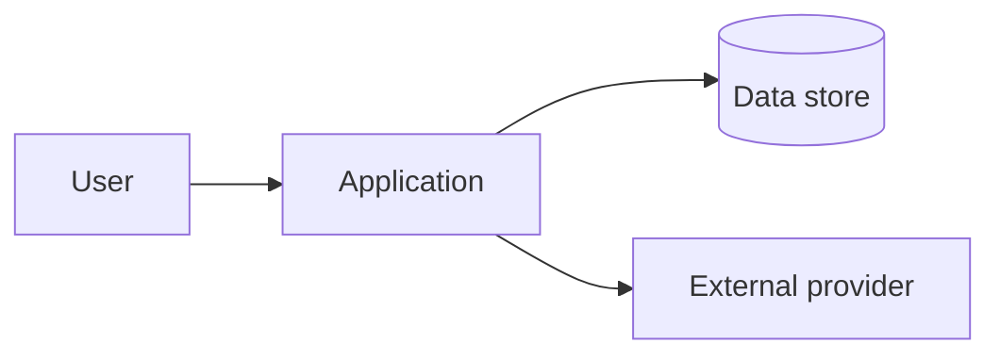

# Mermaid Guidelines

Use this reference when a repository exposes a meaningful architecture, control flow, or data flow.

## Evidence contract

Every node and edge in the proposed diagram must be traceable to one or more repository sources. Keep a private evidence ledger with:

```text
source_path
source_location
fact
confidence: high | medium | low
```

Use this evidence order:

1. executable code and imports;
2. configuration and manifests;
3. CI, deployment, and infrastructure definitions;
4. existing documentation and examples;
5. explicit user-provided context for intended, not yet implemented, behavior.

If code and prose disagree, represent the implemented behavior, report the discrepancy, and do not silently choose the desired behavior.

Do not include secrets, private URLs, credentials, local absolute paths, or internal identifiers that are not intended for public documentation.

## Diagram selection

| Repository profile | Default diagram | Direction |
| --- | --- | --- |
| Web app or API | runtime component flow | `LR` |
| Library or SDK | public API to modules and adapters | `TB` |
| CLI | user to command entry point to core and outputs | `LR` |
| Data project | sources to transformations to storage or consumers | `LR` |
| Infrastructure | deployable units, network boundaries, storage, providers | `LR` |
| Monorepo | apps, packages, shared tooling, and important dependencies | `LR` or `TB` |
| Documentation project | documentation or publication flow only when evidenced | `LR` |

Start with one overview. Add a second diagram only if the overview would hide distinct flows or trust boundaries. Prefer a short diagram that a reader can understand in one viewport over a complete dependency graph.

## Safe syntax baseline

Use a fenced Markdown block:

````markdown

````

Prefer stable `flowchart`, `graph`, and `sequenceDiagram` syntax. Use simple node shapes, short labels, and explicit edges. Avoid experimental diagram types, undocumented renderer features, HTML embedded in labels, and excessive styling.

Recommended conventions:

- internal components use plain labels;
- external dependencies include an `External` qualifier or a clearly explained legend;
- stores use a store-shaped node only when the repository proves persistence;
- trust or deployment boundaries use subgraphs only when the boundary is real and evidenced;
- keep identifiers ASCII-safe and place human-readable text in labels;
- avoid long URLs in nodes; link to the relevant documentation outside the diagram;
- do not use color as the only semantic distinction.

## Diagram review checklist

- Is there enough evidence for at least two components or a concrete flow?
- Is the entry point visible?
- Are external systems distinguished from internal components?
- Are data stores and queues only shown when evidenced?
- Are all edges supported by imports, calls, configuration, workflows, or documented behavior?
- Is the diagram readable without implementation knowledge?
- Does the fenced block use `mermaid` exactly?
- Can a local Mermaid renderer validate it, or is rendering explicitly marked unverified?
